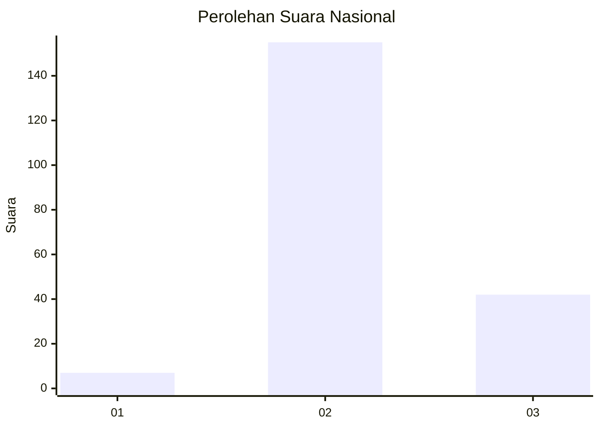

# Hasil

## Grafik

## Tabel

| No. | Nama Paslon    | Suara | Suara (raw) | Persentase |
|:--- |:-------------- | -----:| -----------:| ----------:|
| 1   | ANIES MUHAIMIN | 7     | [7][p-1]    | 3,43       |
| 2   | PRABOWO GIBRAN | 155   | [155][p-2]  | 75,98      |
| 3   | GANJAR MAHFUD  | 42    | [42][p-3]   | 20,59      |

[p-1]: https://github.com/gigit-pemilu/pemilu-2024/blob/main/pilpres/hitung-suara/sub/51-bali/sub/07-karangasem/sub/04-karangasem/sub/2006-seraya/sub/024-tps/sub/paslon-1.txt
[p-2]: https://github.com/gigit-pemilu/pemilu-2024/blob/main/pilpres/hitung-suara/sub/51-bali/sub/07-karangasem/sub/04-karangasem/sub/2006-seraya/sub/024-tps/sub/paslon-2.txt
[p-3]: https://github.com/gigit-pemilu/pemilu-2024/blob/main/pilpres/hitung-suara/sub/51-bali/sub/07-karangasem/sub/04-karangasem/sub/2006-seraya/sub/024-tps/sub/paslon-3.txt

## Foto C Plano

https://sirekap-obj-formc.kpu.go.id/72c7/pemilu/ppwp/51/07/04/20/06/5107042006024-20240214-132956--b83b00c7-a9c0-4400-beca-b5487d467d3c.jpg

https://sirekap-obj-formc.kpu.go.id/72c7/pemilu/ppwp/51/07/04/20/06/5107042006024-20240214-133038--91017894-e3bb-4add-9c95-7ab7a9fd7202.jpg

https://sirekap-obj-formc.kpu.go.id/72c7/pemilu/ppwp/51/07/04/20/06/5107042006024-20240214-133112--829e65b1-f8f7-45d1-82f2-c1768981c9e6.jpg

## Metadata

| Key        | Value               |
| ---------- | ------------------- |
| Time Stamp | 2024-02-19 06:16:00 |

