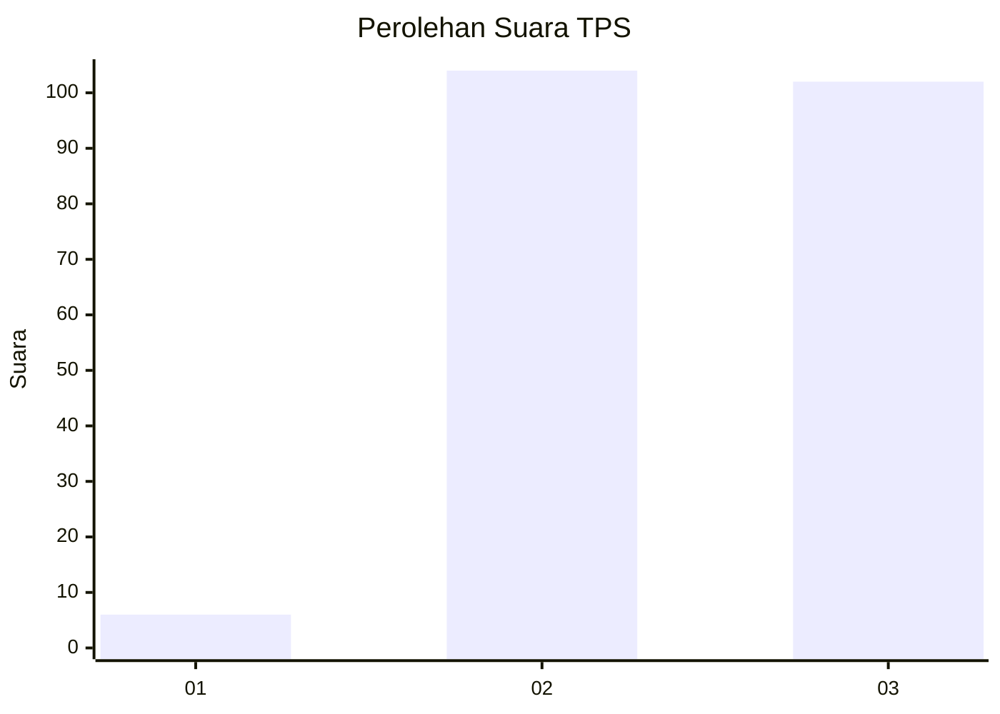
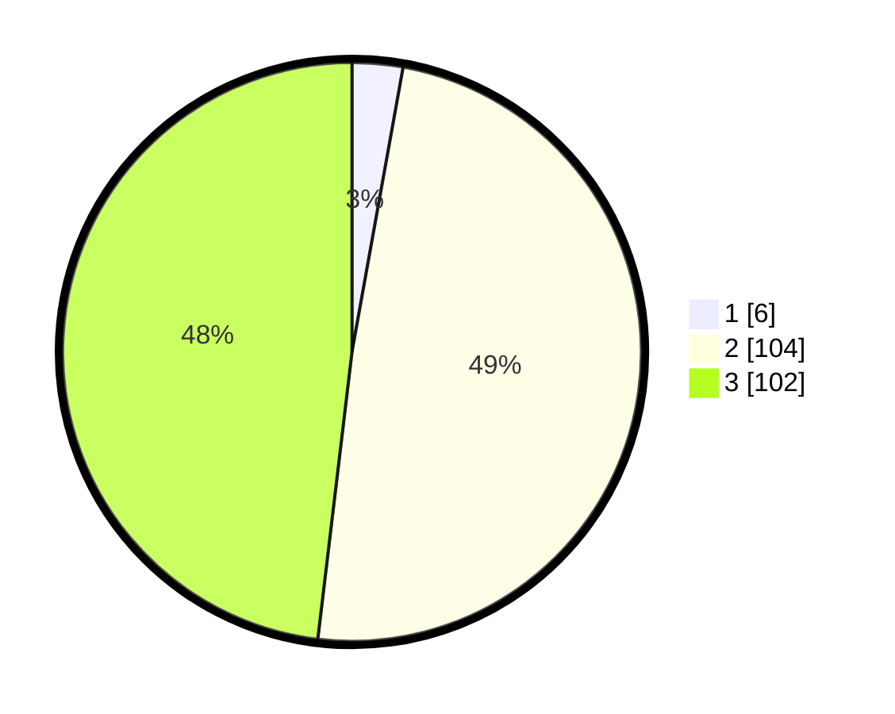

# Hasil

## Grafik

## Tabel

| No. | Nama Paslon    | Suara | Suara (raw) | Persentase |
|:--- |:-------------- | -----:| -----------:| ----------:|
| 1   | ANIES MUHAIMIN | 6     | [6][p-1]    | 2,83       |
| 2   | PRABOWO GIBRAN | 104   | [104][p-2]  | 49,06      |
| 3   | GANJAR MAHFUD  | 102   | [102][p-3]  | 48,11      |

[p-1]: https://github.com/gigit-pemilu/pemilu-2024-51-bali/blob/main/pilpres/hitung-suara/sub/51-bali/sub/07-karangasem/sub/04-karangasem/sub/2007-seraya-barat/sub/003-tps/sub/paslon-1.txt
[p-2]: https://github.com/gigit-pemilu/pemilu-2024-51-bali/blob/main/pilpres/hitung-suara/sub/51-bali/sub/07-karangasem/sub/04-karangasem/sub/2007-seraya-barat/sub/003-tps/sub/paslon-2.txt
[p-3]: https://github.com/gigit-pemilu/pemilu-2024-51-bali/blob/main/pilpres/hitung-suara/sub/51-bali/sub/07-karangasem/sub/04-karangasem/sub/2007-seraya-barat/sub/003-tps/sub/paslon-3.txt

## Foto C Plano

https://sirekap-obj-formc.kpu.go.id/f5ca/pemilu/ppwp/51/07/04/20/07/5107042007003-20240215-213309--e46a652a-9be7-4132-8d23-20339f0f5a59.jpg

https://sirekap-obj-formc.kpu.go.id/f5ca/pemilu/ppwp/51/07/04/20/07/5107042007003-20240215-213310--7ffcdb8c-ed69-4cee-b615-36fcac2b5449.jpg

https://sirekap-obj-formc.kpu.go.id/f5ca/pemilu/ppwp/51/07/04/20/07/5107042007003-20240215-213310--754cfb44-eff6-48b4-8123-2da6a71a5532.jpg

## Metadata

| Key        | Value               |
| ---------- | ------------------- |
| Time Stamp | 2024-02-16 11:00:29 |

## DATA PEMILIH TETAP

Jumlah pemilih dalam DPT: **231**.
 * L: **116**.
 * P: **115**.

## DATA PENGGUNA HAK PILIH

Jumlah pengguna hak pilih dalam DPT: **210**.
 * L: **106**.
 * P: **104**.

Jumlah pengguna hak pilih dalam DPTb: **3**.
 * L: **1**.
 * P: **2**.

Jumlah pengguna hak pilih dalam DPK: **6**.
 * L: **3**.
 * P: **3**.

Jumlah pengguna hak pilih: **219**.
 * L: **110**.
 * P: **109**.

## JUMLAH SUARA SAH DAN TIDAK SAH

JUMLAH SELURUH SUARA SAH: **212**.

JUMLAH SUARA TIDAK SAH: **7**.

JUMLAH SELURUH SUARA SAH DAN SUARA TIDAK SAH: **219**.

