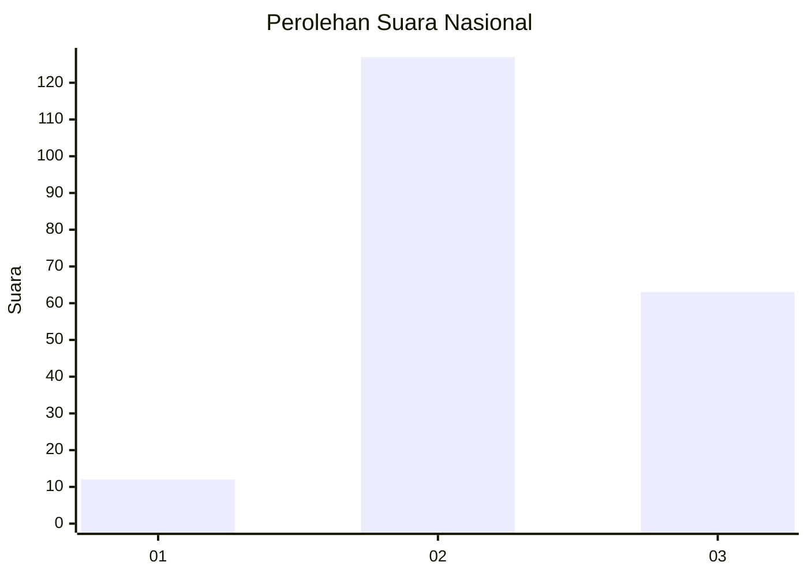
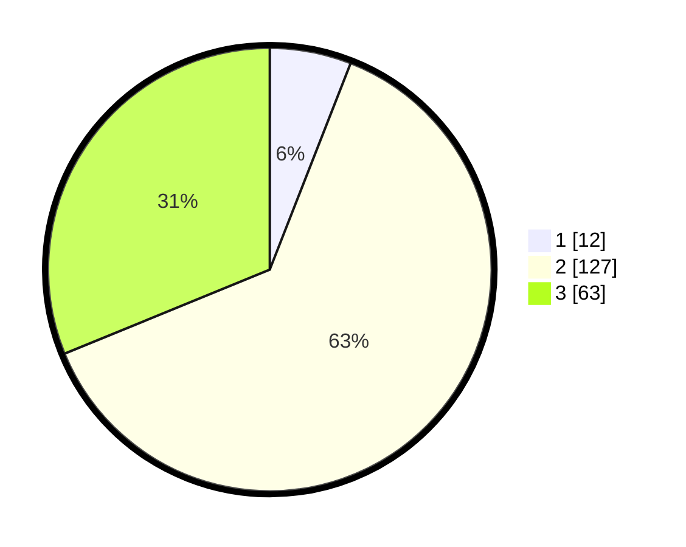

# Hasil

## Grafik

## Tabel

| No. | Nama Paslon    | Suara | Suara (raw) | Persentase |
|:--- |:-------------- | -----:| -----------:| ----------:|
| 1   | ANIES MUHAIMIN | 12    | [12][p-1]   | 5,94       |
| 2   | PRABOWO GIBRAN | 127   | [127][p-2]  | 62,87      |
| 3   | GANJAR MAHFUD  | 63    | [63][p-3]   | 31,19      |

[p-1]: https://github.com/gigit-pemilu/pemilu-2024/blob/main/pilpres/hitung-suara/sub/51-bali/sub/07-karangasem/sub/04-karangasem/sub/2007-seraya-barat/sub/004-tps/sub/paslon-1.txt
[p-2]: https://github.com/gigit-pemilu/pemilu-2024/blob/main/pilpres/hitung-suara/sub/51-bali/sub/07-karangasem/sub/04-karangasem/sub/2007-seraya-barat/sub/004-tps/sub/paslon-2.txt
[p-3]: https://github.com/gigit-pemilu/pemilu-2024/blob/main/pilpres/hitung-suara/sub/51-bali/sub/07-karangasem/sub/04-karangasem/sub/2007-seraya-barat/sub/004-tps/sub/paslon-3.txt

## Foto C Plano

https://sirekap-obj-formc.kpu.go.id/7e96/pemilu/ppwp/51/07/04/20/07/5107042007004-20240215-205824--18c79900-a89d-483b-bd7d-0526bbccfbe9.jpg

https://sirekap-obj-formc.kpu.go.id/7e96/pemilu/ppwp/51/07/04/20/07/5107042007004-20240215-205827--27715ed7-a391-49d7-bf75-8479dffa3b97.jpg

https://sirekap-obj-formc.kpu.go.id/7e96/pemilu/ppwp/51/07/04/20/07/5107042007004-20240215-205826--d2e3f254-ee17-4c77-b59e-e5a0d2a8985c.jpg

## Metadata

| Key        | Value               |
| ---------- | ------------------- |
| Time Stamp | 2024-02-16 11:00:29 |

## DATA PEMILIH TETAP

Jumlah pemilih dalam DPT: **229**.
 * L: **124**.
 * P: **105**.

## DATA PENGGUNA HAK PILIH

Jumlah pengguna hak pilih dalam DPT: **201**.
 * L: **108**.
 * P: **93**.

Jumlah pengguna hak pilih dalam DPTb: **2**.
 * L: **1**.
 * P: **1**.

Jumlah pengguna hak pilih dalam DPK: **0**.
 * L: **0**.
 * P: **0**.

Jumlah pengguna hak pilih: **203**.
 * L: **109**.
 * P: **94**.

## JUMLAH SUARA SAH DAN TIDAK SAH

JUMLAH SELURUH SUARA SAH: **202**.

JUMLAH SUARA TIDAK SAH: **1**.

JUMLAH SELURUH SUARA SAH DAN SUARA TIDAK SAH: **203**.

