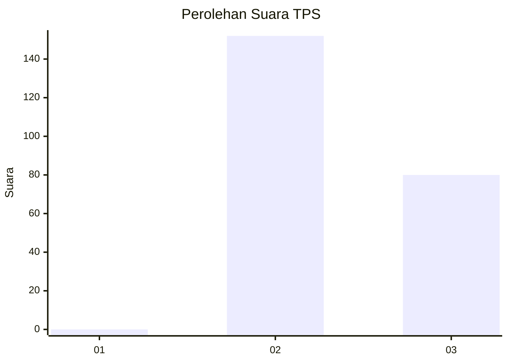
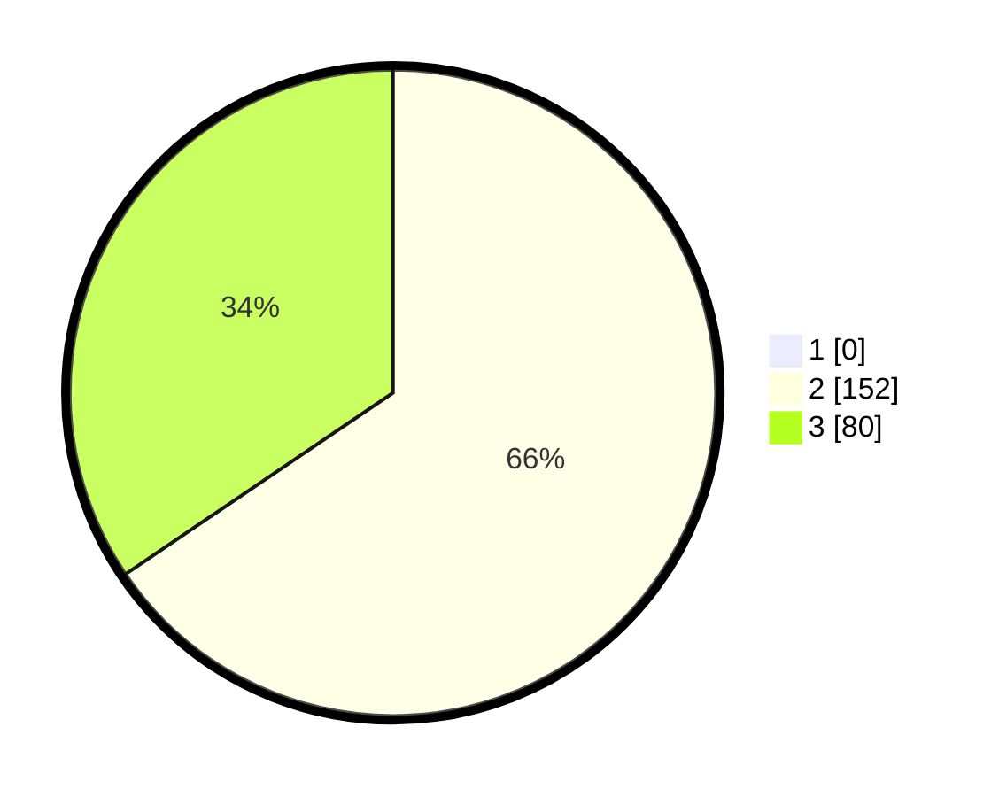

# Hasil

## Grafik

## Tabel

| No. | Nama Paslon    | Suara | Suara (raw) | Persentase |
|:--- |:-------------- | -----:| -----------:| ----------:|
| 1   | ANIES MUHAIMIN | 0     | [0][p-1]    | 0,00       |
| 2   | PRABOWO GIBRAN | 152   | [152][p-2]  | 65,52      |
| 3   | GANJAR MAHFUD  | 80    | [80][p-3]   | 34,48      |

[p-1]: https://github.com/gigit-pemilu/pemilu-2024-51-bali/blob/main/pilpres/hitung-suara/sub/51-bali/sub/07-karangasem/sub/04-karangasem/sub/2008-seraya-timur/sub/017-tps/sub/paslon-1.txt
[p-2]: https://github.com/gigit-pemilu/pemilu-2024-51-bali/blob/main/pilpres/hitung-suara/sub/51-bali/sub/07-karangasem/sub/04-karangasem/sub/2008-seraya-timur/sub/017-tps/sub/paslon-2.txt
[p-3]: https://github.com/gigit-pemilu/pemilu-2024-51-bali/blob/main/pilpres/hitung-suara/sub/51-bali/sub/07-karangasem/sub/04-karangasem/sub/2008-seraya-timur/sub/017-tps/sub/paslon-3.txt

## Foto C Plano

https://sirekap-obj-formc.kpu.go.id/0b63/pemilu/ppwp/51/07/04/20/08/5107042008017-20240214-220433--09dacee3-b0d3-45ce-824c-251fba04d023.jpg

https://sirekap-obj-formc.kpu.go.id/0b63/pemilu/ppwp/51/07/04/20/08/5107042008017-20240214-220530--bf8d113f-fd81-4a49-aba8-dd9dfe0b61b1.jpg

https://sirekap-obj-formc.kpu.go.id/0b63/pemilu/ppwp/51/07/04/20/08/5107042008017-20240214-220627--1f429001-95c2-4d50-9130-29411879101c.jpg

## Metadata

| Key        | Value               |
| ---------- | ------------------- |
| Time Stamp | 2024-02-24 22:31:28 |

