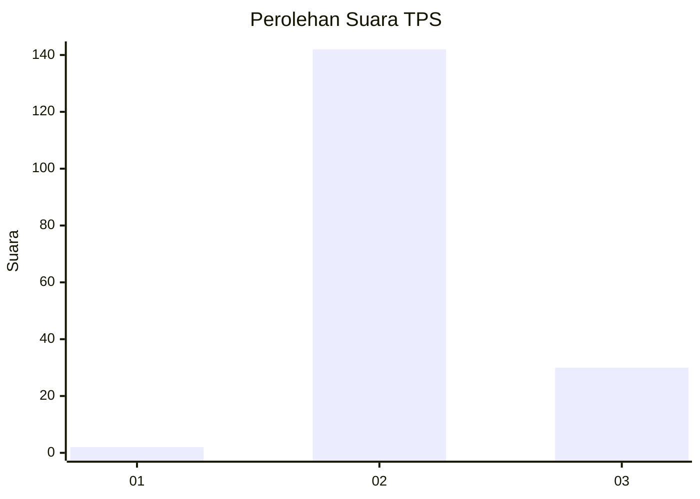
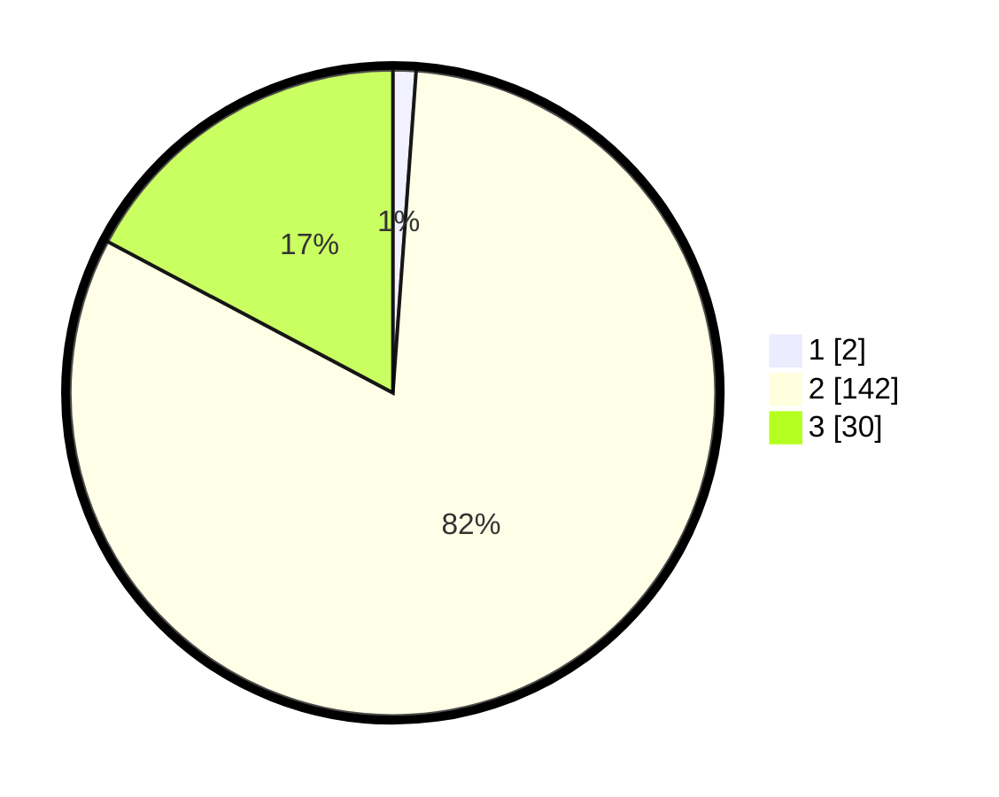

# Hasil

## Grafik

## Tabel

| No. | Nama Paslon    | Suara | Suara (raw) | Persentase |
|:--- |:-------------- | -----:| -----------:| ----------:|
| 1   | ANIES MUHAIMIN | 2     | [2][p-1]    | 1,15       |
| 2   | PRABOWO GIBRAN | 142   | [142][p-2]  | 81,61      |
| 3   | GANJAR MAHFUD  | 30    | [30][p-3]   | 17,24      |

[p-1]: https://github.com/gigit-pemilu/pemilu-2024-51-bali/blob/main/pilpres/hitung-suara/sub/51-bali/sub/07-karangasem/sub/04-karangasem/sub/2009-pertima/sub/002-tps/sub/paslon-1.txt
[p-2]: https://github.com/gigit-pemilu/pemilu-2024-51-bali/blob/main/pilpres/hitung-suara/sub/51-bali/sub/07-karangasem/sub/04-karangasem/sub/2009-pertima/sub/002-tps/sub/paslon-2.txt
[p-3]: https://github.com/gigit-pemilu/pemilu-2024-51-bali/blob/main/pilpres/hitung-suara/sub/51-bali/sub/07-karangasem/sub/04-karangasem/sub/2009-pertima/sub/002-tps/sub/paslon-3.txt

## Foto C Plano

https://sirekap-obj-formc.kpu.go.id/6029/pemilu/ppwp/51/07/04/20/09/5107042009002-20240214-193917--1f1791be-02aa-4720-8ac2-0aa8d316274f.jpg

https://sirekap-obj-formc.kpu.go.id/6029/pemilu/ppwp/51/07/04/20/09/5107042009002-20240214-193911--9e9bb81e-a024-4b7e-9a86-57a860d3b652.jpg

https://sirekap-obj-formc.kpu.go.id/6029/pemilu/ppwp/51/07/04/20/09/5107042009002-20240214-193907--59d31119-8ac2-4344-b830-7a64cb0c6a96.jpg

## Metadata

| Key        | Value               |
| ---------- | ------------------- |
| Time Stamp | 2024-02-19 06:16:00 |

