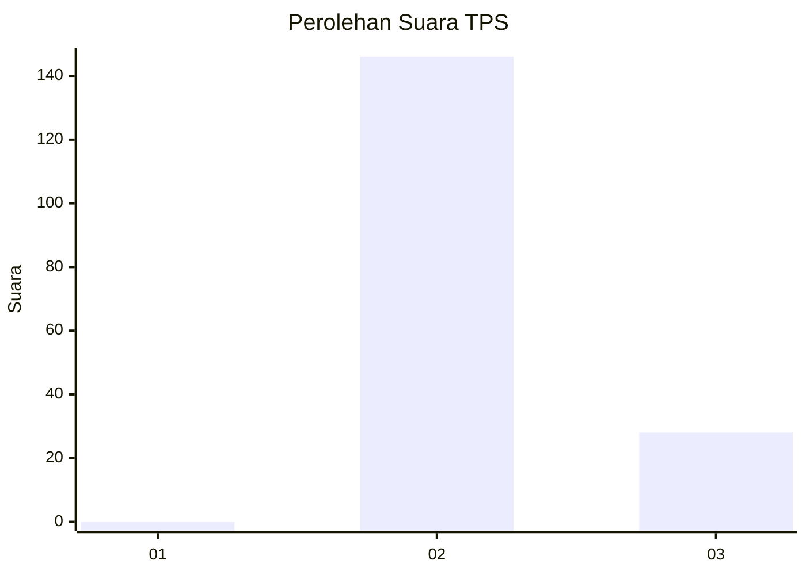
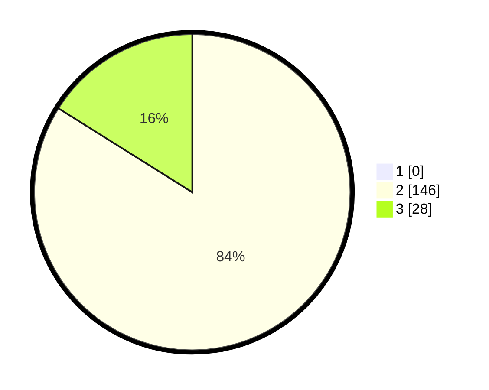

# Hasil

## Grafik

## Tabel

| No. | Nama Paslon    | Suara | Suara (raw) | Persentase |
|:--- |:-------------- | -----:| -----------:| ----------:|
| 1   | ANIES MUHAIMIN | 0     | [0][p-1]    | 0,00       |
| 2   | PRABOWO GIBRAN | 146   | [146][p-2]  | 83,91      |
| 3   | GANJAR MAHFUD  | 28    | [28][p-3]   | 16,09      |

[p-1]: https://github.com/gigit-pemilu/pemilu-2024-51-bali/blob/main/pilpres/hitung-suara/sub/51-bali/sub/07-karangasem/sub/04-karangasem/sub/2009-pertima/sub/004-tps/sub/paslon-1.txt
[p-2]: https://github.com/gigit-pemilu/pemilu-2024-51-bali/blob/main/pilpres/hitung-suara/sub/51-bali/sub/07-karangasem/sub/04-karangasem/sub/2009-pertima/sub/004-tps/sub/paslon-2.txt
[p-3]: https://github.com/gigit-pemilu/pemilu-2024-51-bali/blob/main/pilpres/hitung-suara/sub/51-bali/sub/07-karangasem/sub/04-karangasem/sub/2009-pertima/sub/004-tps/sub/paslon-3.txt

## Foto C Plano

https://sirekap-obj-formc.kpu.go.id/94b8/pemilu/ppwp/51/07/04/20/09/5107042009004-20240214-155310--c7293a31-4959-4c3b-8506-7ef830a0b6c2.jpg

https://sirekap-obj-formc.kpu.go.id/94b8/pemilu/ppwp/51/07/04/20/09/5107042009004-20240214-155027--b0024504-f920-45f1-8dd9-6652ca15c5a5.jpg

https://sirekap-obj-formc.kpu.go.id/94b8/pemilu/ppwp/51/07/04/20/09/5107042009004-20240214-155140--4484f403-bcdc-4339-9db5-29d9dea0a8c9.jpg

## Metadata

| Key        | Value               |
| ---------- | ------------------- |
| Time Stamp | 2024-02-19 06:16:00 |

