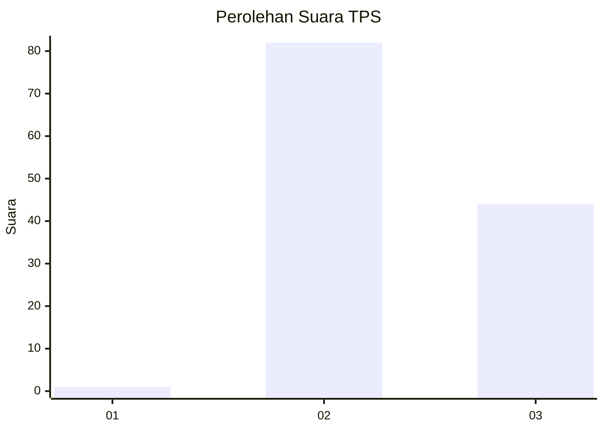
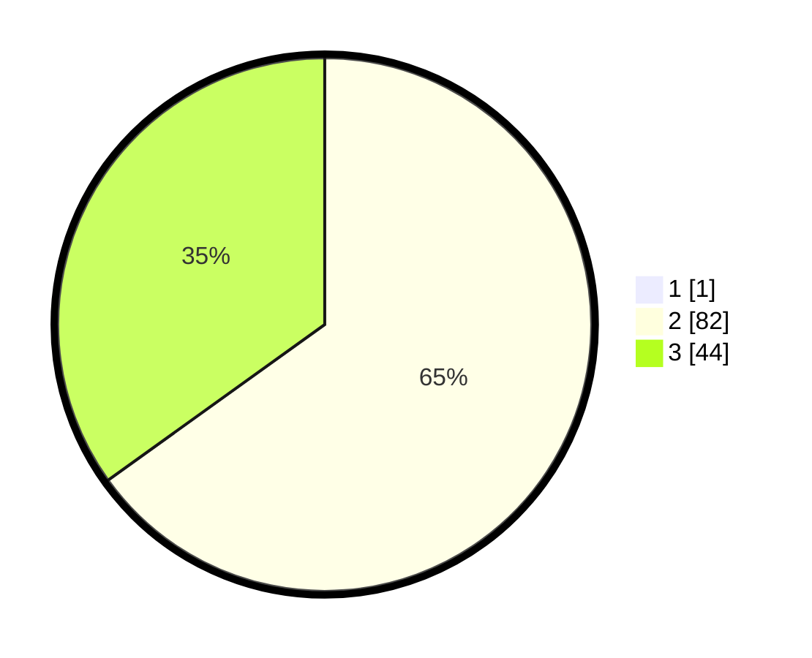

# Hasil

## Grafik

## Tabel

| No. | Nama Paslon    | Suara | Suara (raw) | Persentase |
|:--- |:-------------- | -----:| -----------:| ----------:|
| 1   | ANIES MUHAIMIN | 1     | [1][p-1]    | 0,79       |
| 2   | PRABOWO GIBRAN | 82    | [82][p-2]   | 64,57      |
| 3   | GANJAR MAHFUD  | 44    | [44][p-3]   | 34,65      |

[p-1]: https://github.com/gigit-pemilu/pemilu-2024-51-bali/blob/main/pilpres/hitung-suara/sub/51-bali/sub/07-karangasem/sub/04-karangasem/sub/2009-pertima/sub/015-tps/sub/paslon-1.txt
[p-2]: https://github.com/gigit-pemilu/pemilu-2024-51-bali/blob/main/pilpres/hitung-suara/sub/51-bali/sub/07-karangasem/sub/04-karangasem/sub/2009-pertima/sub/015-tps/sub/paslon-2.txt
[p-3]: https://github.com/gigit-pemilu/pemilu-2024-51-bali/blob/main/pilpres/hitung-suara/sub/51-bali/sub/07-karangasem/sub/04-karangasem/sub/2009-pertima/sub/015-tps/sub/paslon-3.txt

## Foto C Plano

https://sirekap-obj-formc.kpu.go.id/869a/pemilu/ppwp/51/07/04/20/09/5107042009015-20240214-131756--62b3ca0e-7dae-4feb-bd8a-05f7fce1cd99.jpg

https://sirekap-obj-formc.kpu.go.id/869a/pemilu/ppwp/51/07/04/20/09/5107042009015-20240214-131549--a3fc790b-d682-4e95-8f61-c5c028d3d3f0.jpg

https://sirekap-obj-formc.kpu.go.id/869a/pemilu/ppwp/51/07/04/20/09/5107042009015-20240214-131703--ad527bed-e610-42ac-ba37-8e4c6e8990d5.jpg

## Metadata

| Key        | Value               |
| ---------- | ------------------- |
| Time Stamp | 2024-02-14 21:46:01 |

## DATA PEMILIH TETAP

Jumlah pemilih dalam DPT: **163**.
 * L: **88**.
 * P: **75**.

## DATA PENGGUNA HAK PILIH

Jumlah pengguna hak pilih dalam DPT: **128**.
 * L: **70**.
 * P: **58**.

Jumlah pengguna hak pilih dalam DPTb: **0**.
 * L: **0**.
 * P: **0**.

Jumlah pengguna hak pilih dalam DPK: **0**.
 * L: **0**.
 * P: **0**.

Jumlah pengguna hak pilih: **128**.
 * L: **70**.
 * P: **58**.

## JUMLAH SUARA SAH DAN TIDAK SAH

JUMLAH SELURUH SUARA SAH: **127**.

JUMLAH SUARA TIDAK SAH: **1**.

JUMLAH SELURUH SUARA SAH DAN SUARA TIDAK SAH: **128**.

