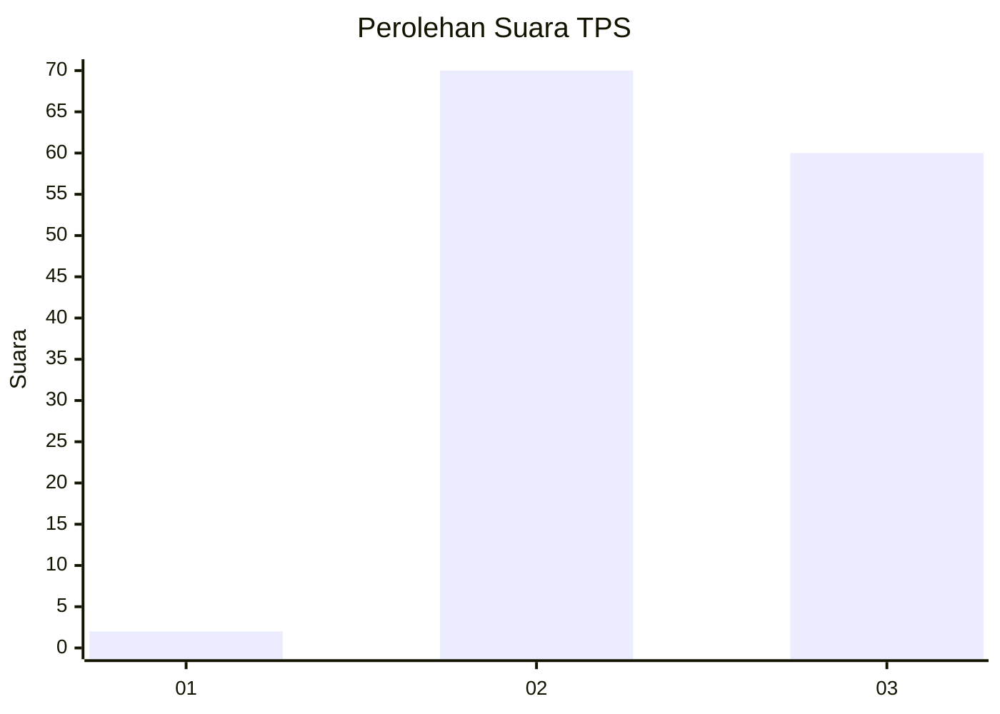
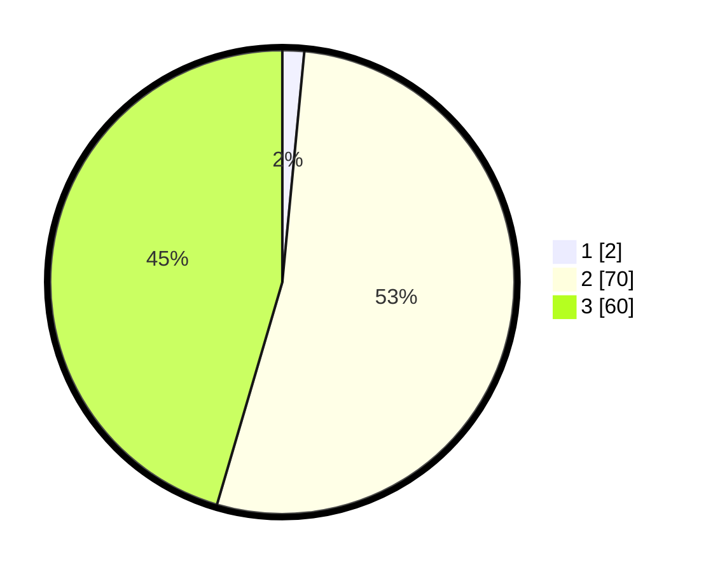

# Hasil

## Grafik

## Tabel

| No. | Nama Paslon    | Suara | Suara (raw) | Persentase |
|:--- |:-------------- | -----:| -----------:| ----------:|
| 1   | ANIES MUHAIMIN | 2     | [2][p-1]    | 1,52       |
| 2   | PRABOWO GIBRAN | 70    | [70][p-2]   | 53,03      |
| 3   | GANJAR MAHFUD  | 60    | [60][p-3]   | 45,45      |

[p-1]: https://github.com/gigit-pemilu/pemilu-2024-51-bali/blob/main/pilpres/hitung-suara/sub/51-bali/sub/07-karangasem/sub/04-karangasem/sub/2009-pertima/sub/021-tps/sub/paslon-1.txt
[p-2]: https://github.com/gigit-pemilu/pemilu-2024-51-bali/blob/main/pilpres/hitung-suara/sub/51-bali/sub/07-karangasem/sub/04-karangasem/sub/2009-pertima/sub/021-tps/sub/paslon-2.txt
[p-3]: https://github.com/gigit-pemilu/pemilu-2024-51-bali/blob/main/pilpres/hitung-suara/sub/51-bali/sub/07-karangasem/sub/04-karangasem/sub/2009-pertima/sub/021-tps/sub/paslon-3.txt

## Foto C Plano

https://sirekap-obj-formc.kpu.go.id/1840/pemilu/ppwp/51/07/04/20/09/5107042009021-20240214-132704--2dca0819-65d8-4a03-80c8-69bb8e27b321.jpg

https://sirekap-obj-formc.kpu.go.id/1840/pemilu/ppwp/51/07/04/20/09/5107042009021-20240214-133102--3df69bc3-889d-409e-8b6d-c113c2562ef6.jpg

## Metadata

| Key        | Value               |
| ---------- | ------------------- |
| Time Stamp | 2024-02-26 22:00:00 |

