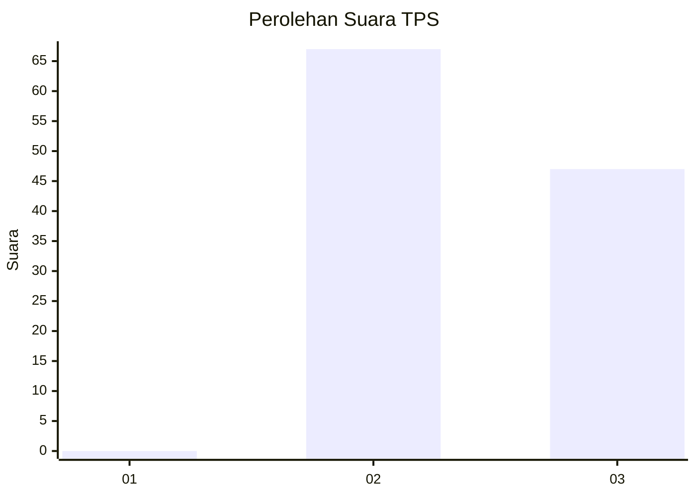
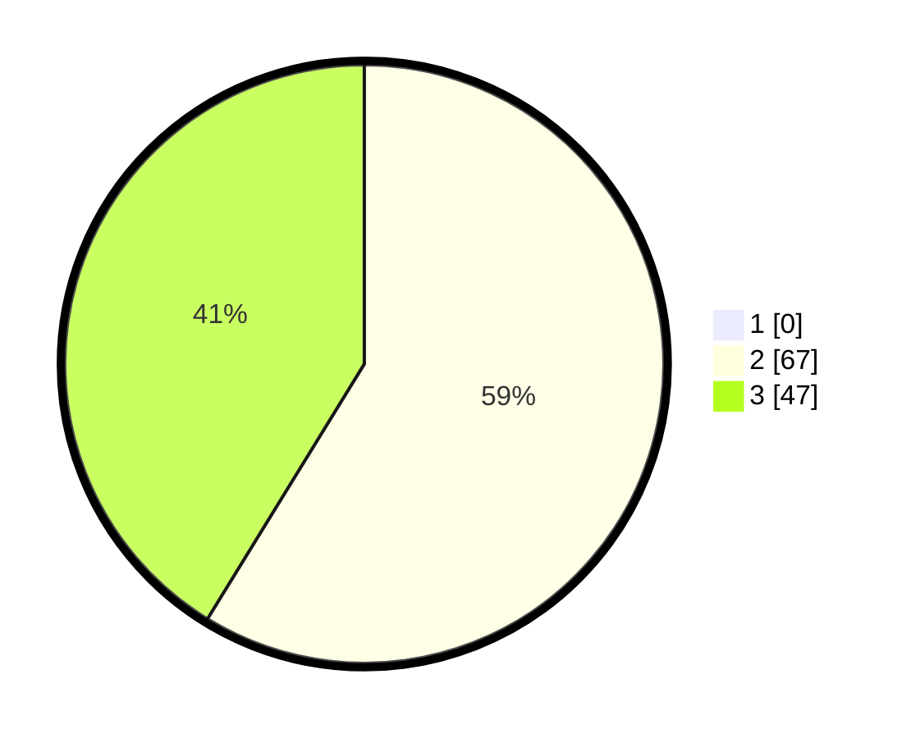

# Hasil

## Grafik

## Tabel

| No. | Nama Paslon    | Suara | Suara (raw) | Persentase |
|:--- |:-------------- | -----:| -----------:| ----------:|
| 1   | ANIES MUHAIMIN | 0     | [0][p-1]    | 0,00       |
| 2   | PRABOWO GIBRAN | 67    | [67][p-2]   | 58,77      |
| 3   | GANJAR MAHFUD  | 47    | [47][p-3]   | 41,23      |

[p-1]: https://github.com/gigit-pemilu/pemilu-2024-51-bali/blob/main/pilpres/hitung-suara/sub/51-bali/sub/07-karangasem/sub/04-karangasem/sub/2009-pertima/sub/023-tps/sub/paslon-1.txt
[p-2]: https://github.com/gigit-pemilu/pemilu-2024-51-bali/blob/main/pilpres/hitung-suara/sub/51-bali/sub/07-karangasem/sub/04-karangasem/sub/2009-pertima/sub/023-tps/sub/paslon-2.txt
[p-3]: https://github.com/gigit-pemilu/pemilu-2024-51-bali/blob/main/pilpres/hitung-suara/sub/51-bali/sub/07-karangasem/sub/04-karangasem/sub/2009-pertima/sub/023-tps/sub/paslon-3.txt

## Foto C Plano

https://sirekap-obj-formc.kpu.go.id/5bcd/pemilu/ppwp/51/07/04/20/09/5107042009023-20240215-073207--ae7b7f09-98cd-4bca-8698-d037476b597c.jpg

https://sirekap-obj-formc.kpu.go.id/5bcd/pemilu/ppwp/51/07/04/20/09/5107042009023-20240215-073224--c337fe98-2d98-468a-a767-e20fb2409f8a.jpg

https://sirekap-obj-formc.kpu.go.id/5bcd/pemilu/ppwp/51/07/04/20/09/5107042009023-20240215-073246--50ac1ca8-1857-4dc4-8eb6-e01c28b5a1fc.jpg

## Metadata

| Key        | Value               |
| ---------- | ------------------- |
| Time Stamp | 2024-02-19 06:16:00 |

