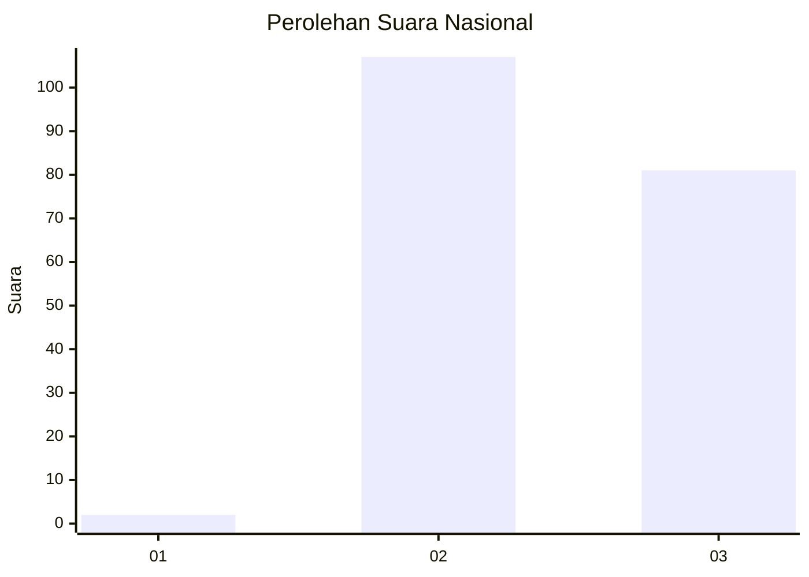
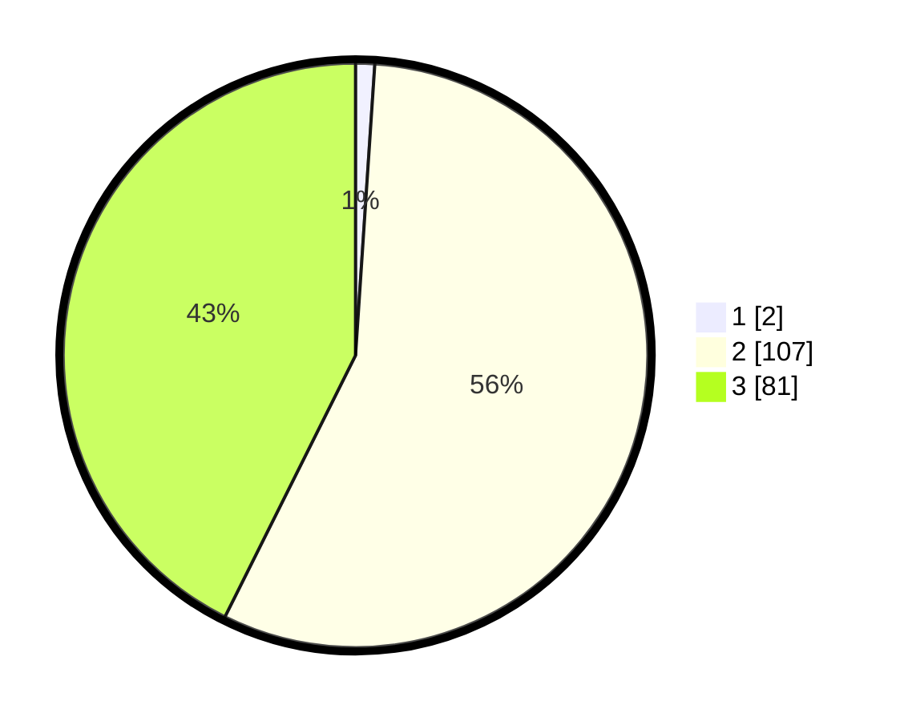

# Hasil

## Grafik

## Tabel

| No. | Nama Paslon    | Suara | Suara (raw) | Persentase |
|:--- |:-------------- | -----:| -----------:| ----------:|
| 1   | ANIES MUHAIMIN | 2     | [2][p-1]    | 1,05       |
| 2   | PRABOWO GIBRAN | 107   | [107][p-2]  | 56,32      |
| 3   | GANJAR MAHFUD  | 81    | [81][p-3]   | 42,63      |

[p-1]: https://github.com/gigit-pemilu/pemilu-2024/blob/main/pilpres/hitung-suara/sub/51-bali/sub/07-karangasem/sub/04-karangasem/sub/2009-pertima/sub/024-tps/sub/paslon-1.txt
[p-2]: https://github.com/gigit-pemilu/pemilu-2024/blob/main/pilpres/hitung-suara/sub/51-bali/sub/07-karangasem/sub/04-karangasem/sub/2009-pertima/sub/024-tps/sub/paslon-2.txt
[p-3]: https://github.com/gigit-pemilu/pemilu-2024/blob/main/pilpres/hitung-suara/sub/51-bali/sub/07-karangasem/sub/04-karangasem/sub/2009-pertima/sub/024-tps/sub/paslon-3.txt

## Foto C Plano

https://sirekap-obj-formc.kpu.go.id/08aa/pemilu/ppwp/51/07/04/20/09/5107042009024-20240214-155725--c3df85fc-b1a6-4748-b9a2-fd7169127f0b.jpg

https://sirekap-obj-formc.kpu.go.id/08aa/pemilu/ppwp/51/07/04/20/09/5107042009024-20240214-155851--56c19bad-d7cd-461f-9caf-3dca20ba6123.jpg

https://sirekap-obj-formc.kpu.go.id/08aa/pemilu/ppwp/51/07/04/20/09/5107042009024-20240214-160103--b391ea47-3803-4ec1-a2cb-83643363b99b.jpg

## Metadata

| Key        | Value               |
| ---------- | ------------------- |
| Time Stamp | 2024-02-19 06:16:00 |

