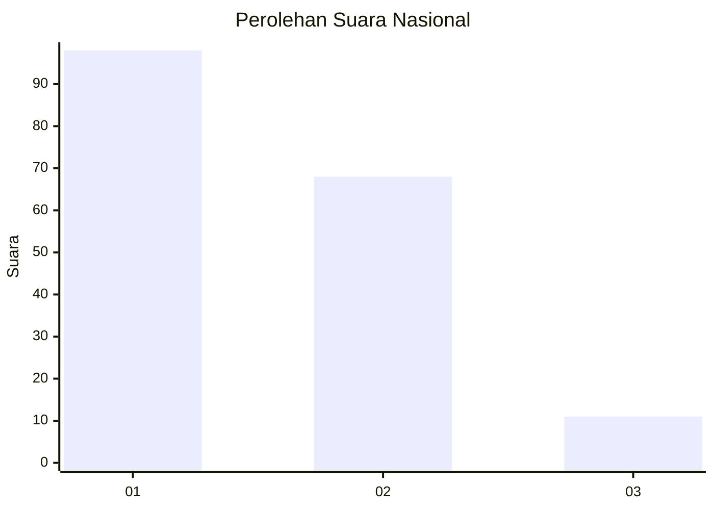
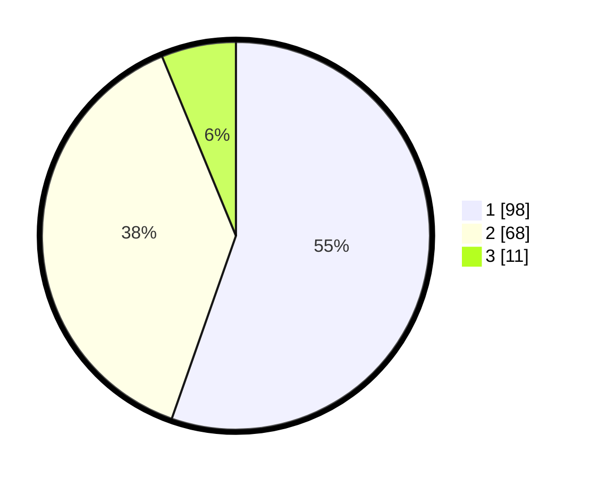

# Hasil

## Grafik

## Tabel

| No. | Nama Paslon    | Suara | Suara (raw) | Persentase |
|:--- |:-------------- | -----:| -----------:| ----------:|
| 1   | ANIES MUHAIMIN | 98    | [98][p-1]   | 55,37      |
| 2   | PRABOWO GIBRAN | 68    | [68][p-2]   | 38,42      |
| 3   | GANJAR MAHFUD  | 11    | [11][p-3]   | 6,21       |

[p-1]: https://github.com/gigit-pemilu/pemilu-2024/blob/main/pilpres/hitung-suara/sub/51-bali/sub/07-karangasem/sub/04-karangasem/sub/2010-tegalinggah/sub/002-tps/sub/paslon-1.txt
[p-2]: https://github.com/gigit-pemilu/pemilu-2024/blob/main/pilpres/hitung-suara/sub/51-bali/sub/07-karangasem/sub/04-karangasem/sub/2010-tegalinggah/sub/002-tps/sub/paslon-2.txt
[p-3]: https://github.com/gigit-pemilu/pemilu-2024/blob/main/pilpres/hitung-suara/sub/51-bali/sub/07-karangasem/sub/04-karangasem/sub/2010-tegalinggah/sub/002-tps/sub/paslon-3.txt

## Foto C Plano

https://sirekap-obj-formc.kpu.go.id/9840/pemilu/ppwp/51/07/04/20/10/5107042010002-20240215-041330--8902ab47-8dec-4913-8f00-fe39821d201f.jpg

https://sirekap-obj-formc.kpu.go.id/9840/pemilu/ppwp/51/07/04/20/10/5107042010002-20240215-040453--2a6c04bf-9793-4cb6-ae34-15b1b8e6c96f.jpg

## Metadata

| Key        | Value               |
| ---------- | ------------------- |
| Time Stamp | 2024-02-19 06:16:00 |

