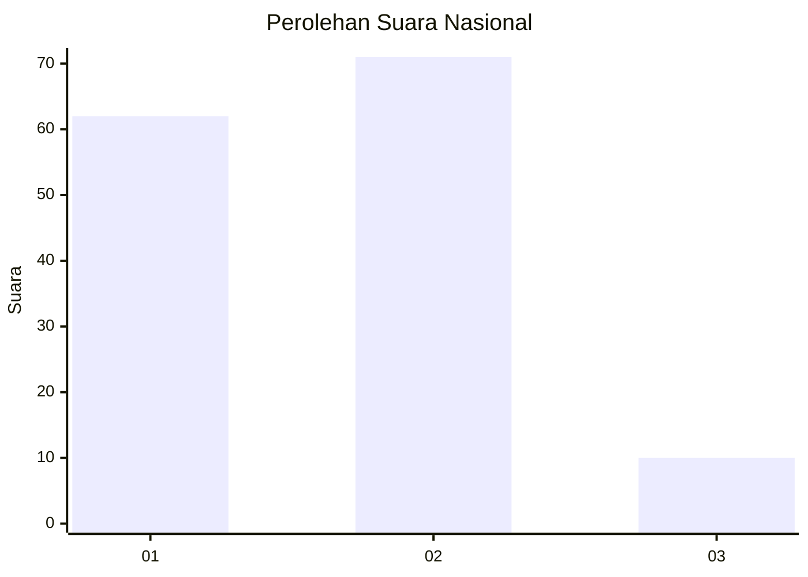
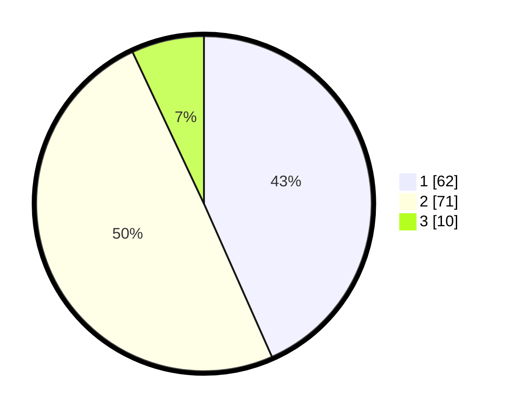

# Hasil

## Grafik

## Tabel

| No. | Nama Paslon    | Suara | Suara (raw) | Persentase |
|:--- |:-------------- | -----:| -----------:| ----------:|
| 1   | ANIES MUHAIMIN | 62    | [62][p-1]   | 43,36      |
| 2   | PRABOWO GIBRAN | 71    | [71][p-2]   | 49,65      |
| 3   | GANJAR MAHFUD  | 10    | [10][p-3]   | 6,99       |

[p-1]: https://github.com/gigit-pemilu/pemilu-2024/blob/main/pilpres/hitung-suara/sub/51-bali/sub/07-karangasem/sub/04-karangasem/sub/2010-tegalinggah/sub/003-tps/sub/paslon-1.txt
[p-2]: https://github.com/gigit-pemilu/pemilu-2024/blob/main/pilpres/hitung-suara/sub/51-bali/sub/07-karangasem/sub/04-karangasem/sub/2010-tegalinggah/sub/003-tps/sub/paslon-2.txt
[p-3]: https://github.com/gigit-pemilu/pemilu-2024/blob/main/pilpres/hitung-suara/sub/51-bali/sub/07-karangasem/sub/04-karangasem/sub/2010-tegalinggah/sub/003-tps/sub/paslon-3.txt

## Foto C Plano

https://sirekap-obj-formc.kpu.go.id/b310/pemilu/ppwp/51/07/04/20/10/5107042010003-20240215-015928--8f126a63-9b1c-40be-8da0-c613129438df.jpg

https://sirekap-obj-formc.kpu.go.id/b310/pemilu/ppwp/51/07/04/20/10/5107042010003-20240215-020455--e64ebdbe-26d3-4481-bede-ba3767f94fe2.jpg

https://sirekap-obj-formc.kpu.go.id/b310/pemilu/ppwp/51/07/04/20/10/5107042010003-20240215-020640--1cf3c791-2f32-4b54-94f5-849845ebd0fb.jpg

## Metadata

| Key        | Value               |
| ---------- | ------------------- |
| Time Stamp | 2024-02-17 13:37:34 |

## DATA PEMILIH TETAP

Jumlah pemilih dalam DPT: **161**.
 * L: **83**.
 * P: **78**.

## DATA PENGGUNA HAK PILIH

Jumlah pengguna hak pilih dalam DPT: **146**.
 * L: **76**.
 * P: **70**.

Jumlah pengguna hak pilih dalam DPTb: **0**.
 * L: **0**.
 * P: **0**.

Jumlah pengguna hak pilih dalam DPK: **0**.
 * L: **0**.
 * P: **0**.

Jumlah pengguna hak pilih: **146**.
 * L: **76**.
 * P: **70**.

## JUMLAH SUARA SAH DAN TIDAK SAH

JUMLAH SELURUH SUARA SAH: **143**.

JUMLAH SUARA TIDAK SAH: **3**.

JUMLAH SELURUH SUARA SAH DAN SUARA TIDAK SAH: **146**.

