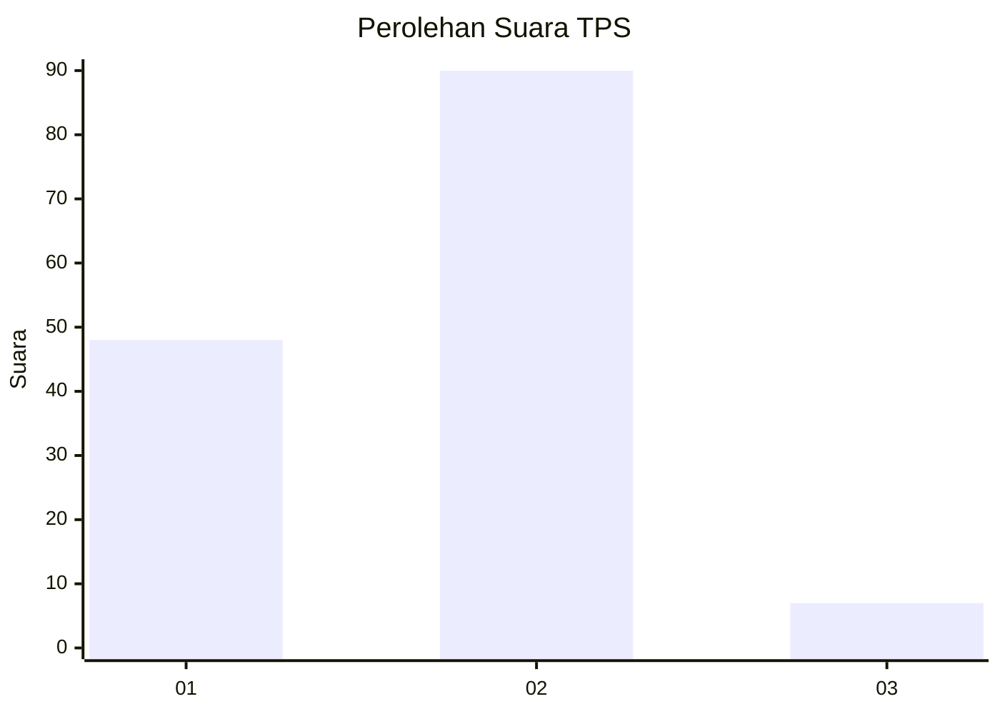
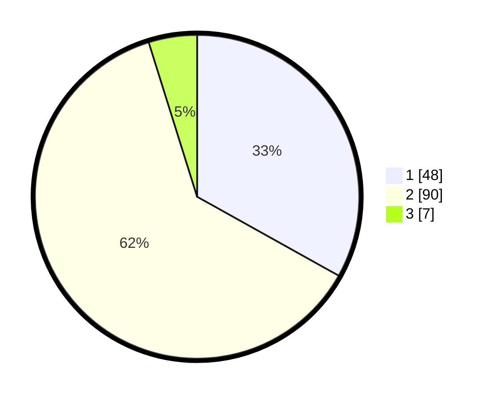

# Hasil

## Grafik

## Tabel

| No. | Nama Paslon    | Suara | Suara (raw) | Persentase |
|:--- |:-------------- | -----:| -----------:| ----------:|
| 1   | ANIES MUHAIMIN | 48    | [48][p-1]   | 33,10      |
| 2   | PRABOWO GIBRAN | 90    | [90][p-2]   | 62,07      |
| 3   | GANJAR MAHFUD  | 7     | [7][p-3]    | 4,83       |

[p-1]: https://github.com/gigit-pemilu/pemilu-2024-51-bali/blob/main/pilpres/hitung-suara/sub/51-bali/sub/07-karangasem/sub/04-karangasem/sub/2010-tegalinggah/sub/004-tps/sub/paslon-1.txt
[p-2]: https://github.com/gigit-pemilu/pemilu-2024-51-bali/blob/main/pilpres/hitung-suara/sub/51-bali/sub/07-karangasem/sub/04-karangasem/sub/2010-tegalinggah/sub/004-tps/sub/paslon-2.txt
[p-3]: https://github.com/gigit-pemilu/pemilu-2024-51-bali/blob/main/pilpres/hitung-suara/sub/51-bali/sub/07-karangasem/sub/04-karangasem/sub/2010-tegalinggah/sub/004-tps/sub/paslon-3.txt

## Foto C Plano

https://sirekap-obj-formc.kpu.go.id/e68f/pemilu/ppwp/51/07/04/20/10/5107042010004-20240214-213007--151196a2-5610-48b6-a388-71cb8db0b617.jpg

https://sirekap-obj-formc.kpu.go.id/e68f/pemilu/ppwp/51/07/04/20/10/5107042010004-20240214-213014--0c42223e-8976-457d-90fc-c9d968da9b42.jpg

https://sirekap-obj-formc.kpu.go.id/e68f/pemilu/ppwp/51/07/04/20/10/5107042010004-20240214-213025--36e89cd8-71fa-4401-af5e-661091726bd0.jpg

## Metadata

| Key        | Value               |
| ---------- | ------------------- |
| Time Stamp | 2024-02-19 06:16:00 |

