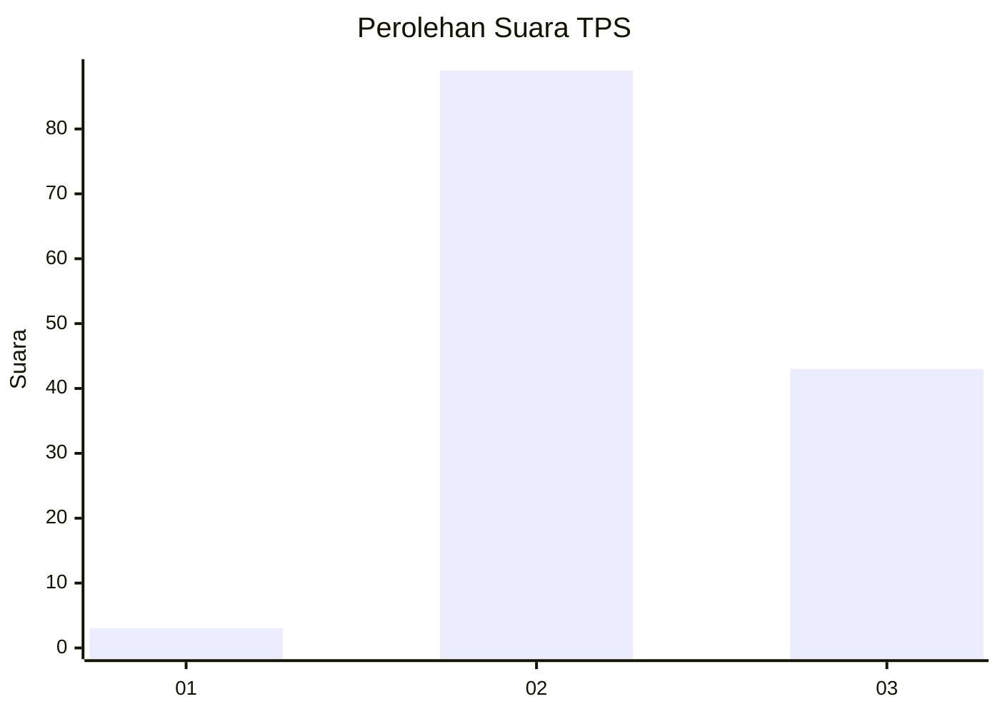
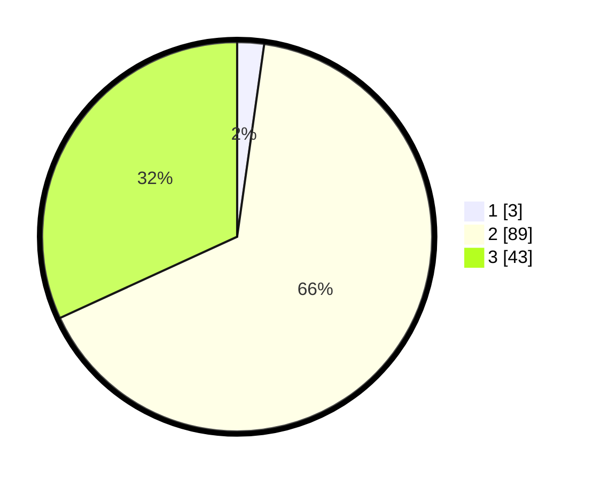

# Hasil

## Grafik

## Tabel

| No. | Nama Paslon    | Suara | Suara (raw) | Persentase |
|:--- |:-------------- | -----:| -----------:| ----------:|
| 1   | ANIES MUHAIMIN | 3     | [3][p-1]    | 2,22       |
| 2   | PRABOWO GIBRAN | 89    | [89][p-2]   | 65,93      |
| 3   | GANJAR MAHFUD  | 43    | [43][p-3]   | 31,85      |

[p-1]: https://github.com/gigit-pemilu/pemilu-2024-51-bali/blob/main/pilpres/hitung-suara/sub/51-bali/sub/07-karangasem/sub/04-karangasem/sub/2010-tegalinggah/sub/009-tps/sub/paslon-1.txt
[p-2]: https://github.com/gigit-pemilu/pemilu-2024-51-bali/blob/main/pilpres/hitung-suara/sub/51-bali/sub/07-karangasem/sub/04-karangasem/sub/2010-tegalinggah/sub/009-tps/sub/paslon-2.txt
[p-3]: https://github.com/gigit-pemilu/pemilu-2024-51-bali/blob/main/pilpres/hitung-suara/sub/51-bali/sub/07-karangasem/sub/04-karangasem/sub/2010-tegalinggah/sub/009-tps/sub/paslon-3.txt

## Foto C Plano

https://sirekap-obj-formc.kpu.go.id/b91a/pemilu/ppwp/51/07/04/20/10/5107042010009-20240214-132447--8ea1c277-b23e-47c3-8f49-3892e4212a92.jpg

https://sirekap-obj-formc.kpu.go.id/b91a/pemilu/ppwp/51/07/04/20/10/5107042010009-20240214-132621--29200640-5442-4fad-aed0-086ac120fe04.jpg

https://sirekap-obj-formc.kpu.go.id/b91a/pemilu/ppwp/51/07/04/20/10/5107042010009-20240214-132742--221db45c-11a1-4b3a-8ce5-dcf963a8c6dd.jpg

## Metadata

| Key        | Value               |
| ---------- | ------------------- |
| Time Stamp | 2024-02-19 06:16:00 |

