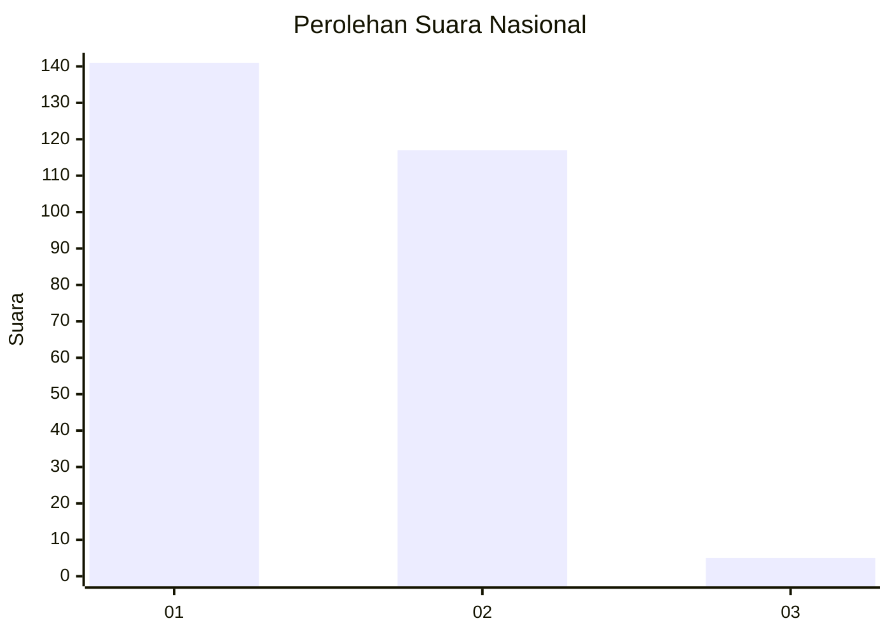
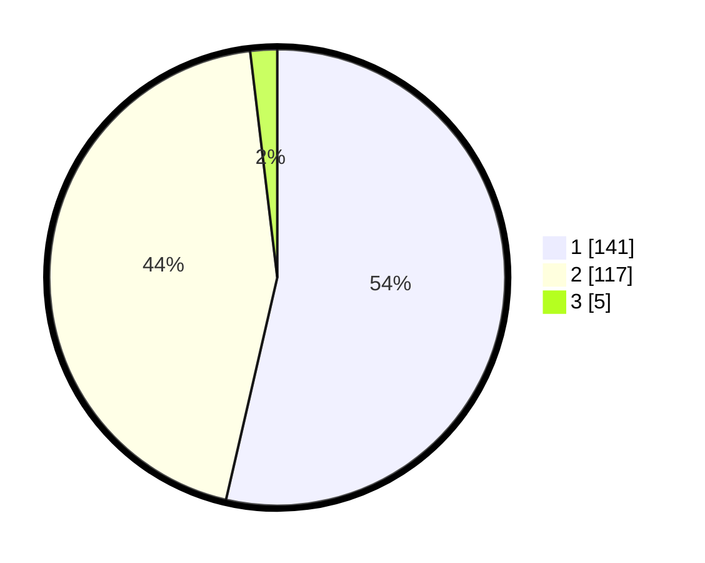

# Hasil

## Grafik

## Tabel

| No. | Nama Paslon    | Suara | Suara (raw) | Persentase |
|:--- |:-------------- | -----:| -----------:| ----------:|
| 1   | ANIES MUHAIMIN | 141   | [141][p-1]  | 53,61      |
| 2   | PRABOWO GIBRAN | 117   | [117][p-2]  | 44,49      |
| 3   | GANJAR MAHFUD  | 5     | [5][p-3]    | 1,90       |

[p-1]: https://github.com/gigit-pemilu/pemilu-2024/blob/main/pilpres/hitung-suara/sub/51-bali/sub/07-karangasem/sub/04-karangasem/sub/2011-bukit/sub/001-tps/sub/paslon-1.txt
[p-2]: https://github.com/gigit-pemilu/pemilu-2024/blob/main/pilpres/hitung-suara/sub/51-bali/sub/07-karangasem/sub/04-karangasem/sub/2011-bukit/sub/001-tps/sub/paslon-2.txt
[p-3]: https://github.com/gigit-pemilu/pemilu-2024/blob/main/pilpres/hitung-suara/sub/51-bali/sub/07-karangasem/sub/04-karangasem/sub/2011-bukit/sub/001-tps/sub/paslon-3.txt

## Foto C Plano

https://sirekap-obj-formc.kpu.go.id/2d7a/pemilu/ppwp/51/07/04/20/11/5107042011001-20240220-075300--6bc44508-3ee7-4423-82fa-3fa7fa2a2cf2.jpg

https://sirekap-obj-formc.kpu.go.id/2d7a/pemilu/ppwp/51/07/04/20/11/5107042011001-20240220-075400--7bcb1f0c-0479-4c99-8eb1-8da7f454e965.jpg

https://sirekap-obj-formc.kpu.go.id/2d7a/pemilu/ppwp/51/07/04/20/11/5107042011001-20240220-075439--ddc42fa3-467b-49e3-8112-e38515c38bdf.jpg

## Metadata

| Key        | Value               |
| ---------- | ------------------- |
| Time Stamp | 2024-02-24 22:31:28 |

