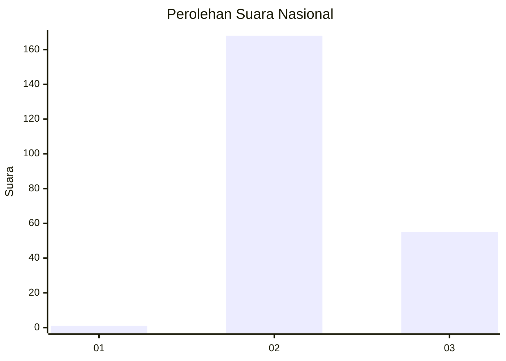
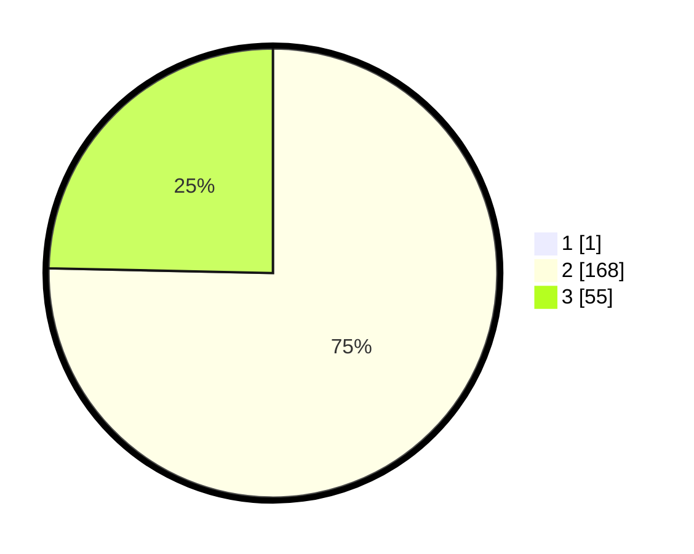

# Hasil

## Grafik

## Tabel

| No. | Nama Paslon    | Suara | Suara (raw) | Persentase |
|:--- |:-------------- | -----:| -----------:| ----------:|
| 1   | ANIES MUHAIMIN | 1     | [1][p-1]    | 0,45       |
| 2   | PRABOWO GIBRAN | 168   | [168][p-2]  | 75,00      |
| 3   | GANJAR MAHFUD  | 55    | [55][p-3]   | 24,55      |

[p-1]: https://github.com/gigit-pemilu/pemilu-2024/blob/main/pilpres/hitung-suara/sub/51-bali/sub/07-karangasem/sub/04-karangasem/sub/2011-bukit/sub/002-tps/sub/paslon-1.txt
[p-2]: https://github.com/gigit-pemilu/pemilu-2024/blob/main/pilpres/hitung-suara/sub/51-bali/sub/07-karangasem/sub/04-karangasem/sub/2011-bukit/sub/002-tps/sub/paslon-2.txt
[p-3]: https://github.com/gigit-pemilu/pemilu-2024/blob/main/pilpres/hitung-suara/sub/51-bali/sub/07-karangasem/sub/04-karangasem/sub/2011-bukit/sub/002-tps/sub/paslon-3.txt

## Foto C Plano

https://sirekap-obj-formc.kpu.go.id/90ba/pemilu/ppwp/51/07/04/20/11/5107042011002-20240220-085415--53f10337-4370-4372-8b0e-54ba0f3f8a92.jpg

https://sirekap-obj-formc.kpu.go.id/90ba/pemilu/ppwp/51/07/04/20/11/5107042011002-20240220-085445--6a8963e4-51df-4227-b344-ae46e4bdc509.jpg

https://sirekap-obj-formc.kpu.go.id/90ba/pemilu/ppwp/51/07/04/20/11/5107042011002-20240220-085508--1926e314-6fdc-435f-a751-5056dc0922e0.jpg

## Metadata

| Key        | Value               |
| ---------- | ------------------- |
| Time Stamp | 2024-02-24 22:31:28 |

