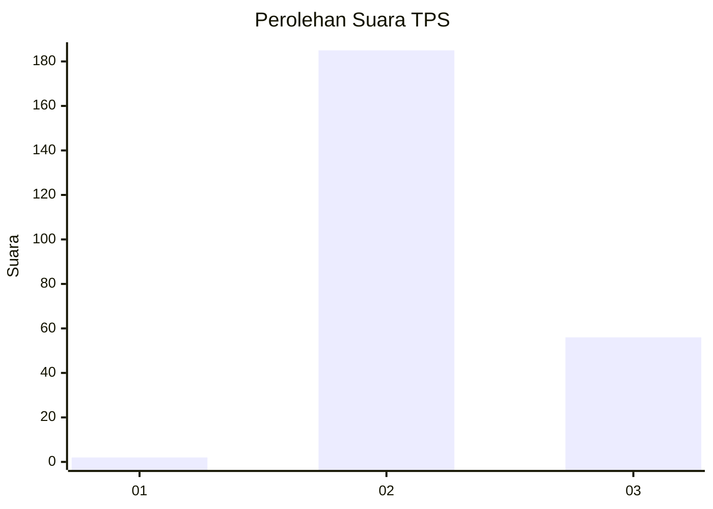
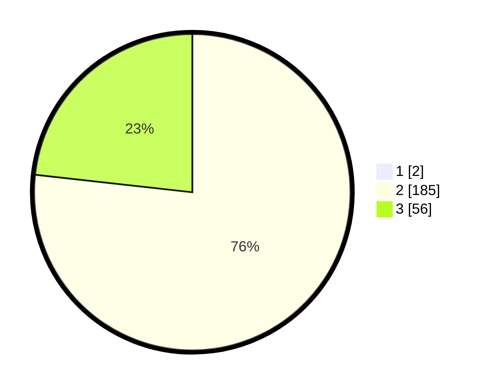

# Hasil

## Grafik

## Tabel

| No. | Nama Paslon    | Suara | Suara (raw) | Persentase |
|:--- |:-------------- | -----:| -----------:| ----------:|
| 1   | ANIES MUHAIMIN | 2     | [2][p-1]    | 0,82       |
| 2   | PRABOWO GIBRAN | 185   | [185][p-2]  | 76,13      |
| 3   | GANJAR MAHFUD  | 56    | [56][p-3]   | 23,05      |

[p-1]: https://github.com/gigit-pemilu/pemilu-2024-51-bali/blob/main/pilpres/hitung-suara/sub/51-bali/sub/07-karangasem/sub/04-karangasem/sub/2011-bukit/sub/006-tps/sub/paslon-1.txt
[p-2]: https://github.com/gigit-pemilu/pemilu-2024-51-bali/blob/main/pilpres/hitung-suara/sub/51-bali/sub/07-karangasem/sub/04-karangasem/sub/2011-bukit/sub/006-tps/sub/paslon-2.txt
[p-3]: https://github.com/gigit-pemilu/pemilu-2024-51-bali/blob/main/pilpres/hitung-suara/sub/51-bali/sub/07-karangasem/sub/04-karangasem/sub/2011-bukit/sub/006-tps/sub/paslon-3.txt

## Foto C Plano

https://sirekap-obj-formc.kpu.go.id/3abe/pemilu/ppwp/51/07/04/20/11/5107042011006-20240216-141002--65a13506-b356-42b4-97f3-4ec37212ce4d.jpg

https://sirekap-obj-formc.kpu.go.id/3abe/pemilu/ppwp/51/07/04/20/11/5107042011006-20240216-141004--0721aec7-2267-452f-bdbf-5a0f9cb30685.jpg

https://sirekap-obj-formc.kpu.go.id/3abe/pemilu/ppwp/51/07/04/20/11/5107042011006-20240216-141003--ba945f43-3c2f-4992-801c-3c558f9955d8.jpg

## Metadata

| Key        | Value               |
| ---------- | ------------------- |
| Time Stamp | 2024-02-17 10:30:03 |

## DATA PEMILIH TETAP

Jumlah pemilih dalam DPT: **288**.
 * L: **147**.
 * P: **141**.

## DATA PENGGUNA HAK PILIH

Jumlah pengguna hak pilih dalam DPT: **237**.
 * L: **122**.
 * P: **115**.

Jumlah pengguna hak pilih dalam DPTb: **0**.
 * L: **0**.
 * P: **0**.

Jumlah pengguna hak pilih dalam DPK: **12**.
 * L: **5**.
 * P: **7**.

Jumlah pengguna hak pilih: **249**.
 * L: **127**.
 * P: **122**.

## JUMLAH SUARA SAH DAN TIDAK SAH

JUMLAH SELURUH SUARA SAH: **243**.

JUMLAH SUARA TIDAK SAH: **6**.

JUMLAH SELURUH SUARA SAH DAN SUARA TIDAK SAH: **249**.

