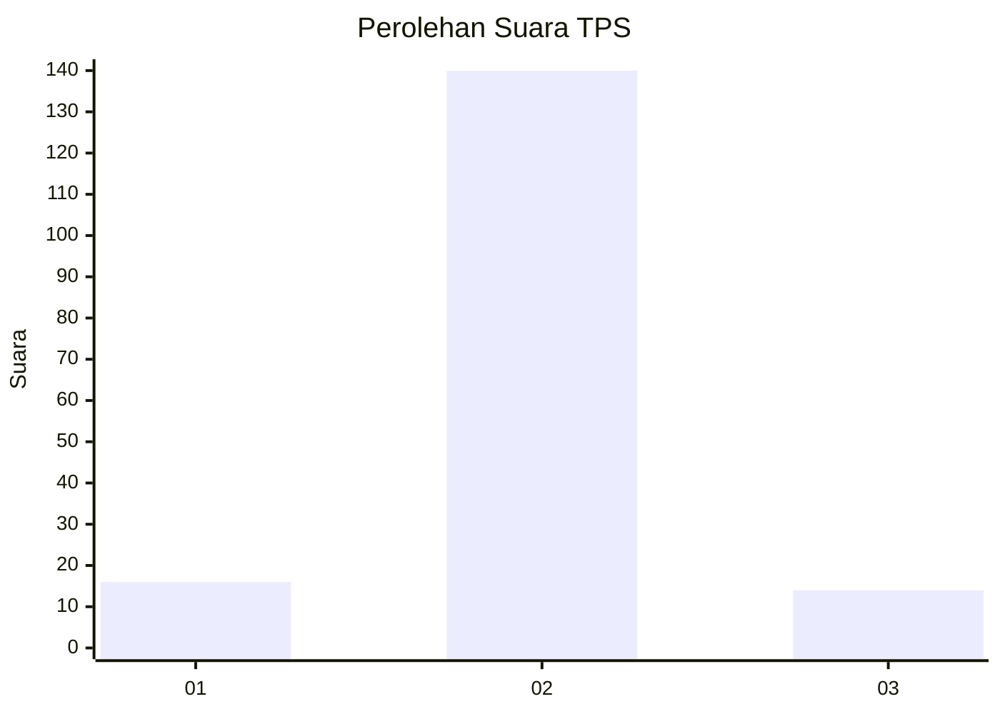
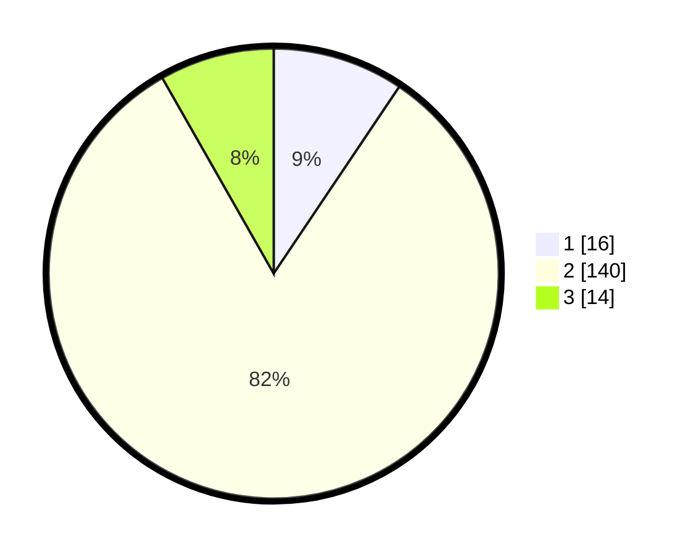

# Hasil

## Grafik

## Tabel

| No. | Nama Paslon    | Suara | Suara (raw) | Persentase |
|:--- |:-------------- | -----:| -----------:| ----------:|
| 1   | ANIES MUHAIMIN | 16    | [16][p-1]   | 9,41       |
| 2   | PRABOWO GIBRAN | 140   | [140][p-2]  | 82,35      |
| 3   | GANJAR MAHFUD  | 14    | [14][p-3]   | 8,24       |

[p-1]: https://github.com/gigit-pemilu/pemilu-2024-51-bali/blob/main/pilpres/hitung-suara/sub/51-bali/sub/07-karangasem/sub/04-karangasem/sub/2011-bukit/sub/014-tps/sub/paslon-1.txt
[p-2]: https://github.com/gigit-pemilu/pemilu-2024-51-bali/blob/main/pilpres/hitung-suara/sub/51-bali/sub/07-karangasem/sub/04-karangasem/sub/2011-bukit/sub/014-tps/sub/paslon-2.txt
[p-3]: https://github.com/gigit-pemilu/pemilu-2024-51-bali/blob/main/pilpres/hitung-suara/sub/51-bali/sub/07-karangasem/sub/04-karangasem/sub/2011-bukit/sub/014-tps/sub/paslon-3.txt

## Foto C Plano

https://sirekap-obj-formc.kpu.go.id/8eb2/pemilu/ppwp/51/07/04/20/11/5107042011014-20240215-005412--322f699e-406d-4821-a4d4-2b564c14f6f3.jpg

https://sirekap-obj-formc.kpu.go.id/8eb2/pemilu/ppwp/51/07/04/20/11/5107042011014-20240215-005423--8f595b1c-b14d-4b21-817a-3561f4b2e67a.jpg

https://sirekap-obj-formc.kpu.go.id/8eb2/pemilu/ppwp/51/07/04/20/11/5107042011014-20240215-203654--61e2b99a-09ce-41ff-81c4-07c7b10c8f39.jpg

## Metadata

| Key        | Value               |
| ---------- | ------------------- |
| Time Stamp | 2024-02-16 12:51:22 |

## DATA PEMILIH TETAP

Jumlah pemilih dalam DPT: **201**.
 * L: **94**.
 * P: **107**.

## DATA PENGGUNA HAK PILIH

Jumlah pengguna hak pilih dalam DPT: **169**.
 * L: **85**.
 * P: **84**.

Jumlah pengguna hak pilih dalam DPTb: **0**.
 * L: **0**.
 * P: **0**.

Jumlah pengguna hak pilih dalam DPK: **5**.
 * L: **3**.
 * P: **2**.

Jumlah pengguna hak pilih: **174**.
 * L: **88**.
 * P: **86**.

## JUMLAH SUARA SAH DAN TIDAK SAH

JUMLAH SELURUH SUARA SAH: **170**.

JUMLAH SUARA TIDAK SAH: **4**.

JUMLAH SELURUH SUARA SAH DAN SUARA TIDAK SAH: **174**.

