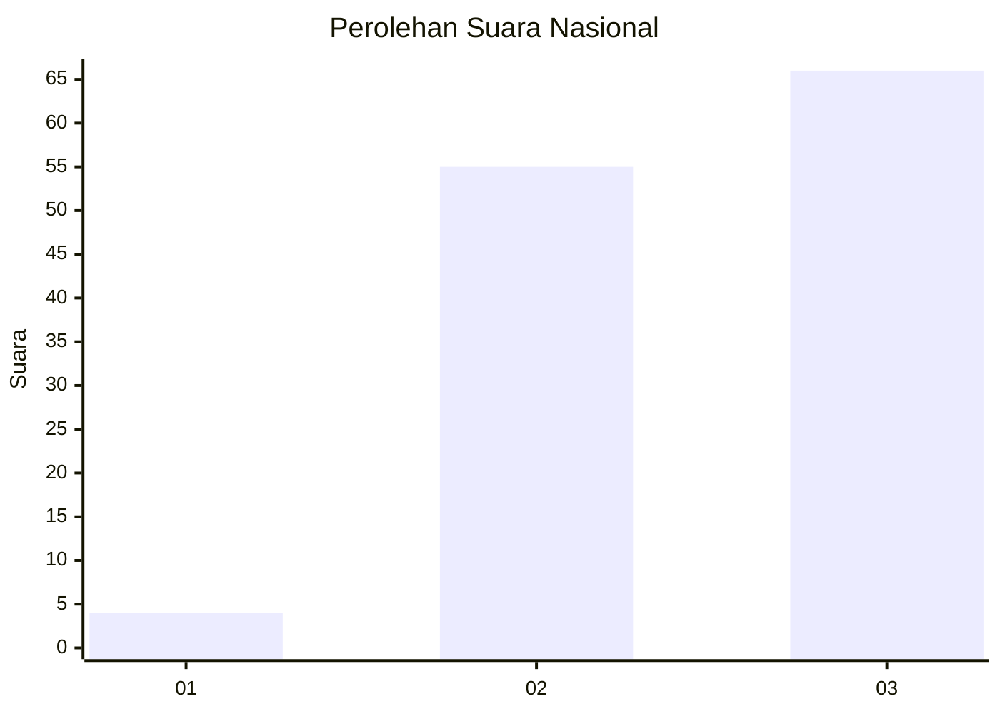
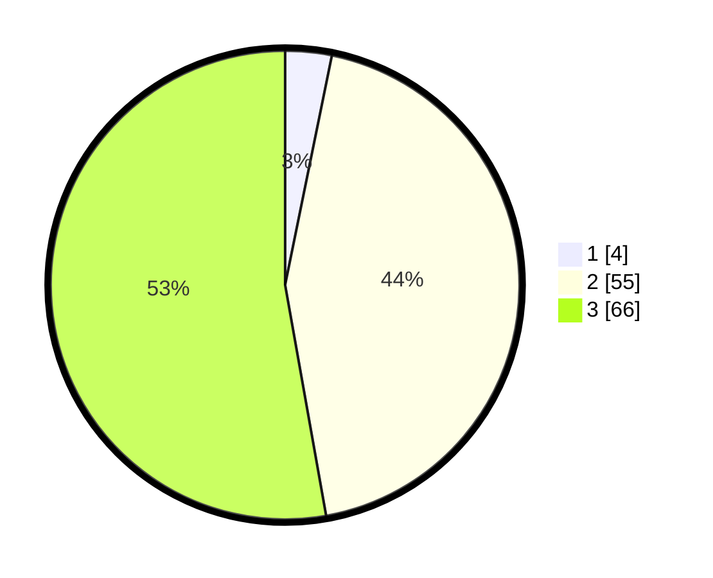

# Hasil

## Grafik

## Tabel

| No. | Nama Paslon    | Suara | Suara (raw) | Persentase |
|:--- |:-------------- | -----:| -----------:| ----------:|
| 1   | ANIES MUHAIMIN | 4     | [4][p-1]    | 3,20       |
| 2   | PRABOWO GIBRAN | 55    | [55][p-2]   | 44,00      |
| 3   | GANJAR MAHFUD  | 66    | [66][p-3]   | 52,80      |

[p-1]: https://github.com/gigit-pemilu/pemilu-2024/blob/main/pilpres/hitung-suara/sub/51-bali/sub/07-karangasem/sub/05-abang/sub/2001-ababi/sub/001-tps/sub/paslon-1.txt
[p-2]: https://github.com/gigit-pemilu/pemilu-2024/blob/main/pilpres/hitung-suara/sub/51-bali/sub/07-karangasem/sub/05-abang/sub/2001-ababi/sub/001-tps/sub/paslon-2.txt
[p-3]: https://github.com/gigit-pemilu/pemilu-2024/blob/main/pilpres/hitung-suara/sub/51-bali/sub/07-karangasem/sub/05-abang/sub/2001-ababi/sub/001-tps/sub/paslon-3.txt

## Foto C Plano

https://sirekap-obj-formc.kpu.go.id/eedd/pemilu/ppwp/51/07/05/20/01/5107052001001-20240225-185629--28901fa0-9014-4400-b209-b9616bbff54c.jpg

https://sirekap-obj-formc.kpu.go.id/eedd/pemilu/ppwp/51/07/05/20/01/5107052001001-20240225-185631--f6381e18-0f85-46ab-bbe3-36b139c946a6.jpg

https://sirekap-obj-formc.kpu.go.id/eedd/pemilu/ppwp/51/07/05/20/01/5107052001001-20240225-185630--49eaf471-6575-4819-bb89-7a9b59603323.jpg

## Metadata

| Key        | Value               |
| ---------- | ------------------- |
| Time Stamp | 2024-02-25 22:00:00 |

## DATA PEMILIH TETAP

Jumlah pemilih dalam DPT: **168**.
 * L: **86**.
 * P: **82**.

## DATA PENGGUNA HAK PILIH

Jumlah pengguna hak pilih dalam DPT: **135**.
 * L: **72**.
 * P: **63**.

Jumlah pengguna hak pilih dalam DPTb: **0**.
 * L: **0**.
 * P: **0**.

Jumlah pengguna hak pilih dalam DPK: **0**.
 * L: **0**.
 * P: **0**.

Jumlah pengguna hak pilih: **135**.
 * L: **72**.
 * P: **63**.

## JUMLAH SUARA SAH DAN TIDAK SAH

JUMLAH SELURUH SUARA SAH: **125**.

JUMLAH SUARA TIDAK SAH: **10**.

JUMLAH SELURUH SUARA SAH DAN SUARA TIDAK SAH: **135**.

