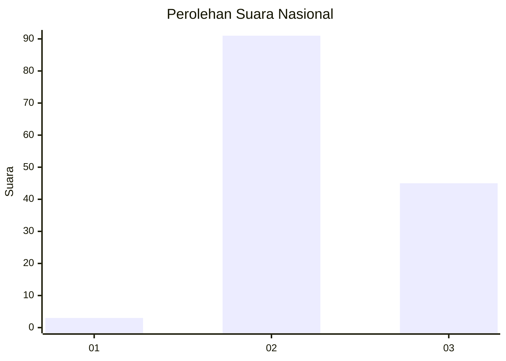
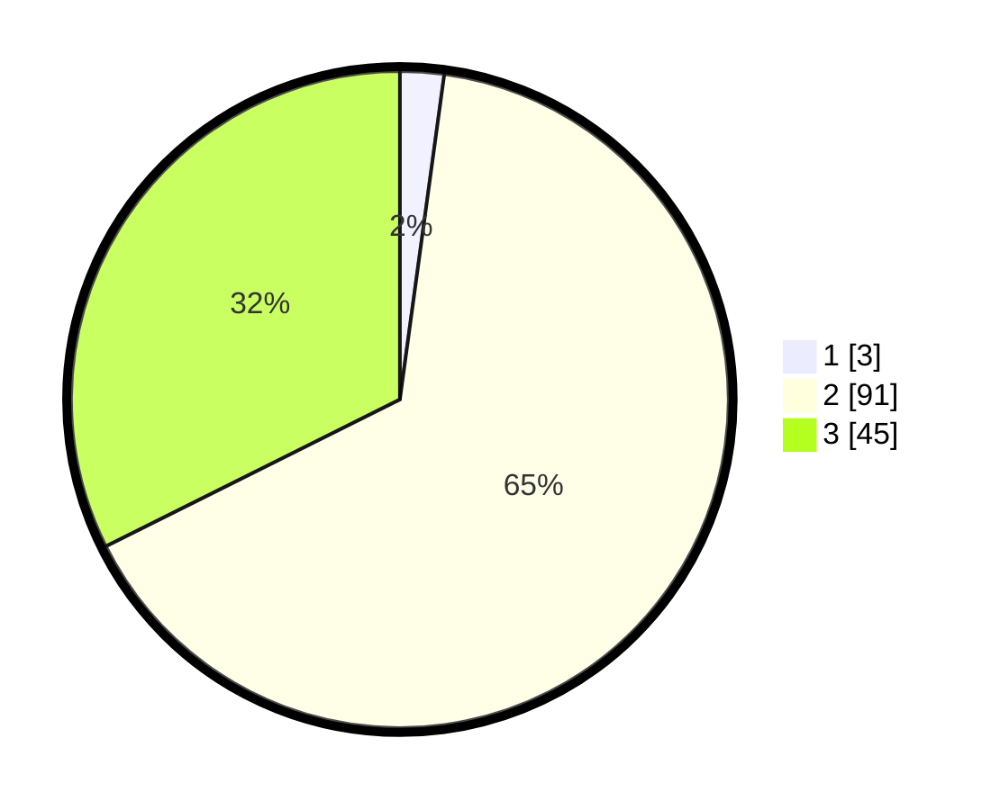

# Hasil

## Grafik

## Tabel

| No. | Nama Paslon    | Suara | Suara (raw) | Persentase |
|:--- |:-------------- | -----:| -----------:| ----------:|
| 1   | ANIES MUHAIMIN | 3     | [3][p-1]    | 2,16       |
| 2   | PRABOWO GIBRAN | 91    | [91][p-2]   | 65,47      |
| 3   | GANJAR MAHFUD  | 45    | [45][p-3]   | 32,37      |

[p-1]: https://github.com/gigit-pemilu/pemilu-2024/blob/main/pilpres/hitung-suara/sub/51-bali/sub/07-karangasem/sub/05-abang/sub/2001-ababi/sub/002-tps/sub/paslon-1.txt
[p-2]: https://github.com/gigit-pemilu/pemilu-2024/blob/main/pilpres/hitung-suara/sub/51-bali/sub/07-karangasem/sub/05-abang/sub/2001-ababi/sub/002-tps/sub/paslon-2.txt
[p-3]: https://github.com/gigit-pemilu/pemilu-2024/blob/main/pilpres/hitung-suara/sub/51-bali/sub/07-karangasem/sub/05-abang/sub/2001-ababi/sub/002-tps/sub/paslon-3.txt

## Foto C Plano

https://sirekap-obj-formc.kpu.go.id/9d06/pemilu/ppwp/51/07/05/20/01/5107052001002-20240225-194132--7724f254-1505-420e-b4d2-aefe6f36e2b3.jpg

https://sirekap-obj-formc.kpu.go.id/9d06/pemilu/ppwp/51/07/05/20/01/5107052001002-20240225-194134--a42dd4bf-9acf-4952-85e4-a897445e175c.jpg

https://sirekap-obj-formc.kpu.go.id/9d06/pemilu/ppwp/51/07/05/20/01/5107052001002-20240225-194133--005521d8-939e-48d5-9858-eb354e5e8f13.jpg

## Metadata

| Key        | Value               |
| ---------- | ------------------- |
| Time Stamp | 2024-02-25 22:00:00 |

## DATA PEMILIH TETAP

Jumlah pemilih dalam DPT: **198**.
 * L: **101**.
 * P: **97**.

## DATA PENGGUNA HAK PILIH

Jumlah pengguna hak pilih dalam DPT: **141**.
 * L: **77**.
 * P: **64**.

Jumlah pengguna hak pilih dalam DPTb: **0**.
 * L: **0**.
 * P: **0**.

Jumlah pengguna hak pilih dalam DPK: **0**.
 * L: **0**.
 * P: **0**.

Jumlah pengguna hak pilih: **141**.
 * L: **77**.
 * P: **64**.

## JUMLAH SUARA SAH DAN TIDAK SAH

JUMLAH SELURUH SUARA SAH: **139**.

JUMLAH SUARA TIDAK SAH: **2**.

JUMLAH SELURUH SUARA SAH DAN SUARA TIDAK SAH: **141**.

