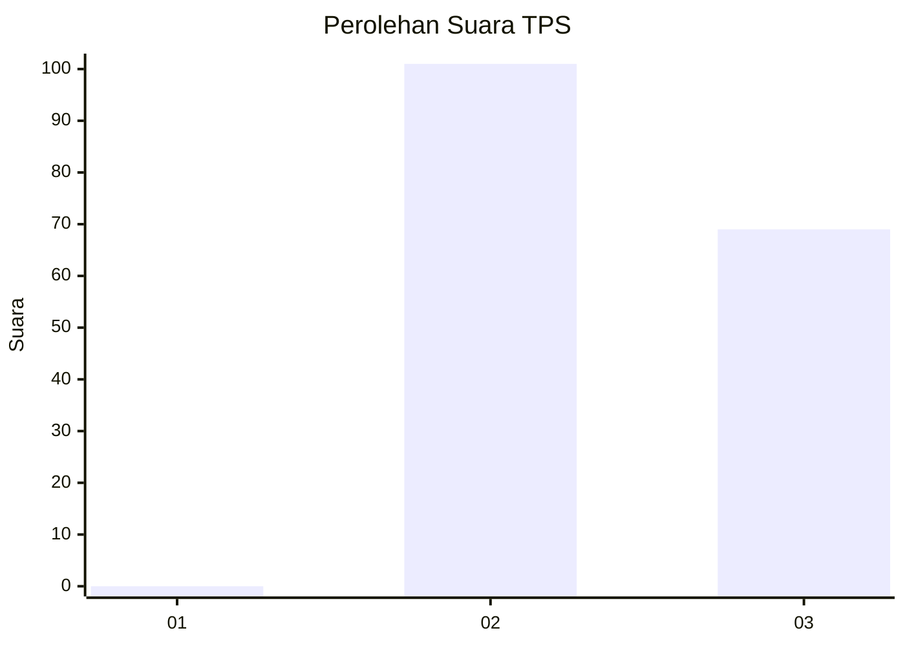
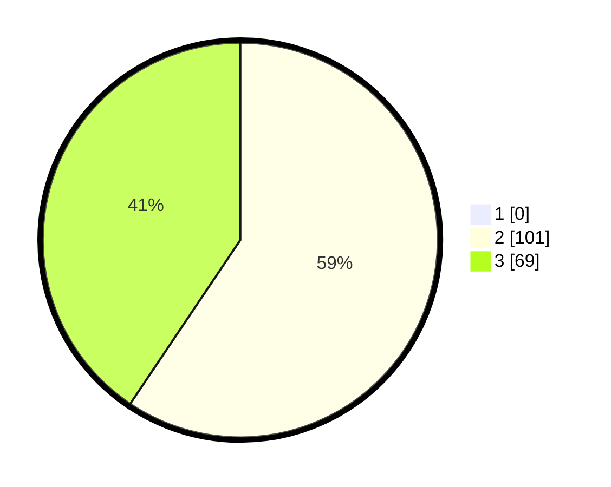

# Hasil

## Grafik

## Tabel

| No. | Nama Paslon    | Suara | Suara (raw) | Persentase |
|:--- |:-------------- | -----:| -----------:| ----------:|
| 1   | ANIES MUHAIMIN | 0     | [0][p-1]    | 0,00       |
| 2   | PRABOWO GIBRAN | 101   | [101][p-2]  | 59,41      |
| 3   | GANJAR MAHFUD  | 69    | [69][p-3]   | 40,59      |

[p-1]: https://github.com/gigit-pemilu/pemilu-2024-51-bali/blob/main/pilpres/hitung-suara/sub/51-bali/sub/07-karangasem/sub/05-abang/sub/2001-ababi/sub/003-tps/sub/paslon-1.txt
[p-2]: https://github.com/gigit-pemilu/pemilu-2024-51-bali/blob/main/pilpres/hitung-suara/sub/51-bali/sub/07-karangasem/sub/05-abang/sub/2001-ababi/sub/003-tps/sub/paslon-2.txt
[p-3]: https://github.com/gigit-pemilu/pemilu-2024-51-bali/blob/main/pilpres/hitung-suara/sub/51-bali/sub/07-karangasem/sub/05-abang/sub/2001-ababi/sub/003-tps/sub/paslon-3.txt

## Foto C Plano

https://sirekap-obj-formc.kpu.go.id/439c/pemilu/ppwp/51/07/05/20/01/5107052001003-20240225-200556--88b4a6dc-79b2-4d2e-9bc9-12e33e55c40c.jpg

https://sirekap-obj-formc.kpu.go.id/439c/pemilu/ppwp/51/07/05/20/01/5107052001003-20240225-202630--91760d23-9674-4a01-8278-1aba8733dcda.jpg

https://sirekap-obj-formc.kpu.go.id/439c/pemilu/ppwp/51/07/05/20/01/5107052001003-20240225-202931--c4ed926b-9ede-4e05-b21e-3bb40a84635e.jpg

## Metadata

| Key        | Value               |
| ---------- | ------------------- |
| Time Stamp | 2024-02-25 21:00:00 |

## DATA PEMILIH TETAP

Jumlah pemilih dalam DPT: **199**.
 * L: **107**.
 * P: **92**.

## DATA PENGGUNA HAK PILIH

Jumlah pengguna hak pilih dalam DPT: **173**.
 * L: **97**.
 * P: **76**.

Jumlah pengguna hak pilih dalam DPTb: **2**.
 * L: **1**.
 * P: **1**.

Jumlah pengguna hak pilih dalam DPK: **0**.
 * L: **0**.
 * P: **0**.

Jumlah pengguna hak pilih: **175**.
 * L: **98**.
 * P: **77**.

## JUMLAH SUARA SAH DAN TIDAK SAH

JUMLAH SELURUH SUARA SAH: **170**.

JUMLAH SUARA TIDAK SAH: **5**.

JUMLAH SELURUH SUARA SAH DAN SUARA TIDAK SAH: **175**.

