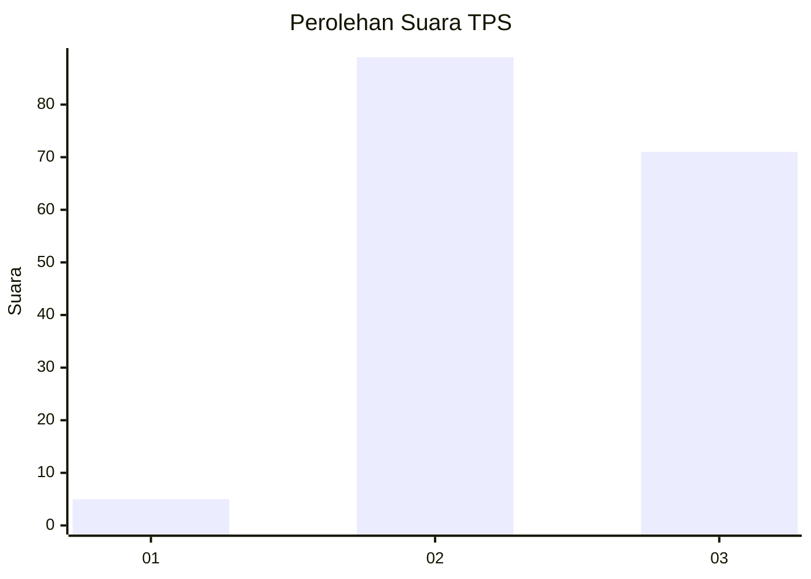
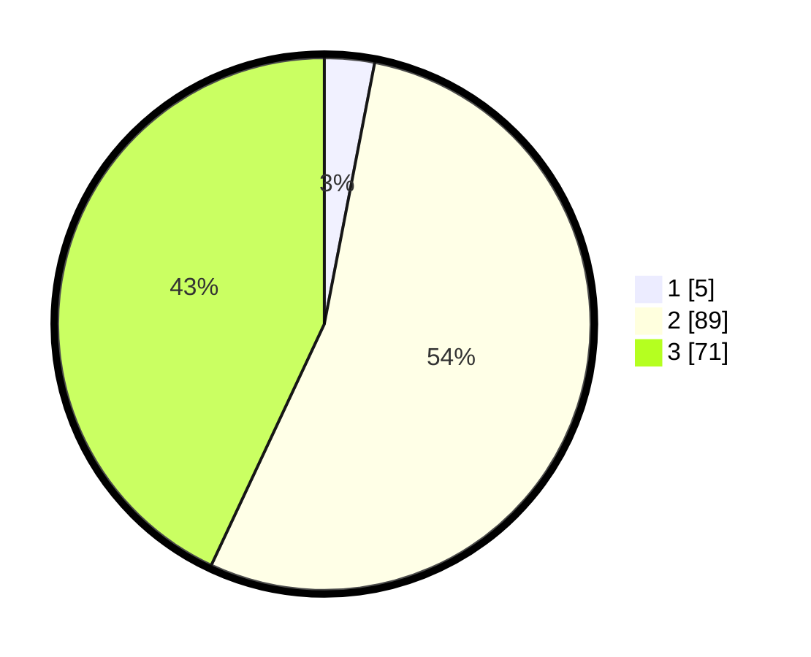

# Hasil

## Grafik

## Tabel

| No. | Nama Paslon    | Suara | Suara (raw) | Persentase |
|:--- |:-------------- | -----:| -----------:| ----------:|
| 1   | ANIES MUHAIMIN | 5     | [5][p-1]    | 3,03       |
| 2   | PRABOWO GIBRAN | 89    | [89][p-2]   | 53,94      |
| 3   | GANJAR MAHFUD  | 71    | [71][p-3]   | 43,03      |

[p-1]: https://github.com/gigit-pemilu/pemilu-2024-51-bali/blob/main/pilpres/hitung-suara/sub/51-bali/sub/07-karangasem/sub/05-abang/sub/2001-ababi/sub/004-tps/sub/paslon-1.txt
[p-2]: https://github.com/gigit-pemilu/pemilu-2024-51-bali/blob/main/pilpres/hitung-suara/sub/51-bali/sub/07-karangasem/sub/05-abang/sub/2001-ababi/sub/004-tps/sub/paslon-2.txt
[p-3]: https://github.com/gigit-pemilu/pemilu-2024-51-bali/blob/main/pilpres/hitung-suara/sub/51-bali/sub/07-karangasem/sub/05-abang/sub/2001-ababi/sub/004-tps/sub/paslon-3.txt

## Foto C Plano

https://sirekap-obj-formc.kpu.go.id/b38a/pemilu/ppwp/51/07/05/20/01/5107052001004-20240225-155804--3a0918db-ec1d-48b9-a969-7fb842deeb14.jpg

https://sirekap-obj-formc.kpu.go.id/b38a/pemilu/ppwp/51/07/05/20/01/5107052001004-20240225-155805--8401c069-c6f7-439f-88c4-e57880e25f65.jpg

https://sirekap-obj-formc.kpu.go.id/b38a/pemilu/ppwp/51/07/05/20/01/5107052001004-20240225-155805--378d1170-b62a-4cb6-9583-9ae0c07e1881.jpg

## Metadata

| Key        | Value               |
| ---------- | ------------------- |
| Time Stamp | 2024-02-25 21:00:00 |

## DATA PEMILIH TETAP

Jumlah pemilih dalam DPT: **200**.
 * L: **100**.
 * P: **100**.

## DATA PENGGUNA HAK PILIH

Jumlah pengguna hak pilih dalam DPT: **165**.
 * L: **87**.
 * P: **78**.

Jumlah pengguna hak pilih dalam DPTb: **0**.
 * L: **0**.
 * P: **0**.

Jumlah pengguna hak pilih dalam DPK: **0**.
 * L: **0**.
 * P: **0**.

Jumlah pengguna hak pilih: **165**.
 * L: **87**.
 * P: **78**.

## JUMLAH SUARA SAH DAN TIDAK SAH

JUMLAH SELURUH SUARA SAH: **165**.

JUMLAH SUARA TIDAK SAH: **0**.

JUMLAH SELURUH SUARA SAH DAN SUARA TIDAK SAH: **165**.

