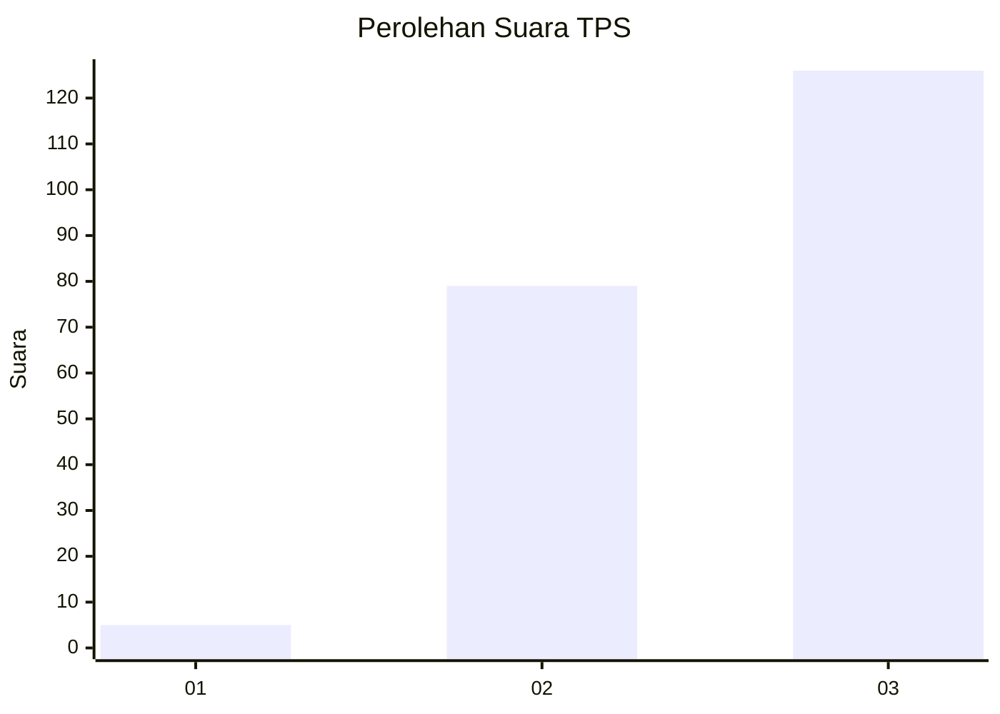
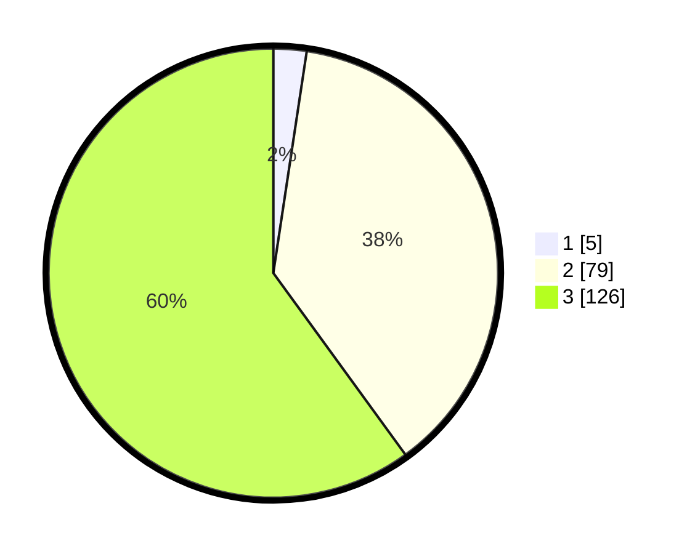

# Hasil

## Grafik

## Tabel

| No. | Nama Paslon    | Suara | Suara (raw) | Persentase |
|:--- |:-------------- | -----:| -----------:| ----------:|
| 1   | ANIES MUHAIMIN | 5     | [5][p-1]    | 2,38       |
| 2   | PRABOWO GIBRAN | 79    | [79][p-2]   | 37,62      |
| 3   | GANJAR MAHFUD  | 126   | [126][p-3]  | 60,00      |

[p-1]: https://github.com/gigit-pemilu/pemilu-2024-51-bali/blob/main/pilpres/hitung-suara/sub/51-bali/sub/07-karangasem/sub/05-abang/sub/2001-ababi/sub/005-tps/sub/paslon-1.txt
[p-2]: https://github.com/gigit-pemilu/pemilu-2024-51-bali/blob/main/pilpres/hitung-suara/sub/51-bali/sub/07-karangasem/sub/05-abang/sub/2001-ababi/sub/005-tps/sub/paslon-2.txt
[p-3]: https://github.com/gigit-pemilu/pemilu-2024-51-bali/blob/main/pilpres/hitung-suara/sub/51-bali/sub/07-karangasem/sub/05-abang/sub/2001-ababi/sub/005-tps/sub/paslon-3.txt

## Foto C Plano

https://sirekap-obj-formc.kpu.go.id/347e/pemilu/ppwp/51/07/05/20/01/5107052001005-20240225-094937--88f8136d-e36b-4393-b294-1304996bdecb.jpg

https://sirekap-obj-formc.kpu.go.id/347e/pemilu/ppwp/51/07/05/20/01/5107052001005-20240225-095048--f12fffdf-d7f0-45b4-9883-18b55dc61a04.jpg

https://sirekap-obj-formc.kpu.go.id/347e/pemilu/ppwp/51/07/05/20/01/5107052001005-20240225-095152--87038700-a053-4b23-be86-31252b136204.jpg

## Metadata

| Key        | Value               |
| ---------- | ------------------- |
| Time Stamp | 2024-02-25 10:00:00 |

## DATA PEMILIH TETAP

Jumlah pemilih dalam DPT: **249**.
 * L: **130**.
 * P: **119**.

## DATA PENGGUNA HAK PILIH

Jumlah pengguna hak pilih dalam DPT: **213**.
 * L: **116**.
 * P: **97**.

Jumlah pengguna hak pilih dalam DPTb: **0**.
 * L: **0**.
 * P: **0**.

Jumlah pengguna hak pilih dalam DPK: **3**.
 * L: **2**.
 * P: **1**.

Jumlah pengguna hak pilih: **216**.
 * L: **118**.
 * P: **98**.

## JUMLAH SUARA SAH DAN TIDAK SAH

JUMLAH SELURUH SUARA SAH: **210**.

JUMLAH SUARA TIDAK SAH: **6**.

JUMLAH SELURUH SUARA SAH DAN SUARA TIDAK SAH: **216**.

