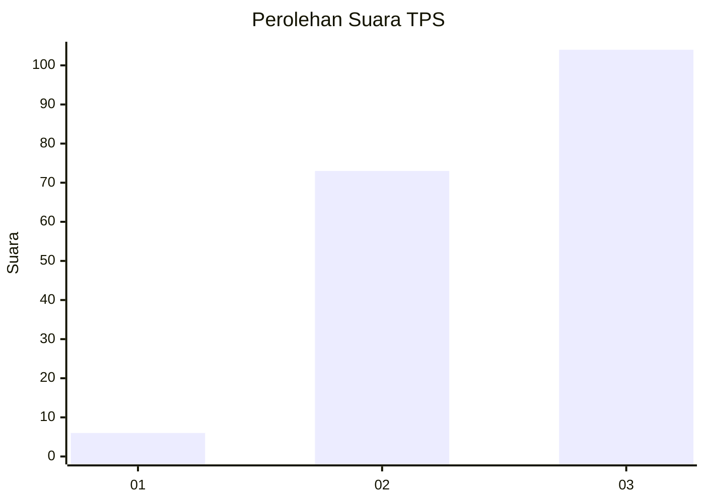
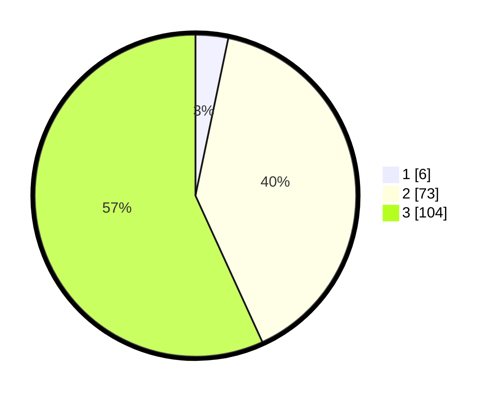

# Hasil

## Grafik

## Tabel

| No. | Nama Paslon    | Suara | Suara (raw) | Persentase |
|:--- |:-------------- | -----:| -----------:| ----------:|
| 1   | ANIES MUHAIMIN | 6     | [6][p-1]    | 3,28       |
| 2   | PRABOWO GIBRAN | 73    | [73][p-2]   | 39,89      |
| 3   | GANJAR MAHFUD  | 104   | [104][p-3]  | 56,83      |

[p-1]: https://github.com/gigit-pemilu/pemilu-2024-51-bali/blob/main/pilpres/hitung-suara/sub/51-bali/sub/07-karangasem/sub/05-abang/sub/2001-ababi/sub/008-tps/sub/paslon-1.txt
[p-2]: https://github.com/gigit-pemilu/pemilu-2024-51-bali/blob/main/pilpres/hitung-suara/sub/51-bali/sub/07-karangasem/sub/05-abang/sub/2001-ababi/sub/008-tps/sub/paslon-2.txt
[p-3]: https://github.com/gigit-pemilu/pemilu-2024-51-bali/blob/main/pilpres/hitung-suara/sub/51-bali/sub/07-karangasem/sub/05-abang/sub/2001-ababi/sub/008-tps/sub/paslon-3.txt

## Foto C Plano

https://sirekap-obj-formc.kpu.go.id/e25f/pemilu/ppwp/51/07/05/20/01/5107052001008-20240225-184524--fb1fd7f0-75ce-4583-b448-3216e08bdc77.jpg

https://sirekap-obj-formc.kpu.go.id/e25f/pemilu/ppwp/51/07/05/20/01/5107052001008-20240225-184526--bce0bea3-88c1-4bfd-b501-efc7c7898545.jpg

https://sirekap-obj-formc.kpu.go.id/e25f/pemilu/ppwp/51/07/05/20/01/5107052001008-20240225-184525--128d4c6c-8fee-4b96-be7f-1559b5a249db.jpg

## Metadata

| Key        | Value               |
| ---------- | ------------------- |
| Time Stamp | 2024-02-25 22:00:00 |

## DATA PEMILIH TETAP

Jumlah pemilih dalam DPT: **240**.
 * L: **119**.
 * P: **121**.

## DATA PENGGUNA HAK PILIH

Jumlah pengguna hak pilih dalam DPT: **198**.
 * L: **101**.
 * P: **97**.

Jumlah pengguna hak pilih dalam DPTb: **0**.
 * L: **0**.
 * P: **0**.

Jumlah pengguna hak pilih dalam DPK: **2**.
 * L: **0**.
 * P: **2**.

Jumlah pengguna hak pilih: **200**.
 * L: **101**.
 * P: **99**.

## JUMLAH SUARA SAH DAN TIDAK SAH

JUMLAH SELURUH SUARA SAH: **183**.

JUMLAH SUARA TIDAK SAH: **17**.

JUMLAH SELURUH SUARA SAH DAN SUARA TIDAK SAH: **200**.

