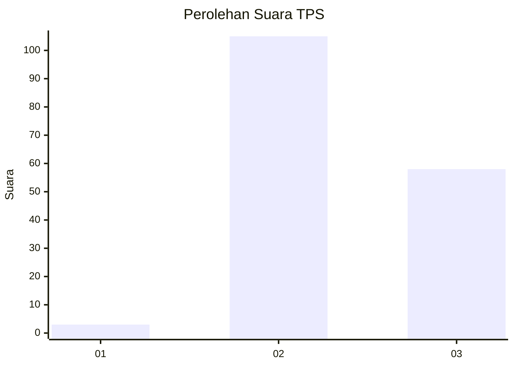
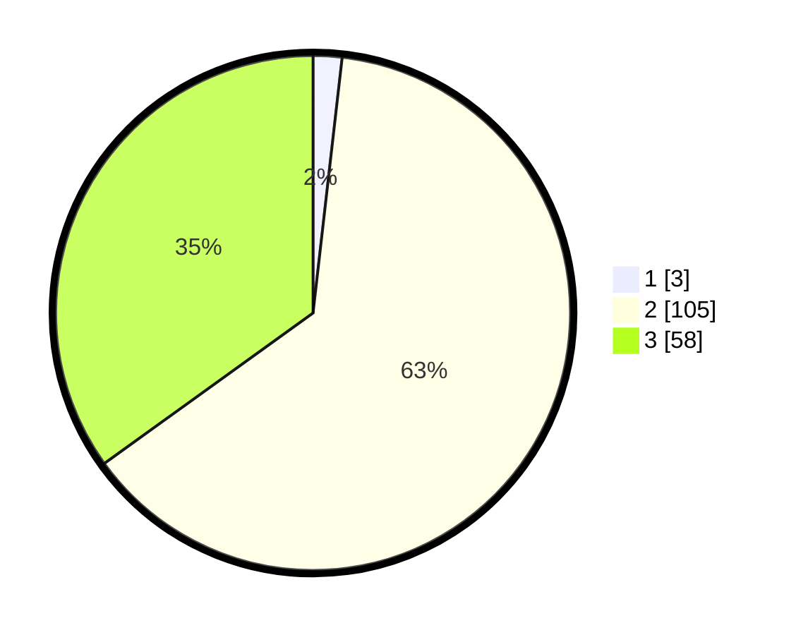

# Hasil

## Grafik

## Tabel

| No. | Nama Paslon    | Suara | Suara (raw) | Persentase |
|:--- |:-------------- | -----:| -----------:| ----------:|
| 1   | ANIES MUHAIMIN | 3     | [3][p-1]    | 1,81       |
| 2   | PRABOWO GIBRAN | 105   | [105][p-2]  | 63,25      |
| 3   | GANJAR MAHFUD  | 58    | [58][p-3]   | 34,94      |

[p-1]: https://github.com/gigit-pemilu/pemilu-2024-51-bali/blob/main/pilpres/hitung-suara/sub/51-bali/sub/07-karangasem/sub/05-abang/sub/2001-ababi/sub/015-tps/sub/paslon-1.txt
[p-2]: https://github.com/gigit-pemilu/pemilu-2024-51-bali/blob/main/pilpres/hitung-suara/sub/51-bali/sub/07-karangasem/sub/05-abang/sub/2001-ababi/sub/015-tps/sub/paslon-2.txt
[p-3]: https://github.com/gigit-pemilu/pemilu-2024-51-bali/blob/main/pilpres/hitung-suara/sub/51-bali/sub/07-karangasem/sub/05-abang/sub/2001-ababi/sub/015-tps/sub/paslon-3.txt

## Foto C Plano

https://sirekap-obj-formc.kpu.go.id/4f12/pemilu/ppwp/51/07/05/20/01/5107052001015-20240225-150414--9dd47be0-445d-4428-b9e6-ab0b6761d5ef.jpg

https://sirekap-obj-formc.kpu.go.id/4f12/pemilu/ppwp/51/07/05/20/01/5107052001015-20240225-150614--219db1c1-c358-44d1-9c50-0b3bf342676c.jpg

https://sirekap-obj-formc.kpu.go.id/4f12/pemilu/ppwp/51/07/05/20/01/5107052001015-20240225-151344--3ae3fdf6-0e87-49e6-9b3f-000c09713436.jpg

## Metadata

| Key        | Value               |
| ---------- | ------------------- |
| Time Stamp | 2024-02-25 21:00:00 |

## DATA PEMILIH TETAP

Jumlah pemilih dalam DPT: **227**.
 * L: **103**.
 * P: **124**.

## DATA PENGGUNA HAK PILIH

Jumlah pengguna hak pilih dalam DPT: **167**.
 * L: **75**.
 * P: **92**.

Jumlah pengguna hak pilih dalam DPTb: **0**.
 * L: **0**.
 * P: **0**.

Jumlah pengguna hak pilih dalam DPK: **1**.
 * L: **0**.
 * P: **1**.

Jumlah pengguna hak pilih: **168**.
 * L: **75**.
 * P: **93**.

## JUMLAH SUARA SAH DAN TIDAK SAH

JUMLAH SELURUH SUARA SAH: **166**.

JUMLAH SUARA TIDAK SAH: **2**.

JUMLAH SELURUH SUARA SAH DAN SUARA TIDAK SAH: **168**.

