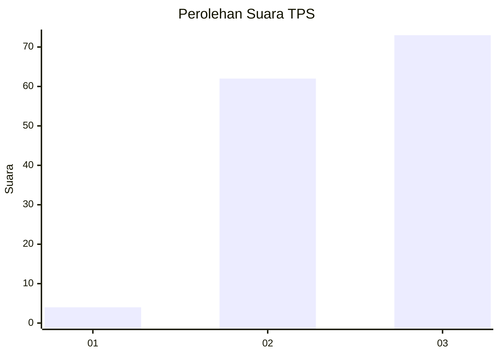
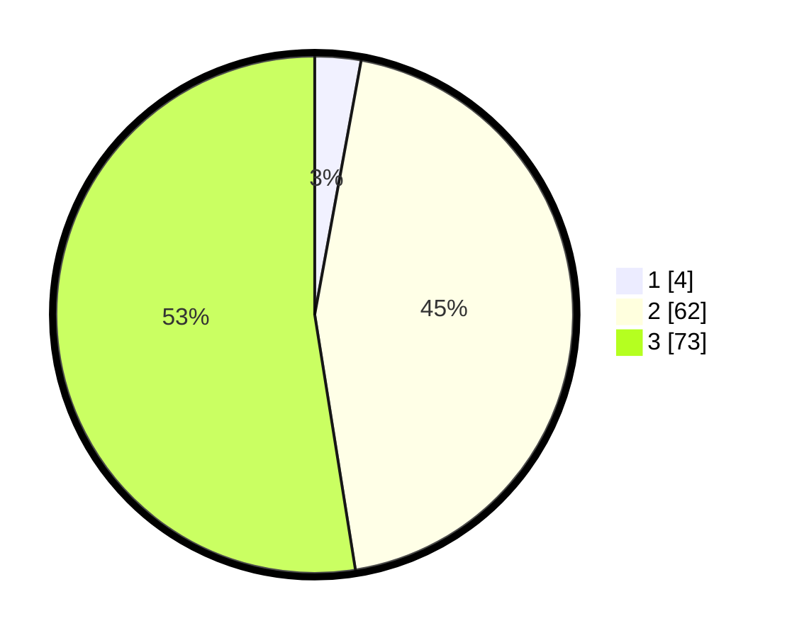

# Hasil

## Grafik

## Tabel

| No. | Nama Paslon    | Suara | Suara (raw) | Persentase |
|:--- |:-------------- | -----:| -----------:| ----------:|
| 1   | ANIES MUHAIMIN | 4     | [4][p-1]    | 2,88       |
| 2   | PRABOWO GIBRAN | 62    | [62][p-2]   | 44,60      |
| 3   | GANJAR MAHFUD  | 73    | [73][p-3]   | 52,52      |

[p-1]: https://github.com/gigit-pemilu/pemilu-2024-51-bali/blob/main/pilpres/hitung-suara/sub/51-bali/sub/07-karangasem/sub/05-abang/sub/2001-ababi/sub/020-tps/sub/paslon-1.txt
[p-2]: https://github.com/gigit-pemilu/pemilu-2024-51-bali/blob/main/pilpres/hitung-suara/sub/51-bali/sub/07-karangasem/sub/05-abang/sub/2001-ababi/sub/020-tps/sub/paslon-2.txt
[p-3]: https://github.com/gigit-pemilu/pemilu-2024-51-bali/blob/main/pilpres/hitung-suara/sub/51-bali/sub/07-karangasem/sub/05-abang/sub/2001-ababi/sub/020-tps/sub/paslon-3.txt

## Foto C Plano

https://sirekap-obj-formc.kpu.go.id/c55d/pemilu/ppwp/51/07/05/20/01/5107052001020-20240225-102401--142de635-bd43-44df-9d3f-d45b2d0d9f29.jpg

https://sirekap-obj-formc.kpu.go.id/c55d/pemilu/ppwp/51/07/05/20/01/5107052001020-20240225-104915--11a51eb4-3986-4043-bcb1-1698234164c3.jpg

https://sirekap-obj-formc.kpu.go.id/c55d/pemilu/ppwp/51/07/05/20/01/5107052001020-20240225-104914--98b83f00-5672-49e2-aac1-0509cd6ebb62.jpg

## Metadata

| Key        | Value               |
| ---------- | ------------------- |
| Time Stamp | 2024-02-25 12:00:00 |

## DATA PEMILIH TETAP

Jumlah pemilih dalam DPT: **194**.
 * L: **104**.
 * P: **90**.

## DATA PENGGUNA HAK PILIH

Jumlah pengguna hak pilih dalam DPT: **150**.
 * L: **82**.
 * P: **68**.

Jumlah pengguna hak pilih dalam DPTb: **0**.
 * L: **0**.
 * P: **0**.

Jumlah pengguna hak pilih dalam DPK: **0**.
 * L: **0**.
 * P: **0**.

Jumlah pengguna hak pilih: **150**.
 * L: **82**.
 * P: **68**.

## JUMLAH SUARA SAH DAN TIDAK SAH

JUMLAH SELURUH SUARA SAH: **139**.

JUMLAH SUARA TIDAK SAH: **11**.

JUMLAH SELURUH SUARA SAH DAN SUARA TIDAK SAH: **150**.

