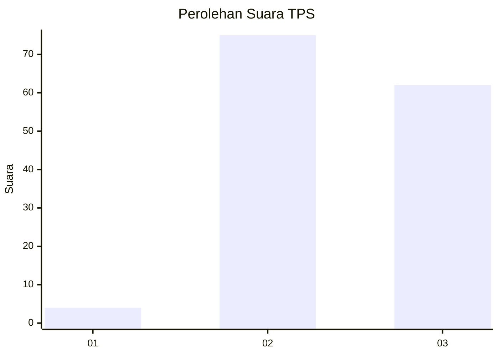
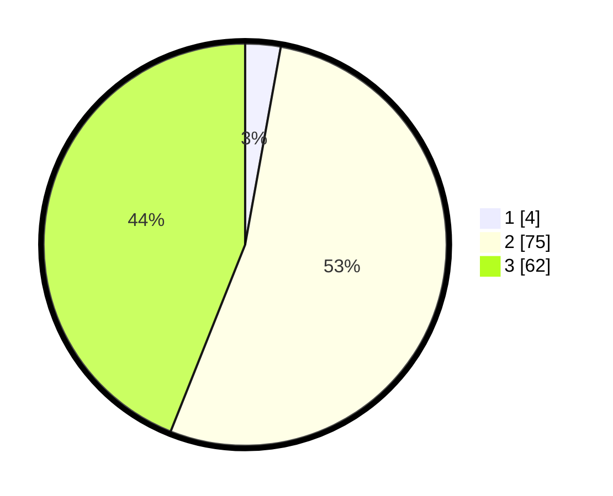

# Hasil

## Grafik

## Tabel

| No. | Nama Paslon    | Suara | Suara (raw) | Persentase |
|:--- |:-------------- | -----:| -----------:| ----------:|
| 1   | ANIES MUHAIMIN | 4     | [4][p-1]    | 2,84       |
| 2   | PRABOWO GIBRAN | 75    | [75][p-2]   | 53,19      |
| 3   | GANJAR MAHFUD  | 62    | [62][p-3]   | 43,97      |

[p-1]: https://github.com/gigit-pemilu/pemilu-2024-51-bali/blob/main/pilpres/hitung-suara/sub/51-bali/sub/07-karangasem/sub/05-abang/sub/2001-ababi/sub/021-tps/sub/paslon-1.txt
[p-2]: https://github.com/gigit-pemilu/pemilu-2024-51-bali/blob/main/pilpres/hitung-suara/sub/51-bali/sub/07-karangasem/sub/05-abang/sub/2001-ababi/sub/021-tps/sub/paslon-2.txt
[p-3]: https://github.com/gigit-pemilu/pemilu-2024-51-bali/blob/main/pilpres/hitung-suara/sub/51-bali/sub/07-karangasem/sub/05-abang/sub/2001-ababi/sub/021-tps/sub/paslon-3.txt

## Foto C Plano

https://sirekap-obj-formc.kpu.go.id/1d11/pemilu/ppwp/51/07/05/20/01/5107052001021-20240225-110239--4cbbc568-b1fc-44e6-bb7b-543fb276ea90.jpg

https://sirekap-obj-formc.kpu.go.id/1d11/pemilu/ppwp/51/07/05/20/01/5107052001021-20240225-110318--5796837e-42c3-4f92-aefa-aee04a4cbe2e.jpg

https://sirekap-obj-formc.kpu.go.id/1d11/pemilu/ppwp/51/07/05/20/01/5107052001021-20240225-110415--1e0dab61-626c-4278-8a05-933cf1af7a4e.jpg

## Metadata

| Key        | Value               |
| ---------- | ------------------- |
| Time Stamp | 2024-02-25 12:00:00 |

## DATA PEMILIH TETAP

Jumlah pemilih dalam DPT: **197**.
 * L: **108**.
 * P: **89**.

## DATA PENGGUNA HAK PILIH

Jumlah pengguna hak pilih dalam DPT: **155**.
 * L: **88**.
 * P: **67**.

Jumlah pengguna hak pilih dalam DPTb: **0**.
 * L: **0**.
 * P: **0**.

Jumlah pengguna hak pilih dalam DPK: **0**.
 * L: **0**.
 * P: **0**.

Jumlah pengguna hak pilih: **155**.
 * L: **88**.
 * P: **67**.

## JUMLAH SUARA SAH DAN TIDAK SAH

JUMLAH SELURUH SUARA SAH: **141**.

JUMLAH SUARA TIDAK SAH: **14**.

JUMLAH SELURUH SUARA SAH DAN SUARA TIDAK SAH: **155**.

