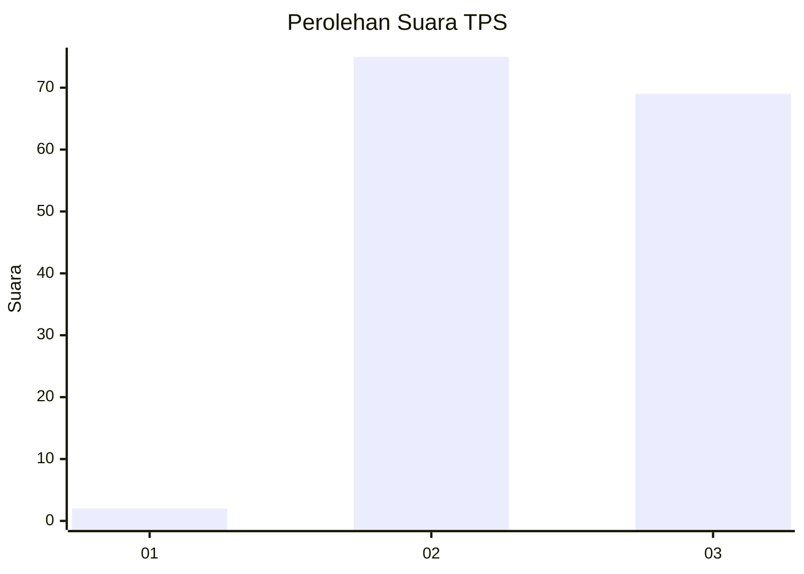
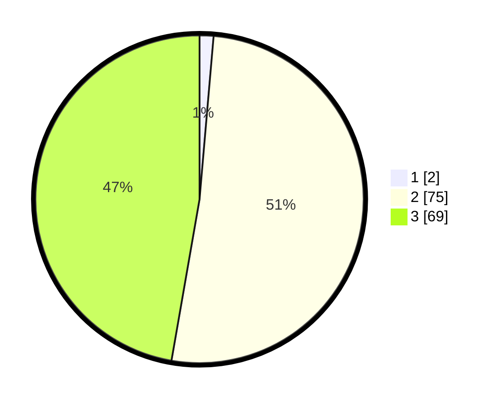

# Hasil

## Grafik

## Tabel

| No. | Nama Paslon    | Suara | Suara (raw) | Persentase |
|:--- |:-------------- | -----:| -----------:| ----------:|
| 1   | ANIES MUHAIMIN | 2     | [2][p-1]    | 1,37       |
| 2   | PRABOWO GIBRAN | 75    | [75][p-2]   | 51,37      |
| 3   | GANJAR MAHFUD  | 69    | [69][p-3]   | 47,26      |

[p-1]: https://github.com/gigit-pemilu/pemilu-2024-51-bali/blob/main/pilpres/hitung-suara/sub/51-bali/sub/07-karangasem/sub/05-abang/sub/2001-ababi/sub/022-tps/sub/paslon-1.txt
[p-2]: https://github.com/gigit-pemilu/pemilu-2024-51-bali/blob/main/pilpres/hitung-suara/sub/51-bali/sub/07-karangasem/sub/05-abang/sub/2001-ababi/sub/022-tps/sub/paslon-2.txt
[p-3]: https://github.com/gigit-pemilu/pemilu-2024-51-bali/blob/main/pilpres/hitung-suara/sub/51-bali/sub/07-karangasem/sub/05-abang/sub/2001-ababi/sub/022-tps/sub/paslon-3.txt

## Foto C Plano

https://sirekap-obj-formc.kpu.go.id/d491/pemilu/ppwp/51/07/05/20/01/5107052001022-20240214-132049--ea43c1b4-f0b1-412e-83cc-3bdc606da27f.jpg

https://sirekap-obj-formc.kpu.go.id/d491/pemilu/ppwp/51/07/05/20/01/5107052001022-20240225-132939--d08ae3db-ba83-4689-880a-5527e5da6c49.jpg

https://sirekap-obj-formc.kpu.go.id/d491/pemilu/ppwp/51/07/05/20/01/5107052001022-20240214-132702--25ca84a8-eae8-4412-8474-70f8f0bf310a.jpg

## Metadata

| Key        | Value               |
| ---------- | ------------------- |
| Time Stamp | 2024-02-25 14:00:00 |

## DATA PEMILIH TETAP

Jumlah pemilih dalam DPT: **200**.
 * L: **99**.
 * P: **101**.

## DATA PENGGUNA HAK PILIH

Jumlah pengguna hak pilih dalam DPT: **153**.
 * L: **82**.
 * P: **71**.

Jumlah pengguna hak pilih dalam DPTb: **0**.
 * L: **0**.
 * P: **0**.

Jumlah pengguna hak pilih dalam DPK: **0**.
 * L: **0**.
 * P: **0**.

Jumlah pengguna hak pilih: **153**.
 * L: **82**.
 * P: **71**.

## JUMLAH SUARA SAH DAN TIDAK SAH

JUMLAH SELURUH SUARA SAH: **146**.

JUMLAH SUARA TIDAK SAH: **7**.

JUMLAH SELURUH SUARA SAH DAN SUARA TIDAK SAH: **153**.

