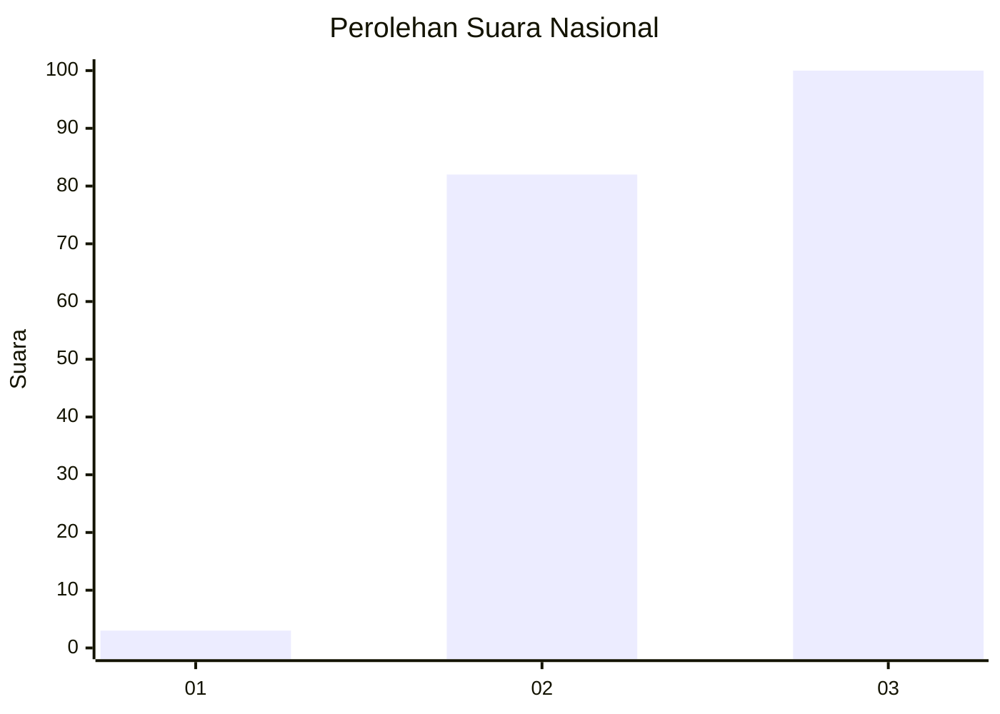
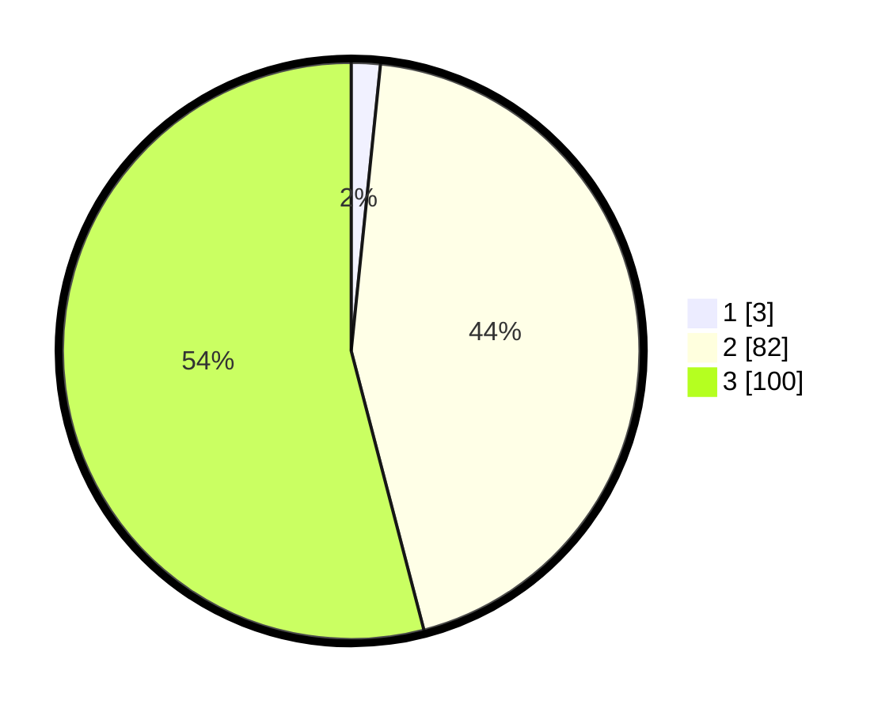

# Hasil

## Grafik

## Tabel

| No. | Nama Paslon    | Suara | Suara (raw) | Persentase |
|:--- |:-------------- | -----:| -----------:| ----------:|
| 1   | ANIES MUHAIMIN | 3     | [3][p-1]    | 1,62       |
| 2   | PRABOWO GIBRAN | 82    | [82][p-2]   | 44,32      |
| 3   | GANJAR MAHFUD  | 100   | [100][p-3]  | 54,05      |

[p-1]: https://github.com/gigit-pemilu/pemilu-2024/blob/main/pilpres/hitung-suara/sub/51-bali/sub/07-karangasem/sub/05-abang/sub/2001-ababi/sub/028-tps/sub/paslon-1.txt
[p-2]: https://github.com/gigit-pemilu/pemilu-2024/blob/main/pilpres/hitung-suara/sub/51-bali/sub/07-karangasem/sub/05-abang/sub/2001-ababi/sub/028-tps/sub/paslon-2.txt
[p-3]: https://github.com/gigit-pemilu/pemilu-2024/blob/main/pilpres/hitung-suara/sub/51-bali/sub/07-karangasem/sub/05-abang/sub/2001-ababi/sub/028-tps/sub/paslon-3.txt

## Foto C Plano

https://sirekap-obj-formc.kpu.go.id/2dcf/pemilu/ppwp/51/07/05/20/01/5107052001028-20240225-135152--cab27027-869b-41a0-bc75-f5f99db224f8.jpg

https://sirekap-obj-formc.kpu.go.id/2dcf/pemilu/ppwp/51/07/05/20/01/5107052001028-20240225-165752--ec63e096-752a-4de4-8cd4-d963b7482729.jpg

https://sirekap-obj-formc.kpu.go.id/2dcf/pemilu/ppwp/51/07/05/20/01/5107052001028-20240225-141343--234a5382-1311-4349-9c16-644679e6720e.jpg

## Metadata

| Key        | Value               |
| ---------- | ------------------- |
| Time Stamp | 2024-02-25 21:00:00 |

## DATA PEMILIH TETAP

Jumlah pemilih dalam DPT: **227**.
 * L: **121**.
 * P: **106**.

## DATA PENGGUNA HAK PILIH

Jumlah pengguna hak pilih dalam DPT: **191**.
 * L: **105**.
 * P: **86**.

Jumlah pengguna hak pilih dalam DPTb: **0**.
 * L: **0**.
 * P: **0**.

Jumlah pengguna hak pilih dalam DPK: **3**.
 * L: **2**.
 * P: **1**.

Jumlah pengguna hak pilih: **194**.
 * L: **107**.
 * P: **87**.

## JUMLAH SUARA SAH DAN TIDAK SAH

JUMLAH SELURUH SUARA SAH: **185**.

JUMLAH SUARA TIDAK SAH: **9**.

JUMLAH SELURUH SUARA SAH DAN SUARA TIDAK SAH: **194**.

