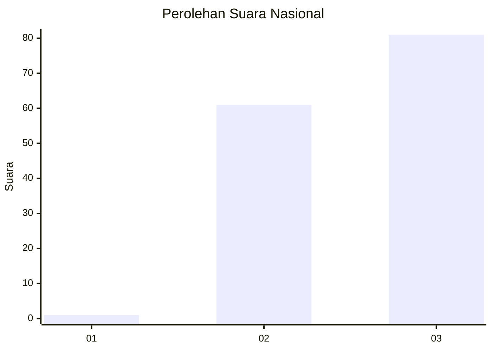
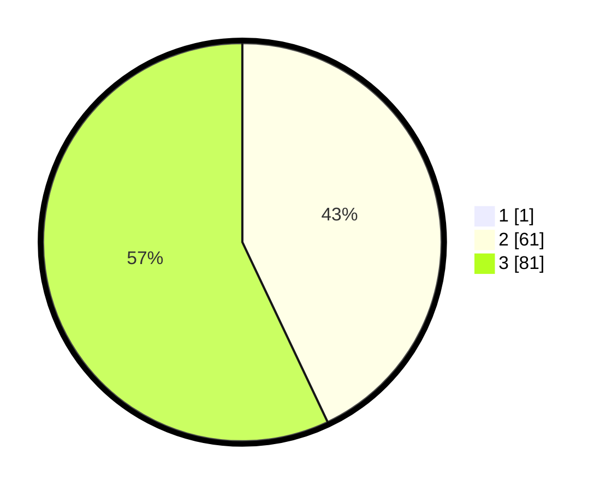

# Hasil

## Grafik

## Tabel

| No. | Nama Paslon    | Suara | Suara (raw) | Persentase |
|:--- |:-------------- | -----:| -----------:| ----------:|
| 1   | ANIES MUHAIMIN | 1     | [1][p-1]    | 0,70       |
| 2   | PRABOWO GIBRAN | 61    | [61][p-2]   | 42,66      |
| 3   | GANJAR MAHFUD  | 81    | [81][p-3]   | 56,64      |

[p-1]: https://github.com/gigit-pemilu/pemilu-2024/blob/main/pilpres/hitung-suara/sub/51-bali/sub/07-karangasem/sub/05-abang/sub/2001-ababi/sub/034-tps/sub/paslon-1.txt
[p-2]: https://github.com/gigit-pemilu/pemilu-2024/blob/main/pilpres/hitung-suara/sub/51-bali/sub/07-karangasem/sub/05-abang/sub/2001-ababi/sub/034-tps/sub/paslon-2.txt
[p-3]: https://github.com/gigit-pemilu/pemilu-2024/blob/main/pilpres/hitung-suara/sub/51-bali/sub/07-karangasem/sub/05-abang/sub/2001-ababi/sub/034-tps/sub/paslon-3.txt

## Foto C Plano

https://sirekap-obj-formc.kpu.go.id/b258/pemilu/ppwp/51/07/05/20/01/5107052001034-20240225-162516--155ec9ec-1731-4a66-b321-51a7450d31ae.jpg

https://sirekap-obj-formc.kpu.go.id/b258/pemilu/ppwp/51/07/05/20/01/5107052001034-20240225-162825--a43a882b-ff06-416a-867c-5178b27a41f3.jpg

https://sirekap-obj-formc.kpu.go.id/b258/pemilu/ppwp/51/07/05/20/01/5107052001034-20240225-163016--abef2bc6-0ab4-4e63-bad7-6124174e280e.jpg

## Metadata

| Key        | Value               |
| ---------- | ------------------- |
| Time Stamp | 2024-02-25 19:00:00 |

## DATA PEMILIH TETAP

Jumlah pemilih dalam DPT: **187**.
 * L: **90**.
 * P: **97**.

## DATA PENGGUNA HAK PILIH

Jumlah pengguna hak pilih dalam DPT: **146**.
 * L: **72**.
 * P: **74**.

Jumlah pengguna hak pilih dalam DPTb: **0**.
 * L: **0**.
 * P: **0**.

Jumlah pengguna hak pilih dalam DPK: **1**.
 * L: **0**.
 * P: **1**.

Jumlah pengguna hak pilih: **147**.
 * L: **72**.
 * P: **75**.

## JUMLAH SUARA SAH DAN TIDAK SAH

JUMLAH SELURUH SUARA SAH: **143**.

JUMLAH SUARA TIDAK SAH: **4**.

JUMLAH SELURUH SUARA SAH DAN SUARA TIDAK SAH: **147**.

