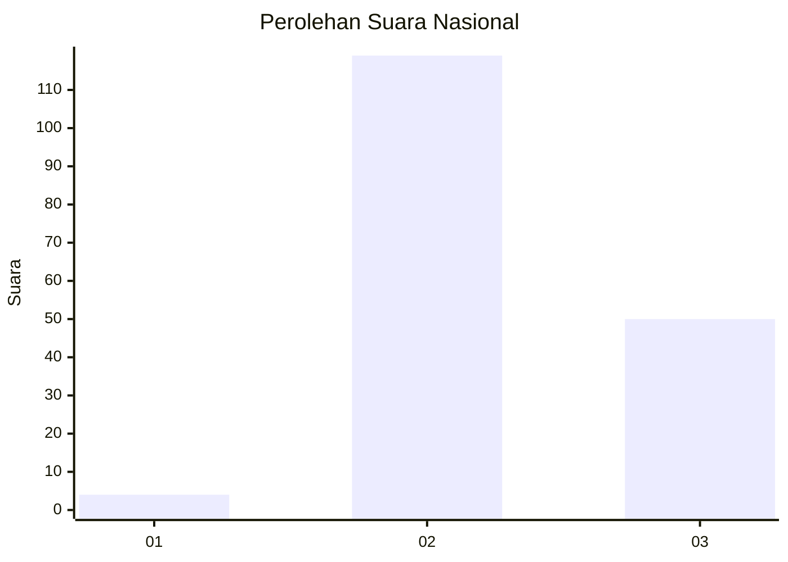

# Hasil

## Grafik

## Tabel

| No. | Nama Paslon    | Suara | Suara (raw) | Persentase |
|:--- |:-------------- | -----:| -----------:| ----------:|
| 1   | ANIES MUHAIMIN | 4     | [4][p-1]    | 2,31       |
| 2   | PRABOWO GIBRAN | 119   | [119][p-2]  | 68,79      |
| 3   | GANJAR MAHFUD  | 50    | [50][p-3]   | 28,90      |

[p-1]: https://github.com/gigit-pemilu/pemilu-2024/blob/main/pilpres/hitung-suara/sub/51-bali/sub/07-karangasem/sub/05-abang/sub/2002-tiyingtali/sub/005-tps/sub/paslon-1.txt
[p-2]: https://github.com/gigit-pemilu/pemilu-2024/blob/main/pilpres/hitung-suara/sub/51-bali/sub/07-karangasem/sub/05-abang/sub/2002-tiyingtali/sub/005-tps/sub/paslon-2.txt
[p-3]: https://github.com/gigit-pemilu/pemilu-2024/blob/main/pilpres/hitung-suara/sub/51-bali/sub/07-karangasem/sub/05-abang/sub/2002-tiyingtali/sub/005-tps/sub/paslon-3.txt

## Foto C Plano

https://sirekap-obj-formc.kpu.go.id/e701/pemilu/ppwp/51/07/05/20/02/5107052002005-20240220-191730--44c4cf7e-9eb1-4d40-913d-3424481cc146.jpg

https://sirekap-obj-formc.kpu.go.id/e701/pemilu/ppwp/51/07/05/20/02/5107052002005-20240220-191732--6e150e89-5eca-42bd-8940-683caa24ae73.jpg

https://sirekap-obj-formc.kpu.go.id/e701/pemilu/ppwp/51/07/05/20/02/5107052002005-20240220-191731--6a03f1e9-b3b4-4516-8f28-bc00483635f1.jpg

## Metadata

| Key        | Value               |
| ---------- | ------------------- |
| Time Stamp | 2024-02-22 18:00:00 |

## DATA PEMILIH TETAP

Jumlah pemilih dalam DPT: **204**.
 * L: **95**.
 * P: **109**.

## DATA PENGGUNA HAK PILIH

Jumlah pengguna hak pilih dalam DPT: **172**.
 * L: **83**.
 * P: **89**.

Jumlah pengguna hak pilih dalam DPTb: **1**.
 * L: **1**.
 * P: **0**.

Jumlah pengguna hak pilih dalam DPK: **0**.
 * L: **0**.
 * P: **0**.

Jumlah pengguna hak pilih: **173**.
 * L: **84**.
 * P: **89**.

## JUMLAH SUARA SAH DAN TIDAK SAH

JUMLAH SELURUH SUARA SAH: **173**.

JUMLAH SUARA TIDAK SAH: **0**.

JUMLAH SELURUH SUARA SAH DAN SUARA TIDAK SAH: **173**.

