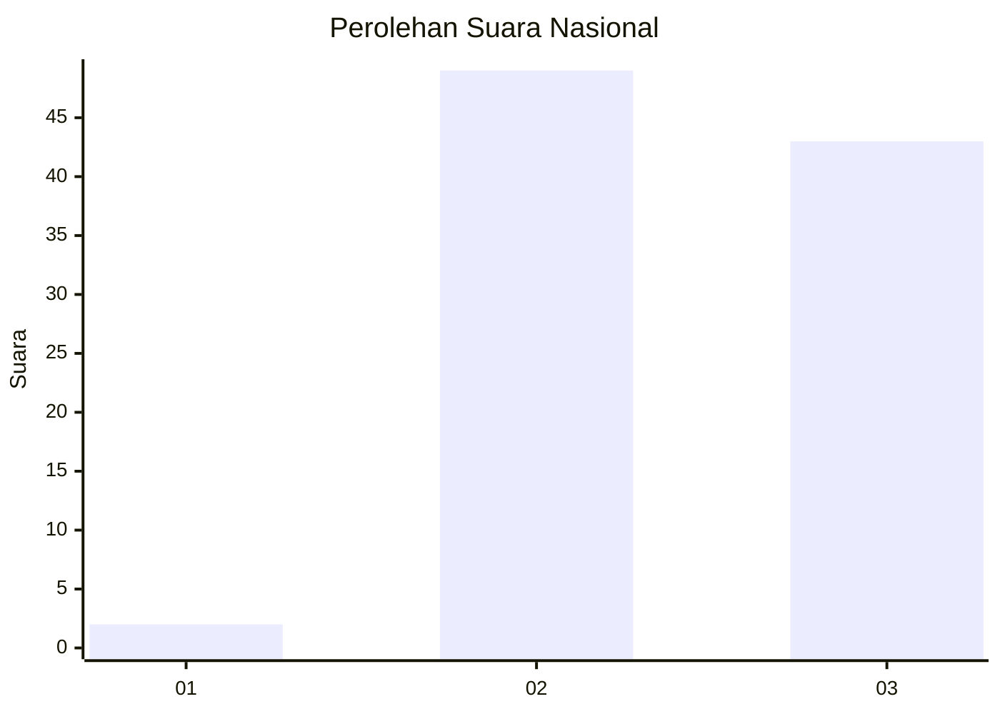
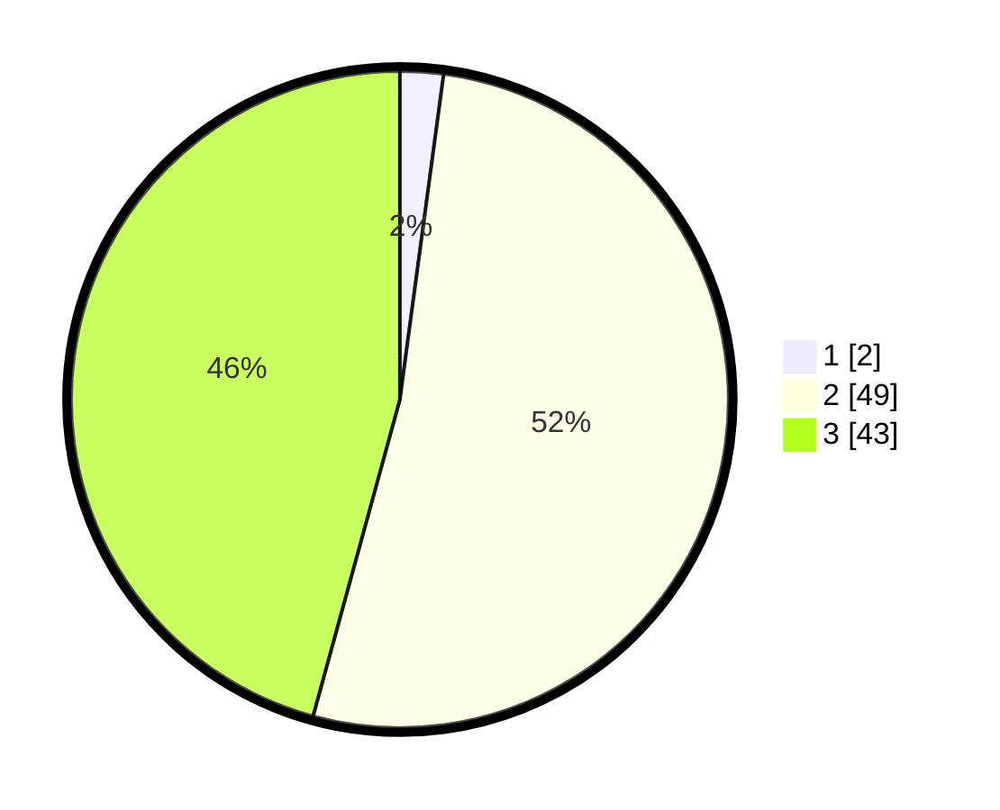

# Hasil

## Grafik

## Tabel

| No. | Nama Paslon    | Suara | Suara (raw) | Persentase |
|:--- |:-------------- | -----:| -----------:| ----------:|
| 1   | ANIES MUHAIMIN | 2     | [2][p-1]    | 2,13       |
| 2   | PRABOWO GIBRAN | 49    | [49][p-2]   | 52,13      |
| 3   | GANJAR MAHFUD  | 43    | [43][p-3]   | 45,74      |

[p-1]: https://github.com/gigit-pemilu/pemilu-2024/blob/main/pilpres/hitung-suara/sub/51-bali/sub/07-karangasem/sub/05-abang/sub/2002-tiyingtali/sub/015-tps/sub/paslon-1.txt
[p-2]: https://github.com/gigit-pemilu/pemilu-2024/blob/main/pilpres/hitung-suara/sub/51-bali/sub/07-karangasem/sub/05-abang/sub/2002-tiyingtali/sub/015-tps/sub/paslon-2.txt
[p-3]: https://github.com/gigit-pemilu/pemilu-2024/blob/main/pilpres/hitung-suara/sub/51-bali/sub/07-karangasem/sub/05-abang/sub/2002-tiyingtali/sub/015-tps/sub/paslon-3.txt

## Foto C Plano

https://sirekap-obj-formc.kpu.go.id/3a0a/pemilu/ppwp/51/07/05/20/02/5107052002015-20240214-140951--bc8d30c7-aaaf-4a18-9258-d1719e927b6f.jpg

https://sirekap-obj-formc.kpu.go.id/3a0a/pemilu/ppwp/51/07/05/20/02/5107052002015-20240214-141029--1a304989-fbb4-4f1e-bee2-85bd5df11889.jpg

https://sirekap-obj-formc.kpu.go.id/3a0a/pemilu/ppwp/51/07/05/20/02/5107052002015-20240218-212542--e8d709a0-14e3-47fc-bf6b-a17e44659528.jpg

## Metadata

| Key        | Value               |
| ---------- | ------------------- |
| Time Stamp | 2024-02-19 06:16:00 |

## DATA PEMILIH TETAP

Jumlah pemilih dalam DPT: **110**.
 * L: **56**.
 * P: **54**.

## DATA PENGGUNA HAK PILIH

Jumlah pengguna hak pilih dalam DPT: **94**.
 * L: **45**.
 * P: **49**.

Jumlah pengguna hak pilih dalam DPTb: **0**.
 * L: **0**.
 * P: **0**.

Jumlah pengguna hak pilih dalam DPK: **1**.
 * L: **1**.
 * P: **0**.

Jumlah pengguna hak pilih: **95**.
 * L: **46**.
 * P: **49**.

## JUMLAH SUARA SAH DAN TIDAK SAH

JUMLAH SELURUH SUARA SAH: **94**.

JUMLAH SUARA TIDAK SAH: **1**.

JUMLAH SELURUH SUARA SAH DAN SUARA TIDAK SAH: **95**.

