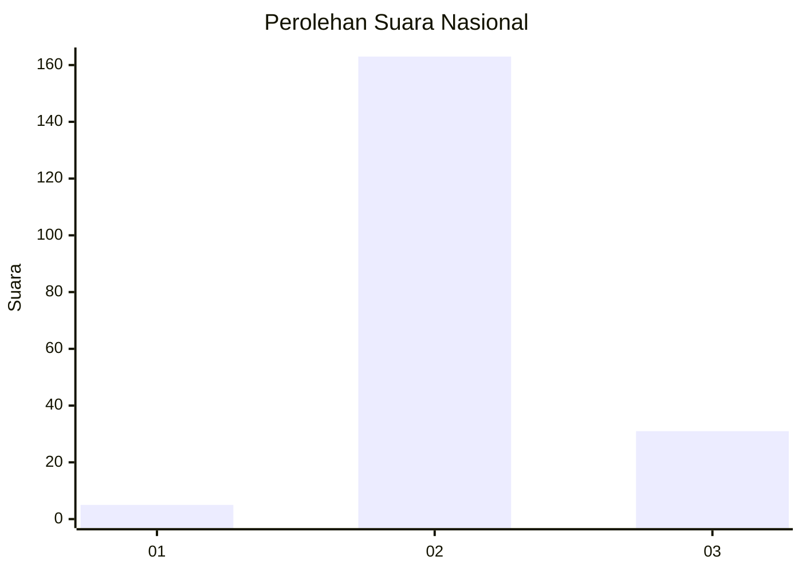
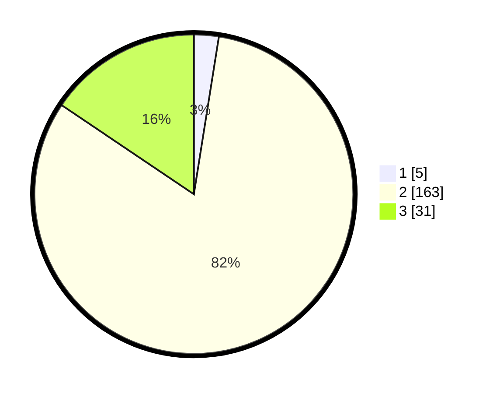

# Hasil

## Grafik

## Tabel

| No. | Nama Paslon    | Suara | Suara (raw) | Persentase |
|:--- |:-------------- | -----:| -----------:| ----------:|
| 1   | ANIES MUHAIMIN | 5     | [5][p-1]    | 2,51       |
| 2   | PRABOWO GIBRAN | 163   | [163][p-2]  | 81,91      |
| 3   | GANJAR MAHFUD  | 31    | [31][p-3]   | 15,58      |

[p-1]: https://github.com/gigit-pemilu/pemilu-2024/blob/main/pilpres/hitung-suara/sub/51-bali/sub/07-karangasem/sub/05-abang/sub/2003-bunutan/sub/003-tps/sub/paslon-1.txt
[p-2]: https://github.com/gigit-pemilu/pemilu-2024/blob/main/pilpres/hitung-suara/sub/51-bali/sub/07-karangasem/sub/05-abang/sub/2003-bunutan/sub/003-tps/sub/paslon-2.txt
[p-3]: https://github.com/gigit-pemilu/pemilu-2024/blob/main/pilpres/hitung-suara/sub/51-bali/sub/07-karangasem/sub/05-abang/sub/2003-bunutan/sub/003-tps/sub/paslon-3.txt

## Foto C Plano

https://sirekap-obj-formc.kpu.go.id/5b95/pemilu/ppwp/51/07/05/20/03/5107052003003-20240224-092541--58ce2e3b-fd4c-4217-8562-d8c521a643d6.jpg

https://sirekap-obj-formc.kpu.go.id/5b95/pemilu/ppwp/51/07/05/20/03/5107052003003-20240224-095739--6be8d5bf-96ee-419f-a957-39991a1f87e8.jpg

https://sirekap-obj-formc.kpu.go.id/5b95/pemilu/ppwp/51/07/05/20/03/5107052003003-20240224-093110--2672f7a7-0de6-4272-9d73-0d6f0e1cc899.jpg

## Metadata

| Key        | Value               |
| ---------- | ------------------- |
| Time Stamp | 2024-02-24 22:31:28 |

## DATA PEMILIH TETAP

Jumlah pemilih dalam DPT: **223**.
 * L: **120**.
 * P: **103**.

## DATA PENGGUNA HAK PILIH

Jumlah pengguna hak pilih dalam DPT: **201**.
 * L: **112**.
 * P: **89**.

Jumlah pengguna hak pilih dalam DPTb: **0**.
 * L: **0**.
 * P: **0**.

Jumlah pengguna hak pilih dalam DPK: **1**.
 * L: **0**.
 * P: **1**.

Jumlah pengguna hak pilih: **202**.
 * L: **112**.
 * P: **90**.

## JUMLAH SUARA SAH DAN TIDAK SAH

JUMLAH SELURUH SUARA SAH: **199**.

JUMLAH SUARA TIDAK SAH: **3**.

JUMLAH SELURUH SUARA SAH DAN SUARA TIDAK SAH: **202**.

