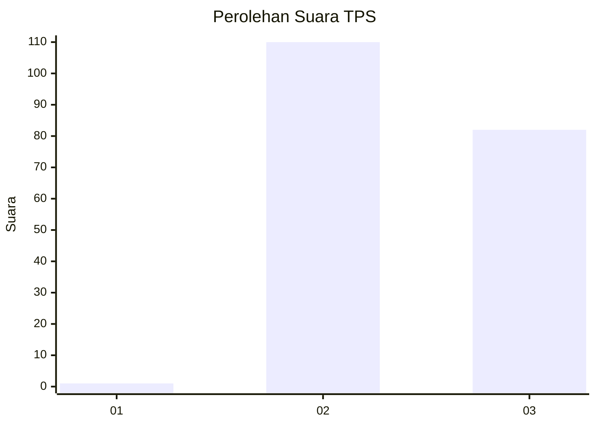
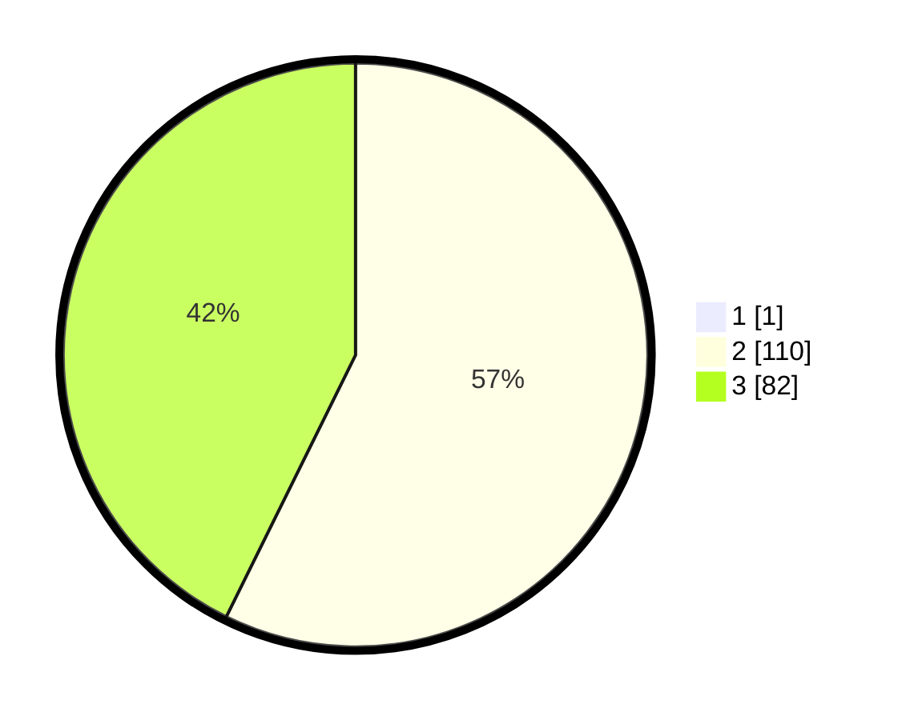

# Hasil

## Grafik

## Tabel

| No. | Nama Paslon    | Suara | Suara (raw) | Persentase |
|:--- |:-------------- | -----:| -----------:| ----------:|
| 1   | ANIES MUHAIMIN | 1     | [1][p-1]    | 0,52       |
| 2   | PRABOWO GIBRAN | 110   | [110][p-2]  | 56,99      |
| 3   | GANJAR MAHFUD  | 82    | [82][p-3]   | 42,49      |

[p-1]: https://github.com/gigit-pemilu/pemilu-2024-51-bali/blob/main/pilpres/hitung-suara/sub/51-bali/sub/07-karangasem/sub/05-abang/sub/2003-bunutan/sub/024-tps/sub/paslon-1.txt
[p-2]: https://github.com/gigit-pemilu/pemilu-2024-51-bali/blob/main/pilpres/hitung-suara/sub/51-bali/sub/07-karangasem/sub/05-abang/sub/2003-bunutan/sub/024-tps/sub/paslon-2.txt
[p-3]: https://github.com/gigit-pemilu/pemilu-2024-51-bali/blob/main/pilpres/hitung-suara/sub/51-bali/sub/07-karangasem/sub/05-abang/sub/2003-bunutan/sub/024-tps/sub/paslon-3.txt

## Foto C Plano

https://sirekap-obj-formc.kpu.go.id/9baa/pemilu/ppwp/51/07/05/20/03/5107052003024-20240225-122144--7ddfe85b-0134-4d1d-855d-106f89d76b8e.jpg

https://sirekap-obj-formc.kpu.go.id/9baa/pemilu/ppwp/51/07/05/20/03/5107052003024-20240225-122145--2e0eaeec-ab29-470f-bf2e-b2ebc533f7c5.jpg

https://sirekap-obj-formc.kpu.go.id/9baa/pemilu/ppwp/51/07/05/20/03/5107052003024-20240225-122144--ce1bdffa-aa53-453f-a6d8-dc435f6fe411.jpg

## Metadata

| Key        | Value               |
| ---------- | ------------------- |
| Time Stamp | 2024-02-25 13:00:00 |

## DATA PEMILIH TETAP

Jumlah pemilih dalam DPT: **233**.
 * L: **111**.
 * P: **122**.

## DATA PENGGUNA HAK PILIH

Jumlah pengguna hak pilih dalam DPT: **196**.
 * L: **98**.
 * P: **98**.

Jumlah pengguna hak pilih dalam DPTb: **0**.
 * L: **0**.
 * P: **0**.

Jumlah pengguna hak pilih dalam DPK: **1**.
 * L: **1**.
 * P: **0**.

Jumlah pengguna hak pilih: **197**.
 * L: **99**.
 * P: **98**.

## JUMLAH SUARA SAH DAN TIDAK SAH

JUMLAH SELURUH SUARA SAH: **193**.

JUMLAH SUARA TIDAK SAH: **4**.

JUMLAH SELURUH SUARA SAH DAN SUARA TIDAK SAH: **197**.

