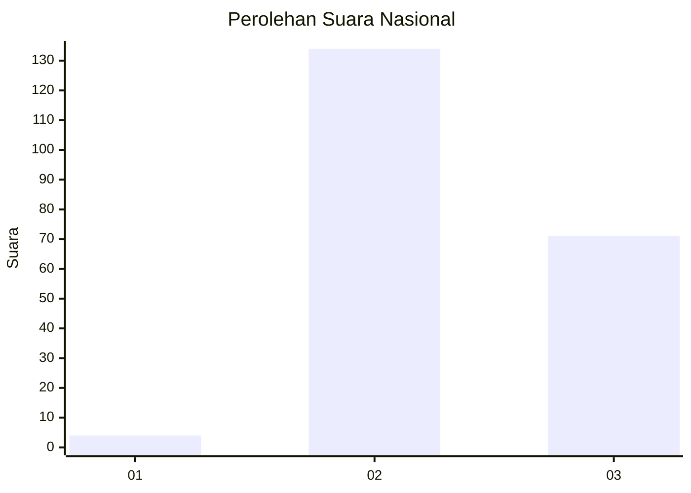
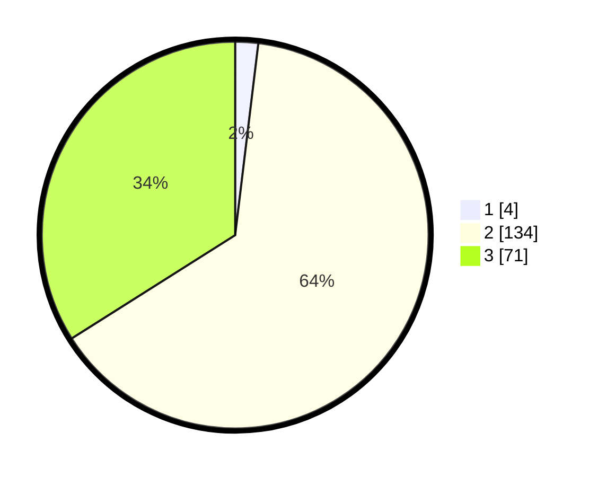

# Hasil

## Grafik

## Tabel

| No. | Nama Paslon    | Suara | Suara (raw) | Persentase |
|:--- |:-------------- | -----:| -----------:| ----------:|
| 1   | ANIES MUHAIMIN | 4     | [4][p-1]    | 1,91       |
| 2   | PRABOWO GIBRAN | 134   | [134][p-2]  | 64,11      |
| 3   | GANJAR MAHFUD  | 71    | [71][p-3]   | 33,97      |

[p-1]: https://github.com/gigit-pemilu/pemilu-2024/blob/main/pilpres/hitung-suara/sub/51-bali/sub/07-karangasem/sub/05-abang/sub/2003-bunutan/sub/033-tps/sub/paslon-1.txt
[p-2]: https://github.com/gigit-pemilu/pemilu-2024/blob/main/pilpres/hitung-suara/sub/51-bali/sub/07-karangasem/sub/05-abang/sub/2003-bunutan/sub/033-tps/sub/paslon-2.txt
[p-3]: https://github.com/gigit-pemilu/pemilu-2024/blob/main/pilpres/hitung-suara/sub/51-bali/sub/07-karangasem/sub/05-abang/sub/2003-bunutan/sub/033-tps/sub/paslon-3.txt

## Foto C Plano

https://sirekap-obj-formc.kpu.go.id/033e/pemilu/ppwp/51/07/05/20/03/5107052003033-20240216-142630--65002a30-91a2-4c02-9ff9-1d0203c5e3a4.jpg

https://sirekap-obj-formc.kpu.go.id/033e/pemilu/ppwp/51/07/05/20/03/5107052003033-20240216-142631--370254ad-b593-4eb1-b13b-545e058136eb.jpg

https://sirekap-obj-formc.kpu.go.id/033e/pemilu/ppwp/51/07/05/20/03/5107052003033-20240216-142630--48f771de-f8d9-41a1-89a2-446464424811.jpg

## Metadata

| Key        | Value               |
| ---------- | ------------------- |
| Time Stamp | 2024-02-17 10:30:03 |

## DATA PEMILIH TETAP

Jumlah pemilih dalam DPT: **245**.
 * L: **120**.
 * P: **125**.

## DATA PENGGUNA HAK PILIH

Jumlah pengguna hak pilih dalam DPT: **199**.
 * L: **102**.
 * P: **97**.

Jumlah pengguna hak pilih dalam DPTb: **0**.
 * L: **0**.
 * P: **0**.

Jumlah pengguna hak pilih dalam DPK: **14**.
 * L: **5**.
 * P: **9**.

Jumlah pengguna hak pilih: **213**.
 * L: **107**.
 * P: **106**.

## JUMLAH SUARA SAH DAN TIDAK SAH

JUMLAH SELURUH SUARA SAH: **209**.

JUMLAH SUARA TIDAK SAH: **4**.

JUMLAH SELURUH SUARA SAH DAN SUARA TIDAK SAH: **213**.

