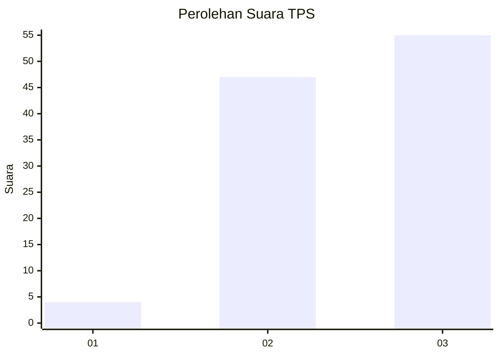
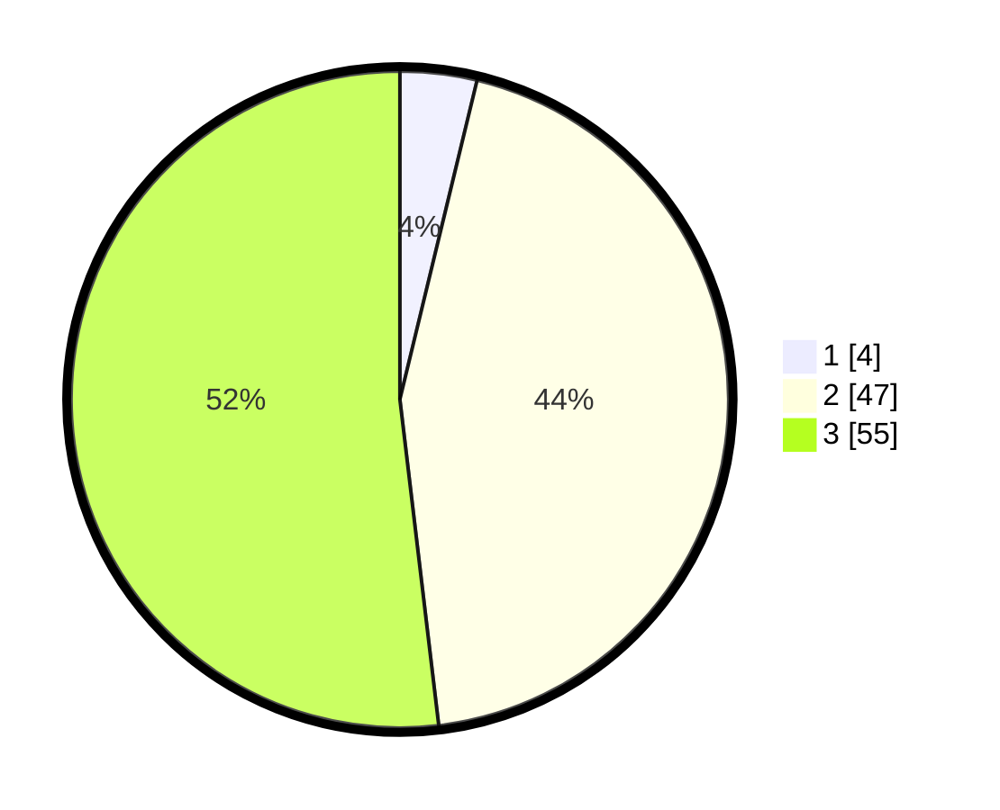

# Hasil

## Grafik

## Tabel

| No. | Nama Paslon    | Suara | Suara (raw) | Persentase |
|:--- |:-------------- | -----:| -----------:| ----------:|
| 1   | ANIES MUHAIMIN | 4     | [4][p-1]    | 3,77       |
| 2   | PRABOWO GIBRAN | 47    | [47][p-2]   | 44,34      |
| 3   | GANJAR MAHFUD  | 55    | [55][p-3]   | 51,89      |

[p-1]: https://github.com/gigit-pemilu/pemilu-2024-51-bali/blob/main/pilpres/hitung-suara/sub/51-bali/sub/07-karangasem/sub/05-abang/sub/2005-abang/sub/008-tps/sub/paslon-1.txt
[p-2]: https://github.com/gigit-pemilu/pemilu-2024-51-bali/blob/main/pilpres/hitung-suara/sub/51-bali/sub/07-karangasem/sub/05-abang/sub/2005-abang/sub/008-tps/sub/paslon-2.txt
[p-3]: https://github.com/gigit-pemilu/pemilu-2024-51-bali/blob/main/pilpres/hitung-suara/sub/51-bali/sub/07-karangasem/sub/05-abang/sub/2005-abang/sub/008-tps/sub/paslon-3.txt

## Foto C Plano

https://sirekap-obj-formc.kpu.go.id/ee8c/pemilu/ppwp/51/07/05/20/05/5107052005008-20240223-101123--e08f39f8-f4fb-4341-9b01-275d4e72470d.jpg

https://sirekap-obj-formc.kpu.go.id/ee8c/pemilu/ppwp/51/07/05/20/05/5107052005008-20240223-101124--5464c236-6b33-4ebf-9a35-ecf45f282c45.jpg

https://sirekap-obj-formc.kpu.go.id/ee8c/pemilu/ppwp/51/07/05/20/05/5107052005008-20240223-101124--5bdc4601-e946-4778-aa5c-1036e0ee3e16.jpg

## Metadata

| Key        | Value               |
| ---------- | ------------------- |
| Time Stamp | 2024-02-24 22:31:28 |

## DATA PEMILIH TETAP

Jumlah pemilih dalam DPT: **133**.
 * L: **71**.
 * P: **62**.

## DATA PENGGUNA HAK PILIH

Jumlah pengguna hak pilih dalam DPT: **108**.
 * L: **60**.
 * P: **48**.

Jumlah pengguna hak pilih dalam DPTb: **1**.
 * L: **0**.
 * P: **1**.

Jumlah pengguna hak pilih dalam DPK: **0**.
 * L: **0**.
 * P: **0**.

Jumlah pengguna hak pilih: **109**.
 * L: **60**.
 * P: **49**.

## JUMLAH SUARA SAH DAN TIDAK SAH

JUMLAH SELURUH SUARA SAH: **106**.

JUMLAH SUARA TIDAK SAH: **3**.

JUMLAH SELURUH SUARA SAH DAN SUARA TIDAK SAH: **109**.

