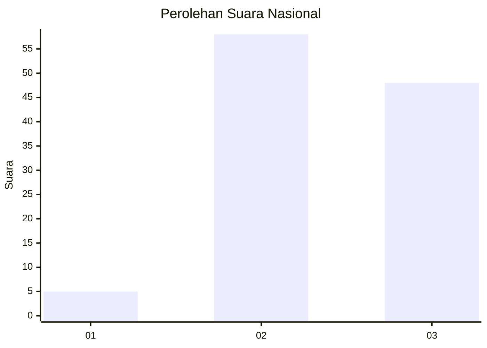
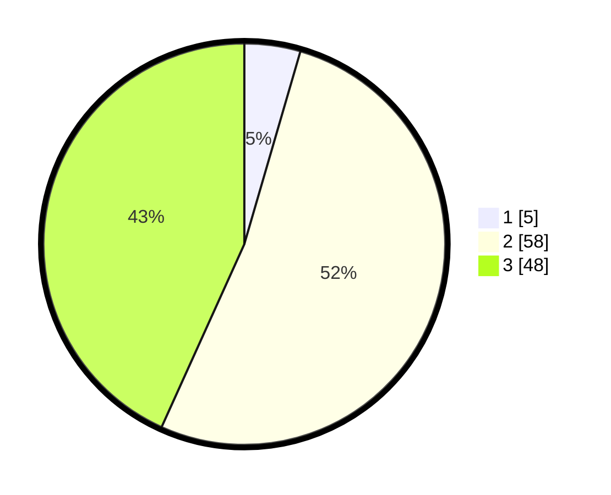

# Hasil

## Grafik

## Tabel

| No. | Nama Paslon    | Suara | Suara (raw) | Persentase |
|:--- |:-------------- | -----:| -----------:| ----------:|
| 1   | ANIES MUHAIMIN | 5     | [5][p-1]    | 4,50       |
| 2   | PRABOWO GIBRAN | 58    | [58][p-2]   | 52,25      |
| 3   | GANJAR MAHFUD  | 48    | [48][p-3]   | 43,24      |

[p-1]: https://github.com/gigit-pemilu/pemilu-2024/blob/main/pilpres/hitung-suara/sub/51-bali/sub/07-karangasem/sub/05-abang/sub/2006-pidpid/sub/004-tps/sub/paslon-1.txt
[p-2]: https://github.com/gigit-pemilu/pemilu-2024/blob/main/pilpres/hitung-suara/sub/51-bali/sub/07-karangasem/sub/05-abang/sub/2006-pidpid/sub/004-tps/sub/paslon-2.txt
[p-3]: https://github.com/gigit-pemilu/pemilu-2024/blob/main/pilpres/hitung-suara/sub/51-bali/sub/07-karangasem/sub/05-abang/sub/2006-pidpid/sub/004-tps/sub/paslon-3.txt

## Foto C Plano

https://sirekap-obj-formc.kpu.go.id/2161/pemilu/ppwp/51/07/05/20/06/5107052006004-20240218-005909--7d27b0b0-497f-4a56-a8b7-73f778ef2e8e.jpg

https://sirekap-obj-formc.kpu.go.id/2161/pemilu/ppwp/51/07/05/20/06/5107052006004-20240218-005911--76f195fd-9588-4623-a514-6d1c6a290c11.jpg

https://sirekap-obj-formc.kpu.go.id/2161/pemilu/ppwp/51/07/05/20/06/5107052006004-20240218-005910--669aac41-38ed-497a-86da-4278ddd98a0c.jpg

## Metadata

| Key        | Value               |
| ---------- | ------------------- |
| Time Stamp | 2024-02-21 10:00:00 |

## DATA PEMILIH TETAP

Jumlah pemilih dalam DPT: **180**.
 * L: **98**.
 * P: **82**.

## DATA PENGGUNA HAK PILIH

Jumlah pengguna hak pilih dalam DPT: **113**.
 * L: **59**.
 * P: **54**.

Jumlah pengguna hak pilih dalam DPTb: **0**.
 * L: **0**.
 * P: **0**.

Jumlah pengguna hak pilih dalam DPK: **1**.
 * L: **1**.
 * P: **0**.

Jumlah pengguna hak pilih: **114**.
 * L: **60**.
 * P: **54**.

## JUMLAH SUARA SAH DAN TIDAK SAH

JUMLAH SELURUH SUARA SAH: **111**.

JUMLAH SUARA TIDAK SAH: **3**.

JUMLAH SELURUH SUARA SAH DAN SUARA TIDAK SAH: **114**.

