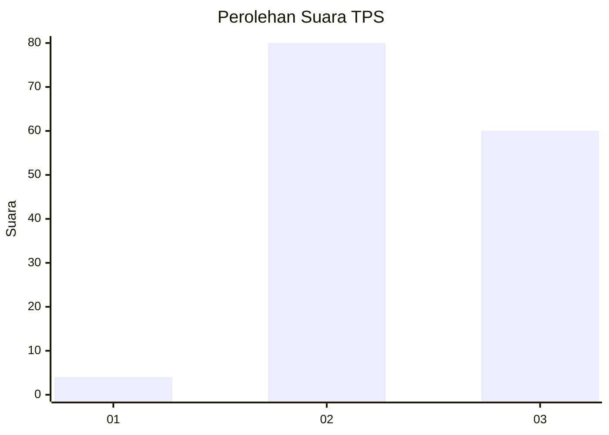
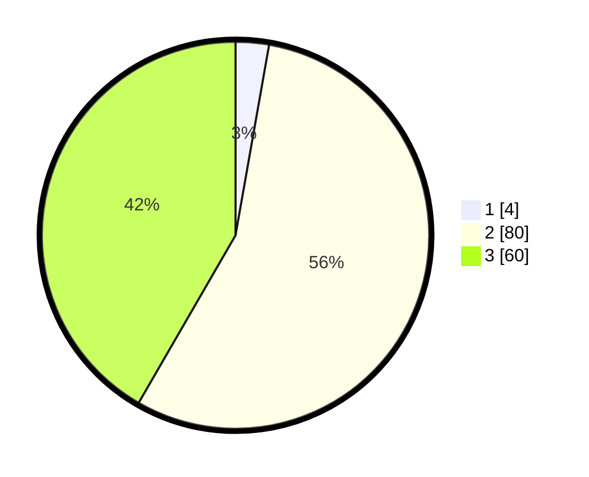

# Hasil

## Grafik

## Tabel

| No. | Nama Paslon    | Suara | Suara (raw) | Persentase |
|:--- |:-------------- | -----:| -----------:| ----------:|
| 1   | ANIES MUHAIMIN | 4     | [4][p-1]    | 2,78       |
| 2   | PRABOWO GIBRAN | 80    | [80][p-2]   | 55,56      |
| 3   | GANJAR MAHFUD  | 60    | [60][p-3]   | 41,67      |

[p-1]: https://github.com/gigit-pemilu/pemilu-2024-51-bali/blob/main/pilpres/hitung-suara/sub/51-bali/sub/07-karangasem/sub/05-abang/sub/2006-pidpid/sub/010-tps/sub/paslon-1.txt
[p-2]: https://github.com/gigit-pemilu/pemilu-2024-51-bali/blob/main/pilpres/hitung-suara/sub/51-bali/sub/07-karangasem/sub/05-abang/sub/2006-pidpid/sub/010-tps/sub/paslon-2.txt
[p-3]: https://github.com/gigit-pemilu/pemilu-2024-51-bali/blob/main/pilpres/hitung-suara/sub/51-bali/sub/07-karangasem/sub/05-abang/sub/2006-pidpid/sub/010-tps/sub/paslon-3.txt

## Foto C Plano

https://sirekap-obj-formc.kpu.go.id/9f21/pemilu/ppwp/51/07/05/20/06/5107052006010-20240222-180449--5eb22a6e-4c9e-4d2a-8b61-e029234021aa.jpg

https://sirekap-obj-formc.kpu.go.id/9f21/pemilu/ppwp/51/07/05/20/06/5107052006010-20240222-180316--8f63f4d8-2234-42fe-89ab-38f4c716addc.jpg

https://sirekap-obj-formc.kpu.go.id/9f21/pemilu/ppwp/51/07/05/20/06/5107052006010-20240222-180008--54bc5f4a-5bfa-4d95-b0d0-88aebc7dfbbe.jpg

## Metadata

| Key        | Value               |
| ---------- | ------------------- |
| Time Stamp | 2024-02-22 19:00:00 |

## DATA PEMILIH TETAP

Jumlah pemilih dalam DPT: **145**.
 * L: **100**.
 * P: **45**.

## DATA PENGGUNA HAK PILIH

Jumlah pengguna hak pilih dalam DPT: **157**.
 * L: **86**.
 * P: **71**.

Jumlah pengguna hak pilih dalam DPTb: **0**.
 * L: **0**.
 * P: **0**.

Jumlah pengguna hak pilih dalam DPK: **0**.
 * L: **0**.
 * P: **0**.

Jumlah pengguna hak pilih: **157**.
 * L: **86**.
 * P: **71**.

## JUMLAH SUARA SAH DAN TIDAK SAH

JUMLAH SELURUH SUARA SAH: **144**.

JUMLAH SUARA TIDAK SAH: **13**.

JUMLAH SELURUH SUARA SAH DAN SUARA TIDAK SAH: **157**.

