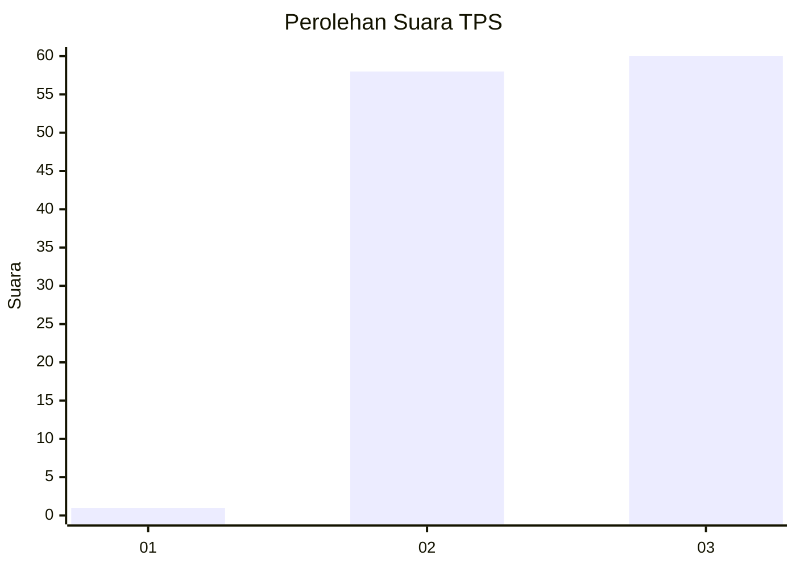
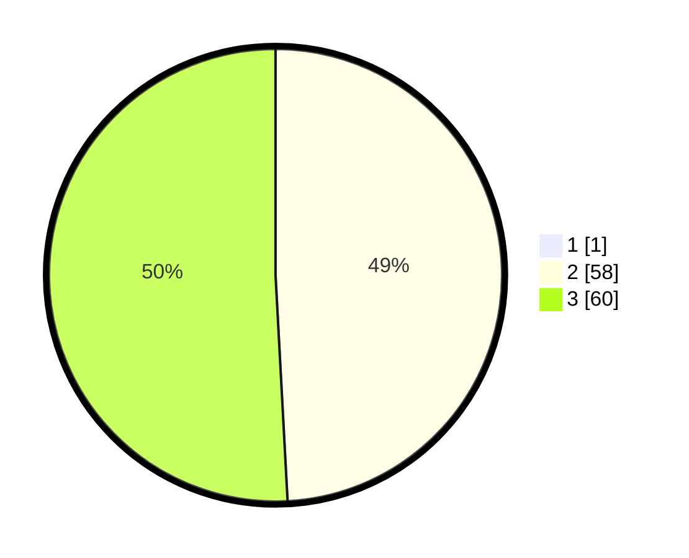

# Hasil

## Grafik

## Tabel

| No. | Nama Paslon    | Suara | Suara (raw) | Persentase |
|:--- |:-------------- | -----:| -----------:| ----------:|
| 1   | ANIES MUHAIMIN | 1     | [1][p-1]    | 0,84       |
| 2   | PRABOWO GIBRAN | 58    | [58][p-2]   | 48,74      |
| 3   | GANJAR MAHFUD  | 60    | [60][p-3]   | 50,42      |

[p-1]: https://github.com/gigit-pemilu/pemilu-2024-51-bali/blob/main/pilpres/hitung-suara/sub/51-bali/sub/07-karangasem/sub/05-abang/sub/2007-datah/sub/011-tps/sub/paslon-1.txt
[p-2]: https://github.com/gigit-pemilu/pemilu-2024-51-bali/blob/main/pilpres/hitung-suara/sub/51-bali/sub/07-karangasem/sub/05-abang/sub/2007-datah/sub/011-tps/sub/paslon-2.txt
[p-3]: https://github.com/gigit-pemilu/pemilu-2024-51-bali/blob/main/pilpres/hitung-suara/sub/51-bali/sub/07-karangasem/sub/05-abang/sub/2007-datah/sub/011-tps/sub/paslon-3.txt

## Foto C Plano

https://sirekap-obj-formc.kpu.go.id/4dd8/pemilu/ppwp/51/07/05/20/07/5107052007011-20240223-181720--4e328229-b81c-4083-95c4-ab5de200a50b.jpg

https://sirekap-obj-formc.kpu.go.id/4dd8/pemilu/ppwp/51/07/05/20/07/5107052007011-20240223-181721--781980aa-595a-4d46-8986-7db32a61d7f9.jpg

https://sirekap-obj-formc.kpu.go.id/4dd8/pemilu/ppwp/51/07/05/20/07/5107052007011-20240223-181720--4583bd7f-ad35-4b71-bcea-ade2c1cdc1ed.jpg

## Metadata

| Key        | Value               |
| ---------- | ------------------- |
| Time Stamp | 2024-02-24 22:31:28 |

## DATA PEMILIH TETAP

Jumlah pemilih dalam DPT: **147**.
 * L: **79**.
 * P: **68**.

## DATA PENGGUNA HAK PILIH

Jumlah pengguna hak pilih dalam DPT: **118**.
 * L: **65**.
 * P: **53**.

Jumlah pengguna hak pilih dalam DPTb: **0**.
 * L: **0**.
 * P: **0**.

Jumlah pengguna hak pilih dalam DPK: **3**.
 * L: **1**.
 * P: **2**.

Jumlah pengguna hak pilih: **121**.
 * L: **66**.
 * P: **55**.

## JUMLAH SUARA SAH DAN TIDAK SAH

JUMLAH SELURUH SUARA SAH: **119**.

JUMLAH SUARA TIDAK SAH: **2**.

JUMLAH SELURUH SUARA SAH DAN SUARA TIDAK SAH: **121**.

