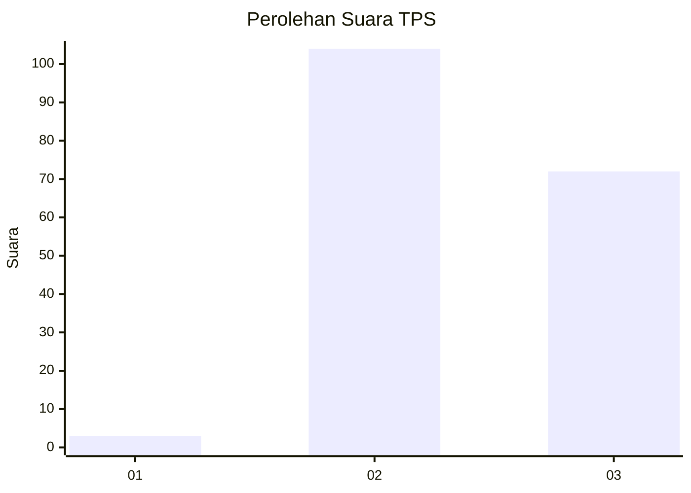
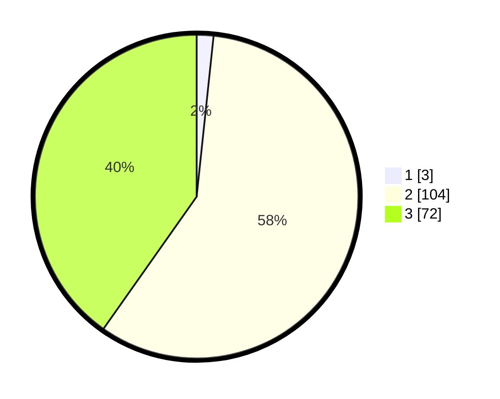

# Hasil

## Grafik

## Tabel

| No. | Nama Paslon    | Suara | Suara (raw) | Persentase |
|:--- |:-------------- | -----:| -----------:| ----------:|
| 1   | ANIES MUHAIMIN | 3     | [3][p-1]    | 1,68       |
| 2   | PRABOWO GIBRAN | 104   | [104][p-2]  | 58,10      |
| 3   | GANJAR MAHFUD  | 72    | [72][p-3]   | 40,22      |

[p-1]: https://github.com/gigit-pemilu/pemilu-2024-51-bali/blob/main/pilpres/hitung-suara/sub/51-bali/sub/07-karangasem/sub/05-abang/sub/2007-datah/sub/026-tps/sub/paslon-1.txt
[p-2]: https://github.com/gigit-pemilu/pemilu-2024-51-bali/blob/main/pilpres/hitung-suara/sub/51-bali/sub/07-karangasem/sub/05-abang/sub/2007-datah/sub/026-tps/sub/paslon-2.txt
[p-3]: https://github.com/gigit-pemilu/pemilu-2024-51-bali/blob/main/pilpres/hitung-suara/sub/51-bali/sub/07-karangasem/sub/05-abang/sub/2007-datah/sub/026-tps/sub/paslon-3.txt

## Foto C Plano

https://sirekap-obj-formc.kpu.go.id/0089/pemilu/ppwp/51/07/05/20/07/5107052007026-20240224-130844--c8ac35e8-1347-4307-9cf5-27a71bb4f4d9.jpg

https://sirekap-obj-formc.kpu.go.id/0089/pemilu/ppwp/51/07/05/20/07/5107052007026-20240224-131017--b0136df1-f031-4d8a-977c-357fd4184c49.jpg

https://sirekap-obj-formc.kpu.go.id/0089/pemilu/ppwp/51/07/05/20/07/5107052007026-20240224-153106--55460f14-08bb-4856-bac4-80f9c68023bf.jpg

## Metadata

| Key        | Value               |
| ---------- | ------------------- |
| Time Stamp | 2024-02-24 22:31:28 |

## DATA PEMILIH TETAP

Jumlah pemilih dalam DPT: **279**.
 * L: **133**.
 * P: **146**.

## DATA PENGGUNA HAK PILIH

Jumlah pengguna hak pilih dalam DPT: **171**.
 * L: **89**.
 * P: **82**.

Jumlah pengguna hak pilih dalam DPTb: **0**.
 * L: **0**.
 * P: **0**.

Jumlah pengguna hak pilih dalam DPK: **15**.
 * L: **5**.
 * P: **10**.

Jumlah pengguna hak pilih: **186**.
 * L: **94**.
 * P: **92**.

## JUMLAH SUARA SAH DAN TIDAK SAH

JUMLAH SELURUH SUARA SAH: **179**.

JUMLAH SUARA TIDAK SAH: **7**.

JUMLAH SELURUH SUARA SAH DAN SUARA TIDAK SAH: **186**.

