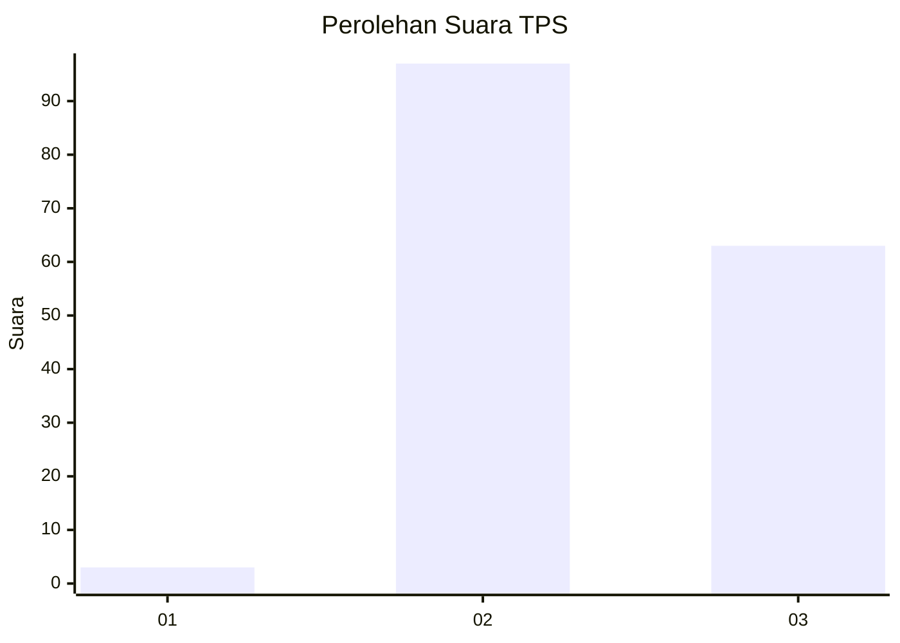
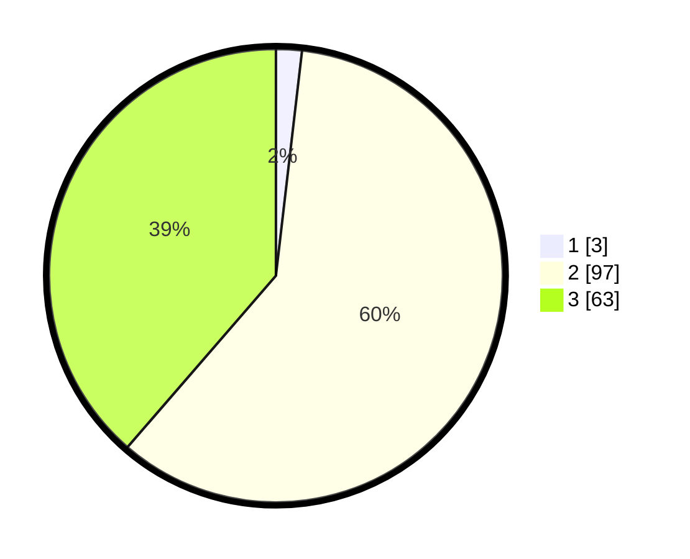

# Hasil

## Grafik

## Tabel

| No. | Nama Paslon    | Suara | Suara (raw) | Persentase |
|:--- |:-------------- | -----:| -----------:| ----------:|
| 1   | ANIES MUHAIMIN | 3     | [3][p-1]    | 1,84       |
| 2   | PRABOWO GIBRAN | 97    | [97][p-2]   | 59,51      |
| 3   | GANJAR MAHFUD  | 63    | [63][p-3]   | 38,65      |

[p-1]: https://github.com/gigit-pemilu/pemilu-2024-51-bali/blob/main/pilpres/hitung-suara/sub/51-bali/sub/07-karangasem/sub/05-abang/sub/2009-purwa-kerthi/sub/003-tps/sub/paslon-1.txt
[p-2]: https://github.com/gigit-pemilu/pemilu-2024-51-bali/blob/main/pilpres/hitung-suara/sub/51-bali/sub/07-karangasem/sub/05-abang/sub/2009-purwa-kerthi/sub/003-tps/sub/paslon-2.txt
[p-3]: https://github.com/gigit-pemilu/pemilu-2024-51-bali/blob/main/pilpres/hitung-suara/sub/51-bali/sub/07-karangasem/sub/05-abang/sub/2009-purwa-kerthi/sub/003-tps/sub/paslon-3.txt

## Foto C Plano

https://sirekap-obj-formc.kpu.go.id/a018/pemilu/ppwp/51/07/05/20/09/5107052009003-20240214-234542--c6b8c20e-05bb-4e15-aacc-9a9429de3e41.jpg

https://sirekap-obj-formc.kpu.go.id/a018/pemilu/ppwp/51/07/05/20/09/5107052009003-20240222-105901--0b490433-905c-4c77-9e6a-b7b63932fbb9.jpg

https://sirekap-obj-formc.kpu.go.id/a018/pemilu/ppwp/51/07/05/20/09/5107052009003-20240222-105900--16e08716-9ad8-44fa-910a-588f6dccf1b1.jpg

## Metadata

| Key        | Value               |
| ---------- | ------------------- |
| Time Stamp | 2024-02-24 22:31:28 |

## DATA PEMILIH TETAP

Jumlah pemilih dalam DPT: **228**.
 * L: **115**.
 * P: **113**.

## DATA PENGGUNA HAK PILIH

Jumlah pengguna hak pilih dalam DPT: **168**.
 * L: **90**.
 * P: **78**.

Jumlah pengguna hak pilih dalam DPTb: **1**.
 * L: **0**.
 * P: **1**.

Jumlah pengguna hak pilih dalam DPK: **0**.
 * L: **0**.
 * P: **0**.

Jumlah pengguna hak pilih: **169**.
 * L: **90**.
 * P: **79**.

## JUMLAH SUARA SAH DAN TIDAK SAH

JUMLAH SELURUH SUARA SAH: **163**.

JUMLAH SUARA TIDAK SAH: **6**.

JUMLAH SELURUH SUARA SAH DAN SUARA TIDAK SAH: **169**.

