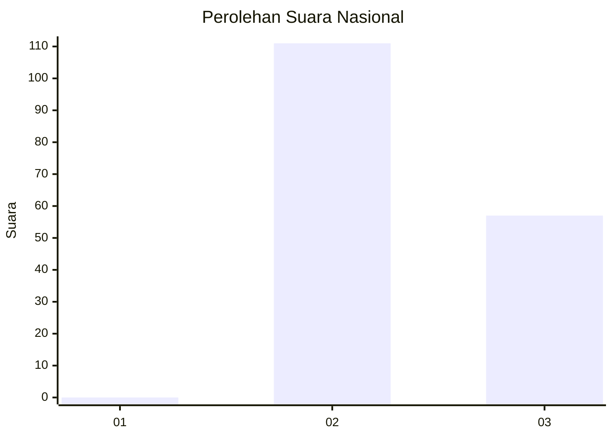
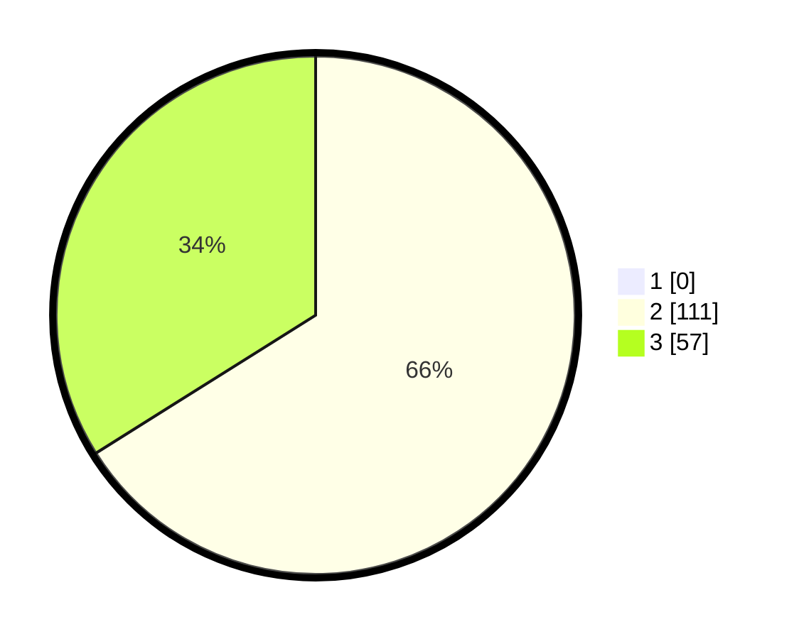

# Hasil

## Grafik

## Tabel

| No. | Nama Paslon    | Suara | Suara (raw) | Persentase |
|:--- |:-------------- | -----:| -----------:| ----------:|
| 1   | ANIES MUHAIMIN | 0     | [0][p-1]    | 0,00       |
| 2   | PRABOWO GIBRAN | 111   | [111][p-2]  | 66,07      |
| 3   | GANJAR MAHFUD  | 57    | [57][p-3]   | 33,93      |

[p-1]: https://github.com/gigit-pemilu/pemilu-2024/blob/main/pilpres/hitung-suara/sub/51-bali/sub/07-karangasem/sub/05-abang/sub/2009-purwa-kerthi/sub/005-tps/sub/paslon-1.txt
[p-2]: https://github.com/gigit-pemilu/pemilu-2024/blob/main/pilpres/hitung-suara/sub/51-bali/sub/07-karangasem/sub/05-abang/sub/2009-purwa-kerthi/sub/005-tps/sub/paslon-2.txt
[p-3]: https://github.com/gigit-pemilu/pemilu-2024/blob/main/pilpres/hitung-suara/sub/51-bali/sub/07-karangasem/sub/05-abang/sub/2009-purwa-kerthi/sub/005-tps/sub/paslon-3.txt

## Foto C Plano

https://sirekap-obj-formc.kpu.go.id/c3ab/pemilu/ppwp/51/07/05/20/09/5107052009005-20240214-214450--e830d12a-f7f3-485f-bfd1-f4164d1bb488.jpg

https://sirekap-obj-formc.kpu.go.id/c3ab/pemilu/ppwp/51/07/05/20/09/5107052009005-20240214-190650--1c3431d1-f84b-4997-87d5-ba1e2a76349e.jpg

https://sirekap-obj-formc.kpu.go.id/c3ab/pemilu/ppwp/51/07/05/20/09/5107052009005-20240214-190656--c99aa386-c763-473b-86a1-d66feffb57e1.jpg

## Metadata

| Key        | Value               |
| ---------- | ------------------- |
| Time Stamp | 2024-02-15 03:06:03 |

## DATA PEMILIH TETAP

Jumlah pemilih dalam DPT: **218**.
 * L: **104**.
 * P: **114**.

## DATA PENGGUNA HAK PILIH

Jumlah pengguna hak pilih dalam DPT: **168**.
 * L: **83**.
 * P: **85**.

Jumlah pengguna hak pilih dalam DPTb: **0**.
 * L: **0**.
 * P: **0**.

Jumlah pengguna hak pilih dalam DPK: **2**.
 * L: **1**.
 * P: **1**.

Jumlah pengguna hak pilih: **170**.
 * L: **84**.
 * P: **86**.

## JUMLAH SUARA SAH DAN TIDAK SAH

JUMLAH SELURUH SUARA SAH: **168**.

JUMLAH SUARA TIDAK SAH: **2**.

JUMLAH SELURUH SUARA SAH DAN SUARA TIDAK SAH: **170**.

