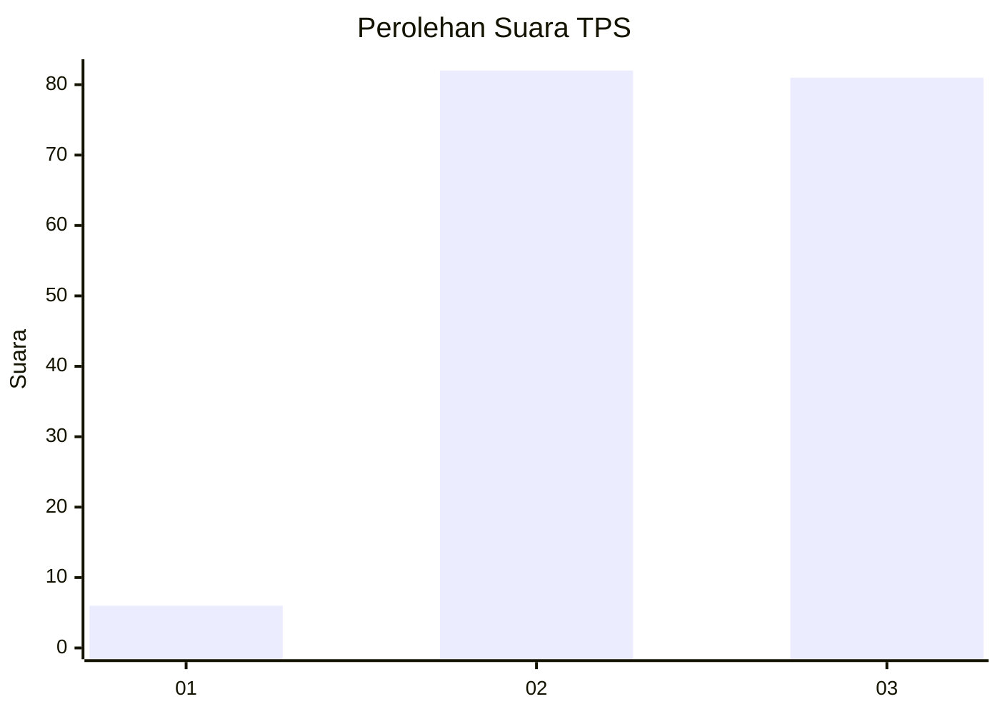
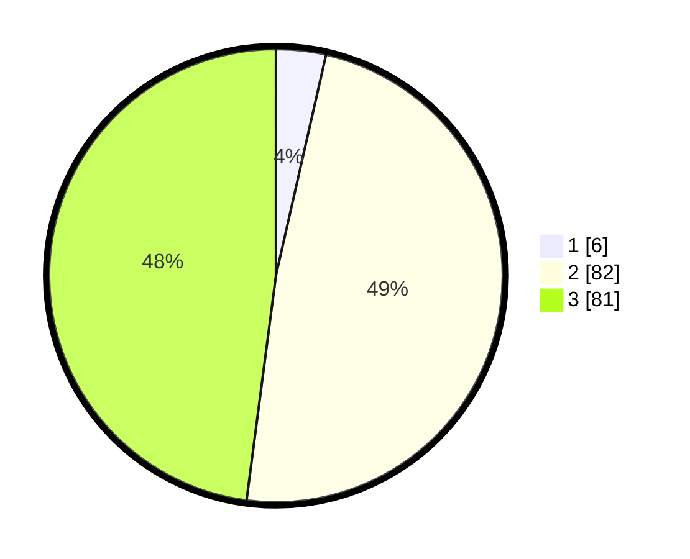

# Hasil

## Grafik

## Tabel

| No. | Nama Paslon    | Suara | Suara (raw) | Persentase |
|:--- |:-------------- | -----:| -----------:| ----------:|
| 1   | ANIES MUHAIMIN | 6     | [6][p-1]    | 3,55       |
| 2   | PRABOWO GIBRAN | 82    | [82][p-2]   | 48,52      |
| 3   | GANJAR MAHFUD  | 81    | [81][p-3]   | 47,93      |

[p-1]: https://github.com/gigit-pemilu/pemilu-2024-51-bali/blob/main/pilpres/hitung-suara/sub/51-bali/sub/07-karangasem/sub/05-abang/sub/2011-laba-sari/sub/001-tps/sub/paslon-1.txt
[p-2]: https://github.com/gigit-pemilu/pemilu-2024-51-bali/blob/main/pilpres/hitung-suara/sub/51-bali/sub/07-karangasem/sub/05-abang/sub/2011-laba-sari/sub/001-tps/sub/paslon-2.txt
[p-3]: https://github.com/gigit-pemilu/pemilu-2024-51-bali/blob/main/pilpres/hitung-suara/sub/51-bali/sub/07-karangasem/sub/05-abang/sub/2011-laba-sari/sub/001-tps/sub/paslon-3.txt

## Foto C Plano

https://sirekap-obj-formc.kpu.go.id/d18d/pemilu/ppwp/51/07/05/20/11/5107052011001-20240222-103140--07236bee-0e1a-4fdc-a5a1-7b25f1386f7b.jpg

https://sirekap-obj-formc.kpu.go.id/d18d/pemilu/ppwp/51/07/05/20/11/5107052011001-20240222-103142--60dbafc1-3b35-474e-add0-e634215eb04c.jpg

https://sirekap-obj-formc.kpu.go.id/d18d/pemilu/ppwp/51/07/05/20/11/5107052011001-20240222-103141--440080cd-0664-4cc8-8912-8d64454328b4.jpg

## Metadata

| Key        | Value               |
| ---------- | ------------------- |
| Time Stamp | 2024-02-24 22:31:28 |

## DATA PEMILIH TETAP

Jumlah pemilih dalam DPT: **203**.
 * L: **103**.
 * P: **100**.

## DATA PENGGUNA HAK PILIH

Jumlah pengguna hak pilih dalam DPT: **168**.
 * L: **90**.
 * P: **78**.

Jumlah pengguna hak pilih dalam DPTb: **1**.
 * L: **0**.
 * P: **1**.

Jumlah pengguna hak pilih dalam DPK: **169**.
 * L: **90**.
 * P: **79**.

Jumlah pengguna hak pilih: **169**.
 * L: **90**.
 * P: **79**.

## JUMLAH SUARA SAH DAN TIDAK SAH

JUMLAH SELURUH SUARA SAH: **169**.

JUMLAH SUARA TIDAK SAH: **0**.

JUMLAH SELURUH SUARA SAH DAN SUARA TIDAK SAH: **169**.

