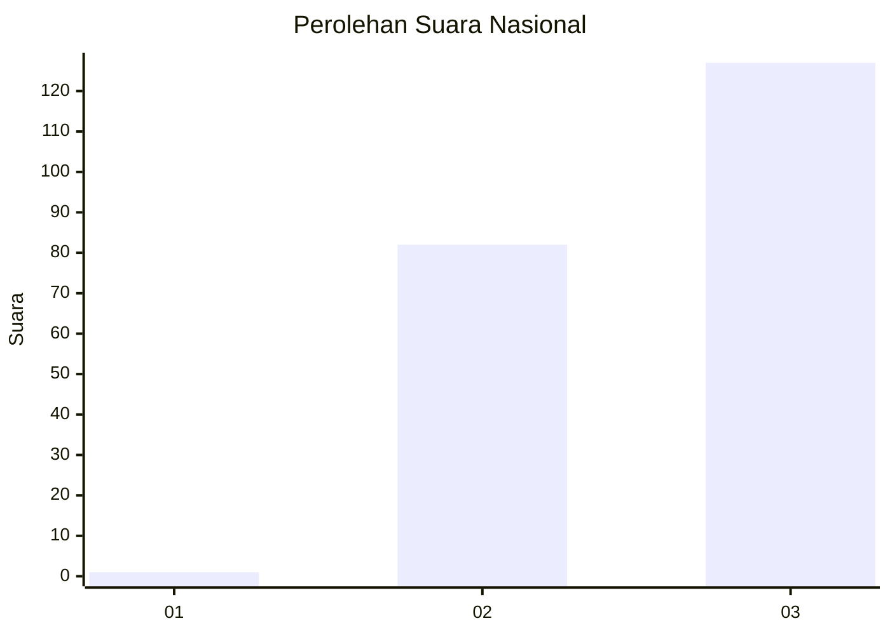
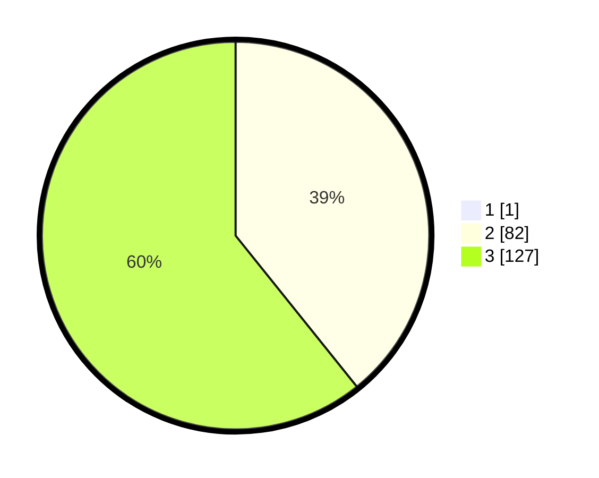

# Hasil

## Grafik

## Tabel

| No. | Nama Paslon    | Suara | Suara (raw) | Persentase |
|:--- |:-------------- | -----:| -----------:| ----------:|
| 1   | ANIES MUHAIMIN | 1     | [1][p-1]    | 0,48       |
| 2   | PRABOWO GIBRAN | 82    | [82][p-2]   | 39,05      |
| 3   | GANJAR MAHFUD  | 127   | [127][p-3]  | 60,48      |

[p-1]: https://github.com/gigit-pemilu/pemilu-2024/blob/main/pilpres/hitung-suara/sub/51-bali/sub/07-karangasem/sub/05-abang/sub/2011-laba-sari/sub/012-tps/sub/paslon-1.txt
[p-2]: https://github.com/gigit-pemilu/pemilu-2024/blob/main/pilpres/hitung-suara/sub/51-bali/sub/07-karangasem/sub/05-abang/sub/2011-laba-sari/sub/012-tps/sub/paslon-2.txt
[p-3]: https://github.com/gigit-pemilu/pemilu-2024/blob/main/pilpres/hitung-suara/sub/51-bali/sub/07-karangasem/sub/05-abang/sub/2011-laba-sari/sub/012-tps/sub/paslon-3.txt

## Foto C Plano

https://sirekap-obj-formc.kpu.go.id/ecc6/pemilu/ppwp/51/07/05/20/11/5107052011012-20240222-120211--deb3f78f-ccca-4a45-a9cf-ecc310d582cb.jpg

https://sirekap-obj-formc.kpu.go.id/ecc6/pemilu/ppwp/51/07/05/20/11/5107052011012-20240222-120439--ed6b7c70-6057-4a1c-a30d-2b5ec4c887e5.jpg

https://sirekap-obj-formc.kpu.go.id/ecc6/pemilu/ppwp/51/07/05/20/11/5107052011012-20240222-120623--00e9dcfb-151a-46d1-9f6d-07c549b24ac6.jpg

## Metadata

| Key        | Value               |
| ---------- | ------------------- |
| Time Stamp | 2024-02-22 13:00:00 |

## DATA PEMILIH TETAP

Jumlah pemilih dalam DPT: **214**.
 * L: **103**.
 * P: **111**.

## DATA PENGGUNA HAK PILIH

Jumlah pengguna hak pilih dalam DPT: **205**.
 * L: **98**.
 * P: **107**.

Jumlah pengguna hak pilih dalam DPTb: **0**.
 * L: **0**.
 * P: **0**.

Jumlah pengguna hak pilih dalam DPK: **8**.
 * L: **3**.
 * P: **5**.

Jumlah pengguna hak pilih: **213**.
 * L: **101**.
 * P: **112**.

## JUMLAH SUARA SAH DAN TIDAK SAH

JUMLAH SELURUH SUARA SAH: **210**.

JUMLAH SUARA TIDAK SAH: **3**.

JUMLAH SELURUH SUARA SAH DAN SUARA TIDAK SAH: **213**.

