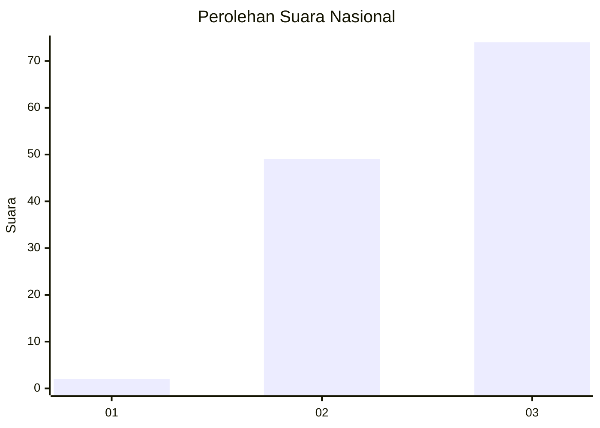
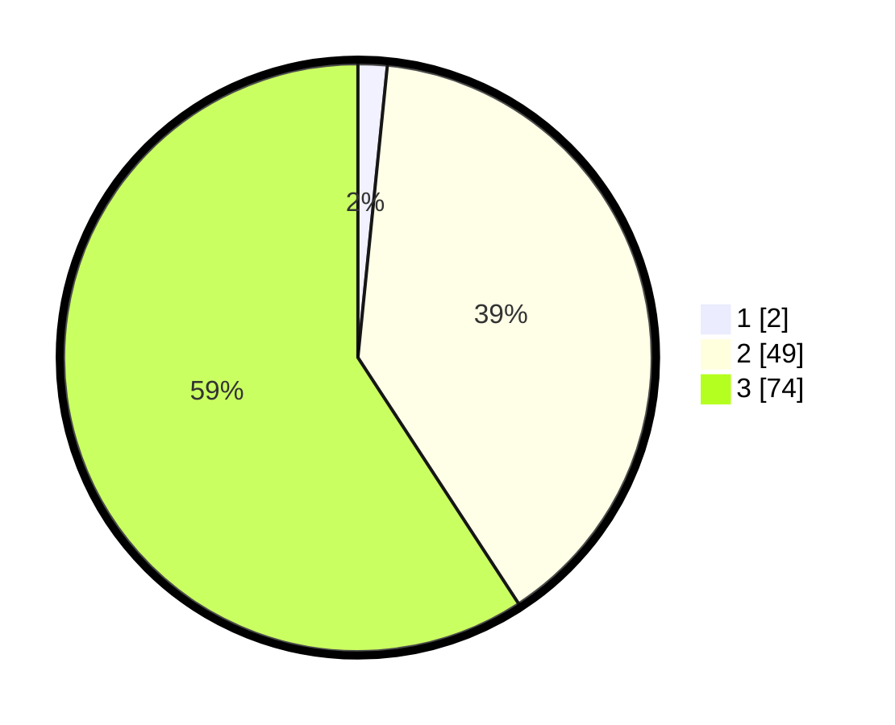

# Hasil

## Grafik

## Tabel

| No. | Nama Paslon    | Suara | Suara (raw) | Persentase |
|:--- |:-------------- | -----:| -----------:| ----------:|
| 1   | ANIES MUHAIMIN | 2     | [2][p-1]    | 1,60       |
| 2   | PRABOWO GIBRAN | 49    | [49][p-2]   | 39,20      |
| 3   | GANJAR MAHFUD  | 74    | [74][p-3]   | 59,20      |

[p-1]: https://github.com/gigit-pemilu/pemilu-2024/blob/main/pilpres/hitung-suara/sub/51-bali/sub/07-karangasem/sub/05-abang/sub/2012-nawa-kerti/sub/003-tps/sub/paslon-1.txt
[p-2]: https://github.com/gigit-pemilu/pemilu-2024/blob/main/pilpres/hitung-suara/sub/51-bali/sub/07-karangasem/sub/05-abang/sub/2012-nawa-kerti/sub/003-tps/sub/paslon-2.txt
[p-3]: https://github.com/gigit-pemilu/pemilu-2024/blob/main/pilpres/hitung-suara/sub/51-bali/sub/07-karangasem/sub/05-abang/sub/2012-nawa-kerti/sub/003-tps/sub/paslon-3.txt

## Foto C Plano

https://sirekap-obj-formc.kpu.go.id/e551/pemilu/ppwp/51/07/05/20/12/5107052012003-20240221-181431--a0276920-accf-4b39-b382-127bf79cd962.jpg

https://sirekap-obj-formc.kpu.go.id/e551/pemilu/ppwp/51/07/05/20/12/5107052012003-20240221-181433--cb262b51-a161-424d-9c06-22dd043d96a8.jpg

https://sirekap-obj-formc.kpu.go.id/e551/pemilu/ppwp/51/07/05/20/12/5107052012003-20240221-181432--8e8629f7-4e33-4255-bfb0-214761c18742.jpg

## Metadata

| Key        | Value               |
| ---------- | ------------------- |
| Time Stamp | 2024-02-24 22:31:28 |

## DATA PEMILIH TETAP

Jumlah pemilih dalam DPT: **246**.
 * L: **121**.
 * P: **125**.

## DATA PENGGUNA HAK PILIH

Jumlah pengguna hak pilih dalam DPT: **135**.
 * L: **73**.
 * P: **62**.

Jumlah pengguna hak pilih dalam DPTb: **0**.
 * L: **0**.
 * P: **0**.

Jumlah pengguna hak pilih dalam DPK: **0**.
 * L: **0**.
 * P: **0**.

Jumlah pengguna hak pilih: **135**.
 * L: **73**.
 * P: **62**.

## JUMLAH SUARA SAH DAN TIDAK SAH

JUMLAH SELURUH SUARA SAH: **125**.

JUMLAH SUARA TIDAK SAH: **10**.

JUMLAH SELURUH SUARA SAH DAN SUARA TIDAK SAH: **135**.

