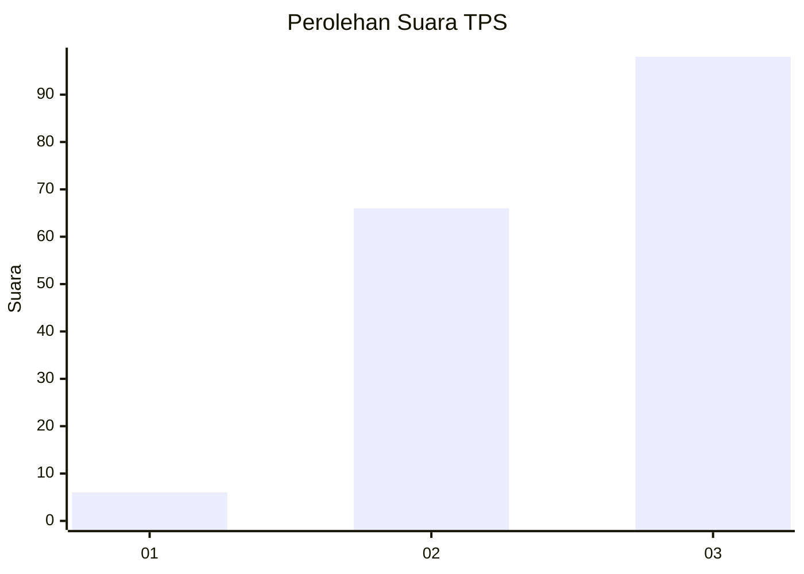
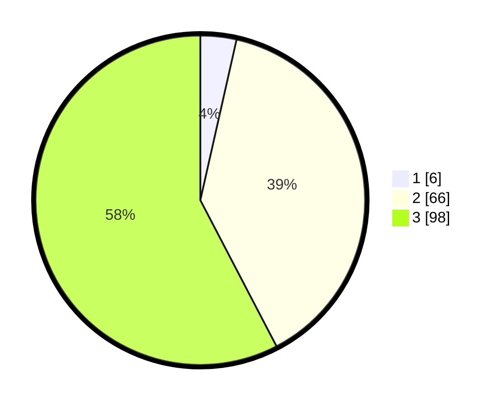

# Hasil

## Grafik

## Tabel

| No. | Nama Paslon    | Suara | Suara (raw) | Persentase |
|:--- |:-------------- | -----:| -----------:| ----------:|
| 1   | ANIES MUHAIMIN | 6     | [6][p-1]    | 3,53       |
| 2   | PRABOWO GIBRAN | 66    | [66][p-2]   | 38,82      |
| 3   | GANJAR MAHFUD  | 98    | [98][p-3]   | 57,65      |

[p-1]: https://github.com/gigit-pemilu/pemilu-2024-51-bali/blob/main/pilpres/hitung-suara/sub/51-bali/sub/07-karangasem/sub/05-abang/sub/2012-nawa-kerti/sub/004-tps/sub/paslon-1.txt
[p-2]: https://github.com/gigit-pemilu/pemilu-2024-51-bali/blob/main/pilpres/hitung-suara/sub/51-bali/sub/07-karangasem/sub/05-abang/sub/2012-nawa-kerti/sub/004-tps/sub/paslon-2.txt
[p-3]: https://github.com/gigit-pemilu/pemilu-2024-51-bali/blob/main/pilpres/hitung-suara/sub/51-bali/sub/07-karangasem/sub/05-abang/sub/2012-nawa-kerti/sub/004-tps/sub/paslon-3.txt

## Foto C Plano

https://sirekap-obj-formc.kpu.go.id/a04d/pemilu/ppwp/51/07/05/20/12/5107052012004-20240216-032455--08d96b10-4b49-4bfe-a57d-3722ae48bb9c.jpg

https://sirekap-obj-formc.kpu.go.id/a04d/pemilu/ppwp/51/07/05/20/12/5107052012004-20240216-032506--0be8a1e2-3a6c-4e2a-b7e6-29bc7fea45e3.jpg

https://sirekap-obj-formc.kpu.go.id/a04d/pemilu/ppwp/51/07/05/20/12/5107052012004-20240216-032458--fd14778c-a13f-4309-a6da-a4d1b4c2879b.jpg

## Metadata

| Key        | Value               |
| ---------- | ------------------- |
| Time Stamp | 2024-02-16 12:51:22 |

## DATA PEMILIH TETAP

Jumlah pemilih dalam DPT: **261**.
 * L: **138**.
 * P: **123**.

## DATA PENGGUNA HAK PILIH

Jumlah pengguna hak pilih dalam DPT: **187**.
 * L: **102**.
 * P: **85**.

Jumlah pengguna hak pilih dalam DPTb: **0**.
 * L: **0**.
 * P: **0**.

Jumlah pengguna hak pilih dalam DPK: **0**.
 * L: **0**.
 * P: **0**.

Jumlah pengguna hak pilih: **187**.
 * L: **102**.
 * P: **85**.

## JUMLAH SUARA SAH DAN TIDAK SAH

JUMLAH SELURUH SUARA SAH: **170**.

JUMLAH SUARA TIDAK SAH: **17**.

JUMLAH SELURUH SUARA SAH DAN SUARA TIDAK SAH: **187**.

