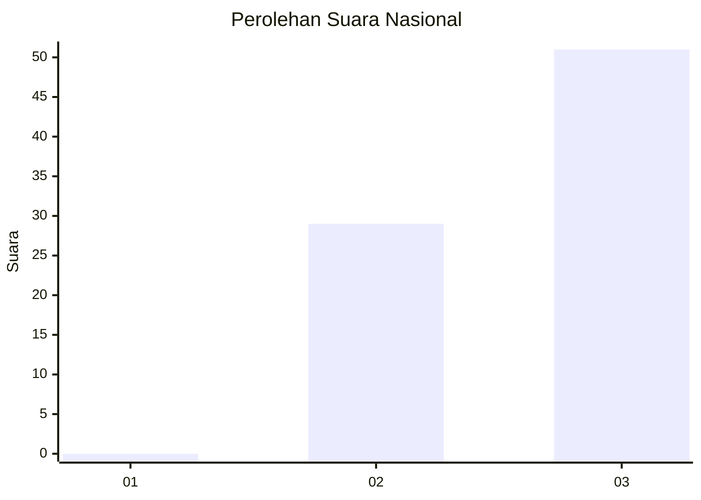
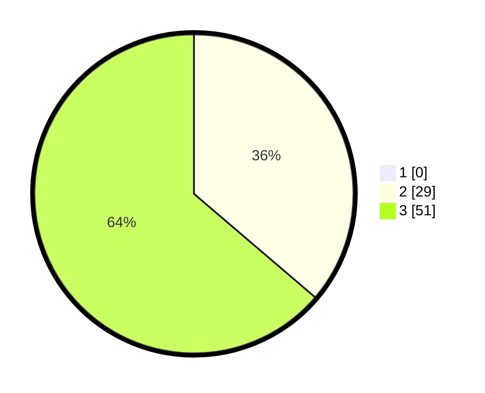

# Hasil

## Grafik

## Tabel

| No. | Nama Paslon    | Suara | Suara (raw) | Persentase |
|:--- |:-------------- | -----:| -----------:| ----------:|
| 1   | ANIES MUHAIMIN | 0     | [0][p-1]    | 0,00       |
| 2   | PRABOWO GIBRAN | 29    | [29][p-2]   | 36,25      |
| 3   | GANJAR MAHFUD  | 51    | [51][p-3]   | 63,75      |

[p-1]: https://github.com/gigit-pemilu/pemilu-2024/blob/main/pilpres/hitung-suara/sub/51-bali/sub/07-karangasem/sub/05-abang/sub/2012-nawa-kerti/sub/012-tps/sub/paslon-1.txt
[p-2]: https://github.com/gigit-pemilu/pemilu-2024/blob/main/pilpres/hitung-suara/sub/51-bali/sub/07-karangasem/sub/05-abang/sub/2012-nawa-kerti/sub/012-tps/sub/paslon-2.txt
[p-3]: https://github.com/gigit-pemilu/pemilu-2024/blob/main/pilpres/hitung-suara/sub/51-bali/sub/07-karangasem/sub/05-abang/sub/2012-nawa-kerti/sub/012-tps/sub/paslon-3.txt

## Foto C Plano

https://sirekap-obj-formc.kpu.go.id/73d3/pemilu/ppwp/51/07/05/20/12/5107052012012-20240221-193430--b6a460c3-d051-4d24-afef-84fee21a7d67.jpg

https://sirekap-obj-formc.kpu.go.id/73d3/pemilu/ppwp/51/07/05/20/12/5107052012012-20240221-193431--89ecd8c1-880d-4298-a34b-dd0f67c21d80.jpg

https://sirekap-obj-formc.kpu.go.id/73d3/pemilu/ppwp/51/07/05/20/12/5107052012012-20240221-193431--20eafed5-e6fa-4104-b716-351bbcb970e6.jpg

## Metadata

| Key        | Value               |
| ---------- | ------------------- |
| Time Stamp | 2024-02-24 22:31:28 |

## DATA PEMILIH TETAP

Jumlah pemilih dalam DPT: **0**.
 * L: **0**.
 * P: **0**.

## DATA PENGGUNA HAK PILIH

Jumlah pengguna hak pilih dalam DPT: **90**.
 * L: **48**.
 * P: **42**.

Jumlah pengguna hak pilih dalam DPTb: **81**.
 * L: **43**.
 * P: **38**.

Jumlah pengguna hak pilih dalam DPK: **0**.
 * L: **0**.
 * P: **0**.

Jumlah pengguna hak pilih: **81**.
 * L: **43**.
 * P: **38**.

## JUMLAH SUARA SAH DAN TIDAK SAH

JUMLAH SELURUH SUARA SAH: **80**.

JUMLAH SUARA TIDAK SAH: **1**.

JUMLAH SELURUH SUARA SAH DAN SUARA TIDAK SAH: **81**.

