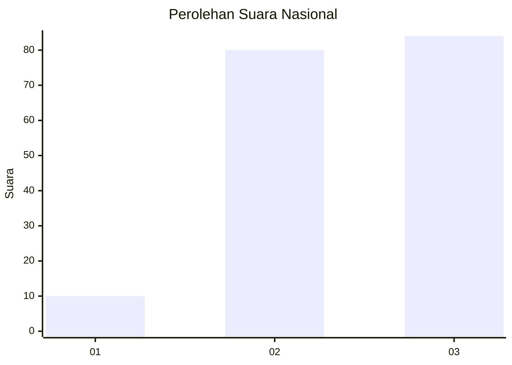
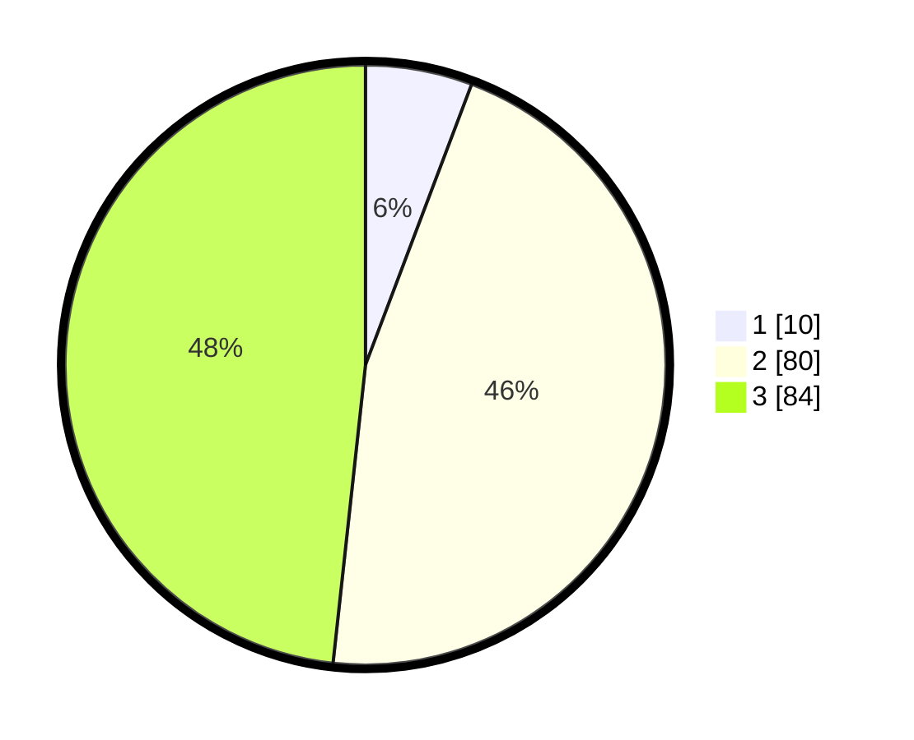

# Hasil

## Grafik

## Tabel

| No. | Nama Paslon    | Suara | Suara (raw) | Persentase |
|:--- |:-------------- | -----:| -----------:| ----------:|
| 1   | ANIES MUHAIMIN | 10    | [10][p-1]   | 5,75       |
| 2   | PRABOWO GIBRAN | 80    | [80][p-2]   | 45,98      |
| 3   | GANJAR MAHFUD  | 84    | [84][p-3]   | 48,28      |

[p-1]: https://github.com/gigit-pemilu/pemilu-2024/blob/main/pilpres/hitung-suara/sub/51-bali/sub/07-karangasem/sub/05-abang/sub/2013-kesimpar/sub/002-tps/sub/paslon-1.txt
[p-2]: https://github.com/gigit-pemilu/pemilu-2024/blob/main/pilpres/hitung-suara/sub/51-bali/sub/07-karangasem/sub/05-abang/sub/2013-kesimpar/sub/002-tps/sub/paslon-2.txt
[p-3]: https://github.com/gigit-pemilu/pemilu-2024/blob/main/pilpres/hitung-suara/sub/51-bali/sub/07-karangasem/sub/05-abang/sub/2013-kesimpar/sub/002-tps/sub/paslon-3.txt

## Foto C Plano

https://sirekap-obj-formc.kpu.go.id/122a/pemilu/ppwp/51/07/05/20/13/5107052013002-20240216-045244--3ae646c0-087a-4b59-9bcc-ad05a69dce2c.jpg

https://sirekap-obj-formc.kpu.go.id/122a/pemilu/ppwp/51/07/05/20/13/5107052013002-20240216-045251--2d447380-9ccc-4497-be4c-0b8e3299191b.jpg

https://sirekap-obj-formc.kpu.go.id/122a/pemilu/ppwp/51/07/05/20/13/5107052013002-20240216-045245--2183756f-631c-4af6-99cb-1d7926158413.jpg

## Metadata

| Key        | Value               |
| ---------- | ------------------- |
| Time Stamp | 2024-02-16 12:51:22 |

## DATA PEMILIH TETAP

Jumlah pemilih dalam DPT: **229**.
 * L: **120**.
 * P: **109**.

## DATA PENGGUNA HAK PILIH

Jumlah pengguna hak pilih dalam DPT: **198**.
 * L: **102**.
 * P: **96**.

Jumlah pengguna hak pilih dalam DPTb: **0**.
 * L: **0**.
 * P: **0**.

Jumlah pengguna hak pilih dalam DPK: **0**.
 * L: **0**.
 * P: **0**.

Jumlah pengguna hak pilih: **198**.
 * L: **102**.
 * P: **96**.

## JUMLAH SUARA SAH DAN TIDAK SAH

JUMLAH SELURUH SUARA SAH: **174**.

JUMLAH SUARA TIDAK SAH: **24**.

JUMLAH SELURUH SUARA SAH DAN SUARA TIDAK SAH: **198**.

