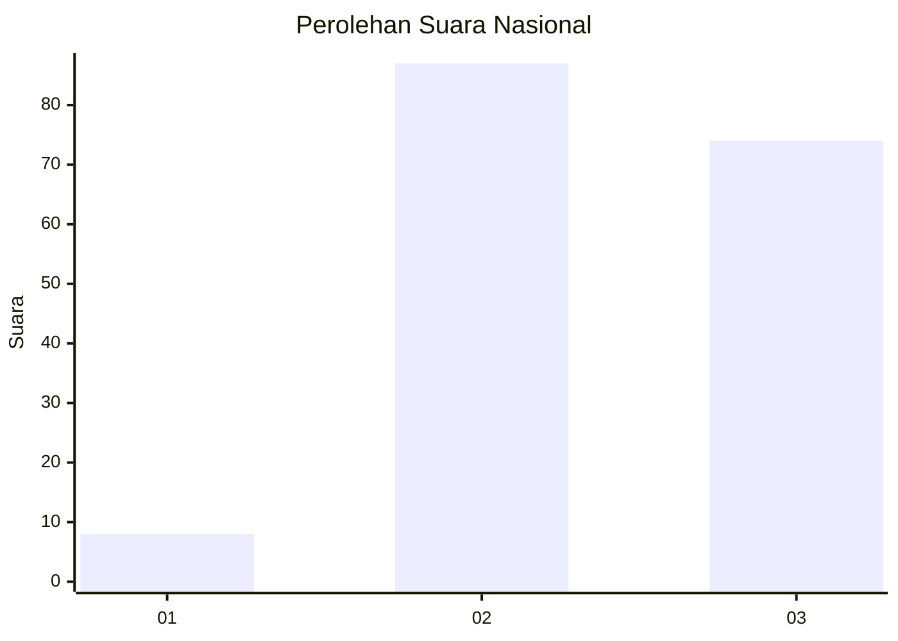
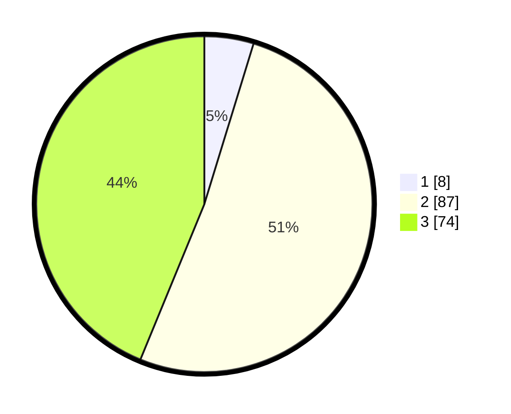

# Hasil

## Grafik

## Tabel

| No. | Nama Paslon    | Suara | Suara (raw) | Persentase |
|:--- |:-------------- | -----:| -----------:| ----------:|
| 1   | ANIES MUHAIMIN | 8     | [8][p-1]    | 4,73       |
| 2   | PRABOWO GIBRAN | 87    | [87][p-2]   | 51,48      |
| 3   | GANJAR MAHFUD  | 74    | [74][p-3]   | 43,79      |

[p-1]: https://github.com/gigit-pemilu/pemilu-2024/blob/main/pilpres/hitung-suara/sub/51-bali/sub/07-karangasem/sub/05-abang/sub/2013-kesimpar/sub/005-tps/sub/paslon-1.txt
[p-2]: https://github.com/gigit-pemilu/pemilu-2024/blob/main/pilpres/hitung-suara/sub/51-bali/sub/07-karangasem/sub/05-abang/sub/2013-kesimpar/sub/005-tps/sub/paslon-2.txt
[p-3]: https://github.com/gigit-pemilu/pemilu-2024/blob/main/pilpres/hitung-suara/sub/51-bali/sub/07-karangasem/sub/05-abang/sub/2013-kesimpar/sub/005-tps/sub/paslon-3.txt

## Foto C Plano

https://sirekap-obj-formc.kpu.go.id/bd99/pemilu/ppwp/51/07/05/20/13/5107052013005-20240215-204630--df255ab6-ff16-4720-a87c-e51700d2494a.jpg

https://sirekap-obj-formc.kpu.go.id/bd99/pemilu/ppwp/51/07/05/20/13/5107052013005-20240215-204632--6e554238-57a9-43fa-9c52-f0fa615e97b5.jpg

https://sirekap-obj-formc.kpu.go.id/bd99/pemilu/ppwp/51/07/05/20/13/5107052013005-20240215-204631--b65366e5-d12e-4661-a1e4-d10828bc98d6.jpg

## Metadata

| Key        | Value               |
| ---------- | ------------------- |
| Time Stamp | 2024-02-16 12:51:22 |

## DATA PEMILIH TETAP

Jumlah pemilih dalam DPT: **264**.
 * L: **135**.
 * P: **129**.

## DATA PENGGUNA HAK PILIH

Jumlah pengguna hak pilih dalam DPT: **191**.
 * L: **98**.
 * P: **93**.

Jumlah pengguna hak pilih dalam DPTb: **0**.
 * L: **0**.
 * P: **0**.

Jumlah pengguna hak pilih dalam DPK: **2**.
 * L: **2**.
 * P: **0**.

Jumlah pengguna hak pilih: **193**.
 * L: **100**.
 * P: **93**.

## JUMLAH SUARA SAH DAN TIDAK SAH

JUMLAH SELURUH SUARA SAH: **169**.

JUMLAH SUARA TIDAK SAH: **24**.

JUMLAH SELURUH SUARA SAH DAN SUARA TIDAK SAH: **193**.

