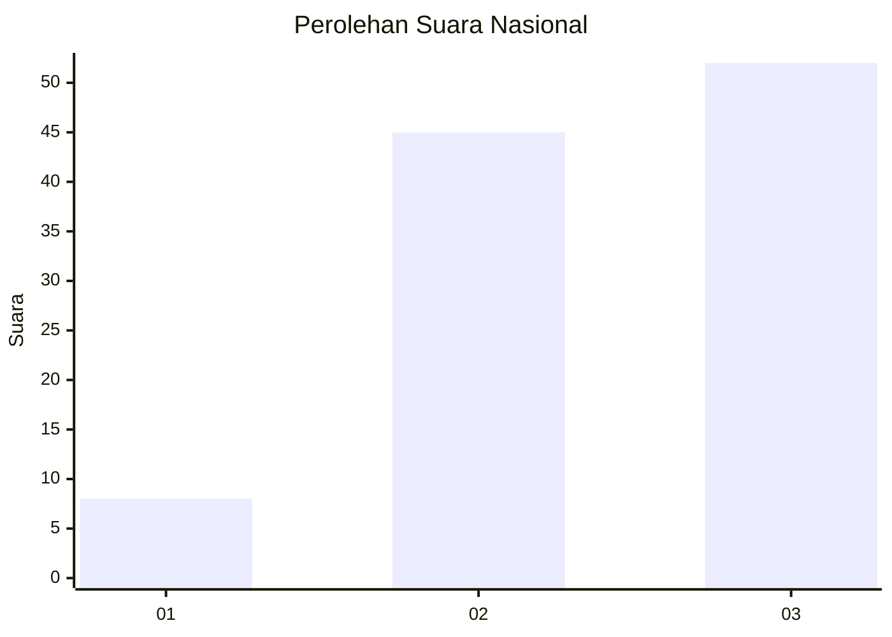
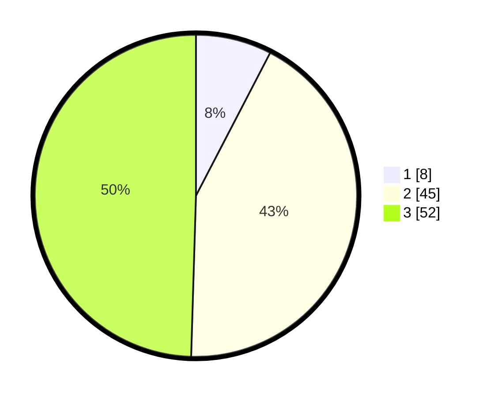

# Hasil

## Grafik

## Tabel

| No. | Nama Paslon    | Suara | Suara (raw) | Persentase |
|:--- |:-------------- | -----:| -----------:| ----------:|
| 1   | ANIES MUHAIMIN | 8     | [8][p-1]    | 7,62       |
| 2   | PRABOWO GIBRAN | 45    | [45][p-2]   | 42,86      |
| 3   | GANJAR MAHFUD  | 52    | [52][p-3]   | 49,52      |

[p-1]: https://github.com/gigit-pemilu/pemilu-2024/blob/main/pilpres/hitung-suara/sub/51-bali/sub/07-karangasem/sub/05-abang/sub/2013-kesimpar/sub/007-tps/sub/paslon-1.txt
[p-2]: https://github.com/gigit-pemilu/pemilu-2024/blob/main/pilpres/hitung-suara/sub/51-bali/sub/07-karangasem/sub/05-abang/sub/2013-kesimpar/sub/007-tps/sub/paslon-2.txt
[p-3]: https://github.com/gigit-pemilu/pemilu-2024/blob/main/pilpres/hitung-suara/sub/51-bali/sub/07-karangasem/sub/05-abang/sub/2013-kesimpar/sub/007-tps/sub/paslon-3.txt

## Foto C Plano

https://sirekap-obj-formc.kpu.go.id/f064/pemilu/ppwp/51/07/05/20/13/5107052013007-20240214-132251--5dad1c5e-32f1-4612-889c-e3b4deba5f3f.jpg

https://sirekap-obj-formc.kpu.go.id/f064/pemilu/ppwp/51/07/05/20/13/5107052013007-20240214-132640--cf75c1f8-4457-410c-88f4-2a5de47f0517.jpg

https://sirekap-obj-formc.kpu.go.id/f064/pemilu/ppwp/51/07/05/20/13/5107052013007-20240214-132950--37ad5cff-0768-4c5b-a22c-acbb6f38e8a4.jpg

## Metadata

| Key        | Value               |
| ---------- | ------------------- |
| Time Stamp | 2024-02-16 12:51:22 |

## DATA PEMILIH TETAP

Jumlah pemilih dalam DPT: **151**.
 * L: **77**.
 * P: **74**.

## DATA PENGGUNA HAK PILIH

Jumlah pengguna hak pilih dalam DPT: **112**.
 * L: **62**.
 * P: **50**.

Jumlah pengguna hak pilih dalam DPTb: **0**.
 * L: **0**.
 * P: **0**.

Jumlah pengguna hak pilih dalam DPK: **0**.
 * L: **0**.
 * P: **0**.

Jumlah pengguna hak pilih: **112**.
 * L: **62**.
 * P: **50**.

## JUMLAH SUARA SAH DAN TIDAK SAH

JUMLAH SELURUH SUARA SAH: **105**.

JUMLAH SUARA TIDAK SAH: **7**.

JUMLAH SELURUH SUARA SAH DAN SUARA TIDAK SAH: **112**.

